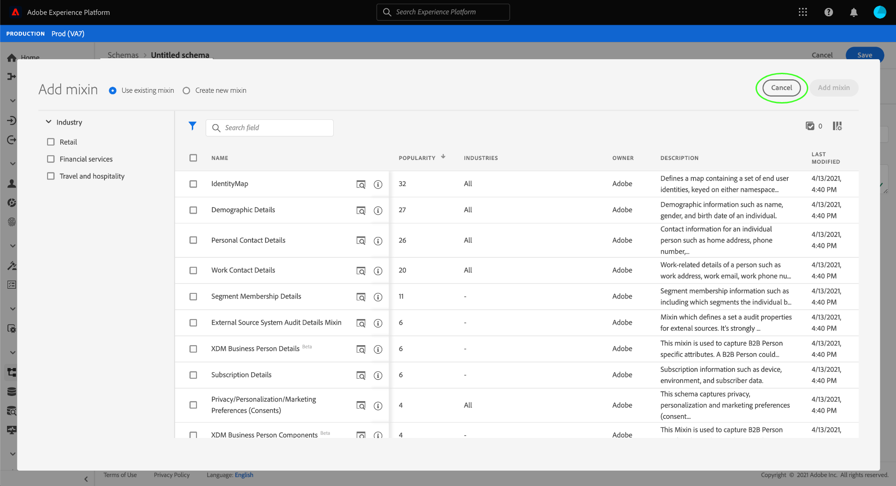
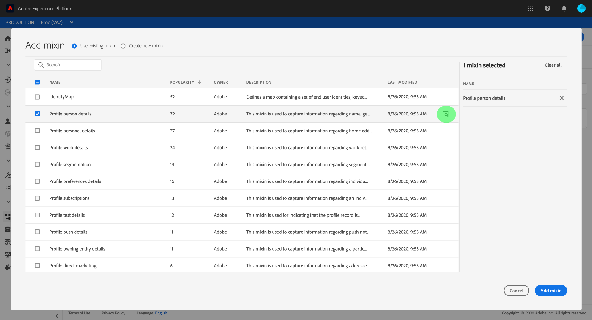
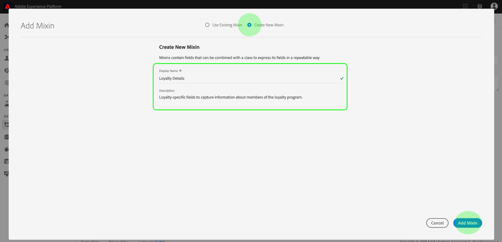

# [!DNL Schema Editor]을(를) 사용하여 스키마 만들기

Adobe Experience Platform 사용자 인터페이스를 사용하면 [!DNL Schema Editor]이라는 대화형 시각적 캔버스에서 [!DNL Experience Data Model](XDM) 스키마를 만들고 관리할 수 있습니다. 이 자습서에서는 [!DNL Schema Editor]을(를) 사용하여 스키마를 만드는 방법에 대해 설명합니다.

>[!NOTE]
>
>데모용으로 이 자습서의 단계에는 고객 충성도 프로그램의 구성원을 설명하는 예제 스키마를 만드는 작업이 포함됩니다. 이러한 단계를 사용하여 고유한 목적으로 다른 스키마를 만들 수 있지만 먼저 예제 스키마를 만들어 [!DNL Schema Editor]의 기능을 배우는 것이 좋습니다.

대신 [!DNL Schema Registry] API를 사용하여 스키마를 작성하려면 [[!DNL Schema Registry] 개발자 안내서](../api/getting-started.md)에서 API](create-schema-api.md)를 사용하여 스키마를 만들기 전에 [개발자 안내서를 읽으십시오.

## 시작하기

이 자습서에서는 스키마 만들기와 관련된 Adobe Experience Platform의 다양한 측면을 파악해야 합니다. 이 자습서를 시작하기 전에 다음 개념에 대한 설명서를 검토하십시오.

* [[!DNL Experience Data Model (XDM)]](../home.md):고객 경험 데이터를  [!DNL Platform] 구성하는 표준화된 프레임워크
   * [스키마 컴포지션의 기본 사항](../schema/composition.md):클래스, 믹싱, 데이터 유형 및 필드를 비롯한 XDM 스키마 및 해당 구성 요소에 대한 개요입니다.
* [[!DNL Real-time Customer Profile]](../../profile/home.md):여러 소스에서 집계된 데이터를 기반으로 통합된 실시간 소비자 프로필을 제공합니다.

## [!UICONTROL Schemas] 작업 영역 {#browse} 열기

[!DNL Platform] UI의 [!UICONTROL Schemas] 작업 영역에서는 [!DNL Schema Library]의 시각화를 제공하므로 조직에서 사용할 수 있는 스키마를 관리할 수 있습니다. 작업 영역에는 이 자습서 전체에서 스키마를 작성할 수 있는 캔버스인 [!DNL Schema Editor]도 포함되어 있습니다.

[!DNL Experience Platform]에 로그인한 후 왼쪽 탐색 영역에서 **[!UICONTROL Schemas]**&#x200B;을 선택하여 **[!UICONTROL Schemas]** 작업 영역을 엽니다. **[!UICONTROL Browse]** 탭에는 사용자가 보고 사용자 정의할 수 있는 스키마 목록([!DNL Schema Library] 표현)이 표시됩니다. 이 목록에는 스키마 기반이 되는 이름, 유형, 클래스 및 비헤이비어(레코드 또는 시간 시리즈)와 스키마를 마지막으로 수정한 날짜 및 시간이 포함됩니다.

자세한 내용은 [UI](../ui/explore.md)의 기존 XDM 리소스 둘러보기에 대한 가이드를 참조하십시오.

## 스키마 {#create} 만들기 및 이름 지정

스키마 구성을 시작하려면 **[!UICONTROL Schemas]** 작업 영역의 오른쪽 위 모서리에서 **[!UICONTROL Create schema]**&#x200B;을 선택합니다. 드롭다운 메뉴가 나타나면서 핵심 클래스 [!UICONTROL XDM Individual Profile]과 [!UICONTROL XDM ExperienceEvent] 중에서 선택할 수 있는 옵션이 표시됩니다. 이러한 클래스가 귀하의 목적에 맞지 않을 경우 **[!UICONTROL Browse]**&#x200B;을 선택하여 다른 사용 가능한 클래스 중에서 선택하거나 [새 클래스](#create-new-class)를 만들 수도 있습니다.

이 자습서를 사용하려면 **[!UICONTROL XDM Individual Profile]**&#x200B;을(를) 선택합니다.

스키마를 기준으로 하는 표준 XDM 클래스를 선택했으므로 **[!UICONTROL Add mixin]** 대화 상자가 표시되므로 스키마에 필드를 바로 추가할 수 있습니다. 지금은 **[!UICONTROL Cancel]**&#x200B;을 선택하여 대화 상자를 종료합니다.

[!DNL Schema Editor]이(가) 나타납니다. 스키마를 작성할 캔버스입니다. 제목이 없는 스키마는 편집기에 도착할 때 해당 클래스를 기반으로 하는 모든 스키마에 포함된 표준 필드와 함께 캔버스의 **[!UICONTROL Structure]** 섹션에 자동으로 생성됩니다. 스키마에 대해 할당된 클래스는 **[!UICONTROL Composition]** 섹션의 **[!UICONTROL Class]** 아래에도 나열됩니다.

>[!NOTE]
>
>[스키마가 저장되기 전에 초기 작성 프로세스 중에 언제든지 스키마](#change-class)의 클래스를 변경할 수 있지만, 이 작업은 매우 주의해야 합니다. 믹스는 특정 클래스와 호환되므로 클래스를 변경하면 캔버스 및 추가한 모든 필드가 재설정됩니다.

편집기의 오른쪽에 있는 필드를 사용하여 스키마에 대한 표시 이름 및 선택적 설명을 제공합니다. 이름을 입력하면 캔버스가 스키마의 새 이름을 반영하도록 업데이트됩니다.

스키마 이름을 결정할 때 고려해야 할 몇 가지 중요한 사항이 있습니다.

* 나중에 스키마를 쉽게 찾을 수 있도록 스키마 이름은 짧고 설명이어야 합니다.
* 스키마 이름은 고유해야 합니다. 이는 나중에 다시 사용할 수 없도록 충분히 구체적이어야 합니다. 예를 들어 조직에 다른 브랜드에 대한 별도의 로열티 프로그램이 있는 경우 나중에 정의할 수 있는 다른 로열티 관련 스키마와 쉽게 구별되도록 스키마 &quot;브랜드 a 충성도 구성원&quot;을 지정하는 것이 좋습니다.
* 스키마 설명을 사용하여 스키마에 대한 추가 컨텍스트 정보를 제공할 수도 있습니다.

이 자습서는 충성도 프로그램 구성원과 관련된 데이터를 인제스트하는 스키마를 구성하므로 스키마의 이름은 &quot;충성도 구성원&quot;입니다.

## 믹신 {#mixin} 추가

이제 믹스를 추가하여 스키마에 필드를 추가할 수 있습니다. 혼합은 특정 개념을 묘사하는 데 주로 함께 사용되는 하나 이상의 필드 그룹입니다. 이 자습서에서는 혼합을 사용하여 로열티 프로그램의 구성원을 설명하고 이름, 생일, 전화번호, 주소 등 주요 정보를 수집합니다.

믹스를 추가하려면 **[!UICONTROL Mixins]** 하위 섹션에서 **[!UICONTROL Add]**&#x200B;을 선택합니다.

사용 가능한 믹스의 목록을 표시하는 새 대화 상자가 나타납니다. 각 믹스는 특정 클래스와 함께 사용하기 위한 것이므로 대화 상자에는 선택한 클래스(이 경우 [!DNL XDM Individual Profile] 클래스)와 호환되는 믹스만 나열됩니다. 표준 XDM 클래스를 사용하는 경우 혼합 목록이 사용 인기도에 따라 지능적으로 정렬됩니다.

목록에서 혼합을 선택하면 오른쪽 레일에 나타납니다. 원할 경우 여러 믹스를 선택하고 확인하기 전에 오른쪽 레일의 목록에 각 믹스를 추가할 수 있습니다. 또한 현재 선택된 믹스의 오른쪽에 아이콘이 표시되어 해당 믹스에서 제공하는 필드의 구조를 미리 볼 수 있습니다.

믹싱을 미리 볼 때 오른쪽 레일에 믹스의 스키마에 대한 자세한 설명이 제공됩니다. 제공된 캔버스에서 믹스의 필드를 탐색할 수도 있습니다. 다른 필드를 선택하면 오른쪽 레일이 업데이트되어 해당 필드에 대한 세부 정보가 표시됩니다. 미리 보기를 마치면 **[!UICONTROL Back]**&#x200B;을 선택하여 혼합 선택 대화 상자로 돌아갑니다.

이 자습서의 경우 **[!UICONTROL Demographic Details]** 믹싱을 선택한 다음 **[!UICONTROL Add mixin]**&#x200B;을 선택합니다.

스키마 캔버스가 다시 나타납니다. 이제 **[!UICONTROL Mixins]** 섹션에는 &quot;[!UICONTROL Demographic Details]&quot;이 표시되고 **[!UICONTROL Structure]** 섹션에는 믹싱에 의해 기여 되는 필드가 포함됩니다. **[!UICONTROL Mixins]** 섹션 아래에서 믹스의 이름을 선택하여 캔버스 내에서 제공하는 특정 필드를 강조 표시할 수 있습니다.

이 혼합은 데이터 유형이 &quot;[!UICONTROL Person]&quot;인 최상위 수준 이름 `person` 아래의 여러 필드에 기여합니다. 이 필드 그룹은 이름, 생년월일, 성별 등 개인에 대한 정보를 설명합니다.

>[!NOTE]
>
>필드는 [!DNL Schema Registry] 내에 정의된 데이터 유형(공통 개념을 나타내는 필드 그룹)은 물론 문자열, 정수, 배열 또는 날짜와 같은 스칼라 유형을 사용할 수 있습니다.

`name` 필드에는 &quot;[!UICONTROL Person name]&quot;의 데이터 유형이 있습니다. 즉, 일반적인 개념을 설명하고 이름, 성, 관례 제목 및 접미어와 같은 이름 관련 하위 필드를 포함합니다.

캔버스 내의 다른 필드를 선택하여 스키마 구조에 기여하는 추가 필드를 표시합니다.

## 다른 믹스인 {#mixin-2} 추가

이제 동일한 단계를 반복하여 다른 믹싱을 추가할 수 있습니다. 이번에 **[!UICONTROL Add mixin]** 대화 상자를 보면 &quot;[!UICONTROL Demographic Details]&quot; 믹스가 회색으로 표시되었고 그 옆에 있는 확인란을 선택할 수 없습니다. 이렇게 하면 현재 스키마에 이미 포함된 믹스를 실수로 복제할 수 없습니다.

이 자습서의 경우 대화 상자에서 &quot;[!DNL Personal Contact Details]&quot; 믹스를 선택한 다음 **[!UICONTROL Add mixin]**&#x200B;을 선택하여 스키마에 추가합니다.

일단 추가되면 캔버스가 다시 나타납니다. &quot;[!UICONTROL Personal Contact Details]&quot;이(가) 이제 **[!UICONTROL Composition]** 섹션의 **[!UICONTROL Mixins]** 아래에 나열되고, 홈 주소, 휴대폰 등의 필드가 **[!UICONTROL Structure]** 아래에 추가되었습니다.

`name` 필드와 유사하게 방금 추가한 필드는 다중 필드 개념을 나타냅니다. 예를 들어 `homeAddress`의 데이터 유형은 &quot;[!UICONTROL Postal address]&quot;이고 `mobilePhone`의 데이터 유형은 &quot;[!UICONTROL Phone number]&quot;입니다. 이러한 필드를 선택하여 확장할 수 있으며 데이터 유형에 포함된 추가 필드를 확인할 수 있습니다.

## {#define-mixin} 사용자 정의 믹싱 정의

&quot;[!UICONTROL Loyalty Members]&quot; 스키마는 충성도 프로그램 구성원과 관련된 데이터를 캡처하기 위한 것으로, 특정 충성도 관련 필드가 필요합니다.

로열티 프로그램과 관련된 공통 필드를 캡처하기 위해 스키마에 추가할 수 있는 표준 [!UICONTROL Loyalty Details] 혼합이 있습니다. 스키마에 의해 캡처된 개념을 나타내기 위해 표준 혼합을 사용하는 것이 적극 권장되지만 표준 충성도 혼합의 구조는 특정 충성도 프로그램에 대한 모든 관련 데이터를 캡처하지 못할 수 있습니다. 이 시나리오에서는 새 사용자 정의 믹싱을 정의하여 이 필드를 대신 캡처할 수 있습니다.

**[!UICONTROL Add Mixin]** 대화 상자를 다시 열었지만 이번에는 맨 위 근처에 있는 **[!UICONTROL Create New Mixin]**&#x200B;을 선택합니다. 그런 다음 혼합에 대한 표시 이름과 설명을 제공하도록 요청을 받습니다.

클래스 이름과 마찬가지로 혼합기 이름은 짧고 단순해야 스키마에 어떤 내용이 기여하는지 설명합니다. 이러한 구성 요소도 고유하므로 이름을 다시 사용할 수 없으므로 해당 이름이 적절한지 확인해야 합니다.

이 튜토리얼의 경우 새로운 믹스의 이름을 &quot;충성도 세부 사항&quot;으로 지정합니다.

[!DNL Schema Editor]으로 돌아가려면 **[!UICONTROL Add mixin]**&#x200B;을 선택합니다. &quot;[!UICONTROL Loyalty Details]&quot;은 이제 캔버스의 왼쪽에 있는 **[!UICONTROL Mixins]** 아래에 표시되어야 하지만 아직 연결된 필드가 없으므로 **[!UICONTROL Structure]** 아래에 새 필드가 나타나지 않습니다.

## {#mixin-fields} 믹스에 필드 추가

이제 &quot;충성도 세부 사항&quot; 믹싱을 만들었으므로 믹싱이 스키마에 기여할 필드를 정의할 때가 되었습니다.

시작하려면 **[!UICONTROL Mixins]** 섹션에서 혼합기 이름을 선택합니다. 이렇게 하면 믹스의 속성이 편집기의 오른쪽에 나타나고 **[!UICONTROL Structure]** 아래의 스키마 이름 옆에 **더하기(+)** 아이콘이 나타납니다.

&quot;[!DNL Loyalty Members]&quot; 옆에 있는 **더하기(+)** 아이콘을 선택하여 구조에 새 노드를 만듭니다. 이 노드(이 예에서 `_tenantId`이라고 함)는 IMS 조직의 테넌트 ID 앞에 밑줄이 있는 것을 나타냅니다. 테넌트 ID가 존재하면 추가할 필드가 조직의 네임스페이스에 포함되어 있음을 나타냅니다.

즉, 추가하려는 필드는 조직에 고유하며 조직만 액세스할 수 있는 특정 영역의 [!DNL Schema Registry]에 저장됩니다. 정의한 필드는 다른 표준 클래스, 혼합, 데이터 유형 및 필드의 이름과 충돌하지 않도록 항상 테넌트 네임스페이스에 추가해야 합니다.

해당 이름 지정 노드 안은 &quot;[!UICONTROL New Field]&quot;입니다. &quot;[!UICONTROL Loyalty Details]&quot; 믹스의 시작입니다.

편집기의 오른쪽에 있는 컨트롤을 사용하여 충성도 관련 필드를 유지하는 데 사용할 &quot;[!UICONTROL Object]&quot; 유형의 `loyalty` 필드를 만듭니다. 완료되면 **[!UICONTROL Apply]**&#x200B;을 선택합니다.

변경 사항이 적용되고 새로 만든 `loyalty` 개체가 나타납니다. 추가 충성도 관련 필드를 추가하려면 개체 옆에 있는 **더하기(+)** 아이콘을 선택합니다. &quot;[!UICONTROL New Field]&quot;이 나타나고 **[!UICONTROL Field properties]** 섹션이 캔버스의 오른쪽에 표시됩니다.

각 필드에는 다음 정보가 필요합니다.

* **[!UICONTROL Field Name]낙타** 케이스로 쓰여진 들판 이름. 예:충성도 수준
* **[!UICONTROL Display Name]:** 제목 사례에 쓰여진 필드의 이름입니다. 예:충성도 수준
* **[!UICONTROL Type]:** 필드의 데이터 유형입니다. 여기에는 기본 스칼라 유형과 [!DNL Schema Registry]에 정의된 모든 데이터 유형이 포함됩니다. 예:[!UICONTROL String], [!UICONTROL Integer], [!UICONTROL Boolean], [!UICONTROL Person], [!UICONTROL Address], [!UICONTROL Phone number] 등
* **[!UICONTROL Description]:** 필드에 대한 선택적 설명은 문장에 200자까지 포함해야 합니다.

`Loyalty` 개체의 첫 번째 필드는 `loyaltyId`이라는 문자열이 됩니다. 새 필드의 유형을 &quot;[!UICONTROL String]&quot;으로 설정하면 기본값, 형식 및 최대 길이를 포함하여 제한을 적용하기 위한 여러 옵션이 **[!UICONTROL Field properties]** 섹션에 채워집니다.

선택한 데이터 유형에 따라 다른 제한 옵션을 사용할 수 있습니다. `loyaltyId`은 이메일 주소이므로 **[!UICONTROL Format]** 드롭다운 메뉴에서 &quot;[!UICONTROL email]&quot;을 선택합니다. **[!UICONTROL Apply]**&#x200B;을 선택하여 변경 내용을 적용합니다.

## {#mixin-fields-2} 믹스에 필드 추가

이제 `loyaltyId` 필드를 추가했으므로 추가 필드를 추가하여 다음과 같은 충성도 관련 정보를 캡처할 수 있습니다.

* 포인트(정수)
* 회원-이후(날짜)

각 필드를 스키마에 추가하려면 `loyalty` 개체 옆에 있는 **더하기(+)** 아이콘을 선택하고 필요한 정보를 입력합니다.

완료되면 충성도 개체에는 충성도 ID, 포인트 및 회원 이후의 필드가 포함됩니다.

## 믹스인 {#enum}에 열거형 필드 추가

[!DNL Schema Editor]에서 필드를 정의할 때 필드에 포함할 수 있는 데이터에 대한 추가 제한을 제공하기 위해 기본 필드 유형에 적용할 수 있는 몇 가지 추가 옵션이 있습니다. 이러한 제한 사항에 대한 사용 사례는 다음 표에 설명되어 있습니다.

| 제한 | 설명 |
| --- | --- |
| [!UICONTROL Required] | 필드를 데이터 수집에 필요함을 나타냅니다. 이 필드를 포함하지 않는 이 스키마를 기반으로 데이터 세트에 업로드한 모든 데이터는 수집 시 실패합니다. |
| [!UICONTROL Array] | 필드에 데이터 유형이 지정된 값 배열을 포함함을 나타냅니다. 예를 들어 데이터 유형이 &quot;[!UICONTROL String]&quot;인 필드에 이 제약 조건을 사용하면 필드에 문자열 배열이 포함되도록 지정합니다. |
| [!UICONTROL Enum] | 이 필드에는 가능한 값이 열거된 목록의 값 중 하나가 포함되어야 함을 나타냅니다. |
| [!UICONTROL Identity] | 이 필드가 ID 필드임을 나타냅니다. ID 필드에 대한 자세한 내용은 이 자습서](#identity-field)에서 [나중에 제공됩니다. |
| [!UICONTROL Relationship] | 공용 스키마 및 [!DNL Real-time Customer Profile]을 사용하여 스키마 관계를 유추할 수 있지만 이는 동일한 클래스를 공유하는 스키마에만 적용됩니다. [!UICONTROL Relationship] 제약 조건은 이 필드가 다른 클래스를 기반으로 스키마의 기본 ID를 참조하며, 두 스키마 간의 관계를 의미합니다. 자세한 내용은 [관계 정의](./relationship-ui.md)의 자습서를 참조하십시오. |

>[!NOTE]
>
>필수, ID 또는 관계 필드는 왼쪽 레일에 표시되므로 스키마의 복잡도에 관계없이 이러한 필드를 쉽게 찾을 수 있습니다.
>
>

이 자습서의 경우 스키마에 있는 [!DNL "loyalty"] 객체에는 고객의 &quot;충성도 수준&quot;을 설명하는 새 열거형 필드가 필요합니다. 여기서 이 값은 가능한 4개의 옵션 중 하나만 사용할 수 있습니다. 이 필드를 스키마에 추가하려면 `loyalty` 개체 옆에 있는 **더하기(+)** 아이콘을 선택하고 **[!UICONTROL Field name]** 및 **[!UICONTROL Display name]**&#x200B;에 대한 필수 필드를 채웁니다. **[!UICONTROL Type]**&#x200B;에 대해 &quot;[!UICONTROL String]&quot;을 선택합니다.

**[!UICONTROL Array]**, **[!UICONTROL Enum]** 및 **[!UICONTROL Identity]**&#x200B;의 확인란을 포함하여 해당 유형을 선택한 후에 필드에 대한 추가 확인란이 표시됩니다.

아래 **[!UICONTROL Enum values]** 섹션을 열려면 **[!UICONTROL Enum]** 확인란을 선택합니다. 여기에서 허용되는 각 충성도 수준에 대해 **[!UICONTROL Value]**(camelCase) 및 **[!UICONTROL Label]**(제목 케이스의 경우 독자에게 친숙한 이름 선택 사항)을 입력할 수 있습니다.

모든 필드 속성을 완료한 경우 **[!UICONTROL Apply]**&#x200B;을 선택하여 &quot;[!DNL loyaltyLevel]&quot; 필드를 `loyalty` 개체에 추가합니다.

## 다중 필드 개체를 데이터 형식 {#datatype}으로 변환

이제 `loyalty` 개체에 몇 개의 충성도별 필드가 있으며 다른 스키마에서 유용할 수 있는 일반적인 데이터 구조를 나타냅니다. [!DNL Schema Editor]을 사용하면 해당 객체의 구조를 데이터 유형으로 변환하여 재사용 가능한 다중 필드 객체를 쉽게 적용할 수 있습니다.

데이터 유형을 사용하면 여러 필드 구조를 일관되게 사용할 수 있으며 스키마 내의 어느 곳에서든 사용할 수 있으므로 혼합보다 더 유연하게 사용할 수 있습니다. 이 작업은 필드의 **[!UICONTROL Type]** 값을 [!DNL Schema Registry]에 정의된 데이터 유형의 값으로 설정하여 수행합니다.

`loyalty` 개체를 데이터 유형으로 변환하려면 **[!UICONTROL Structure]** 아래의 `loyalty` 필드를 선택한 다음 **[!UICONTROL Field properties]** 편집기 오른쪽의 **[!UICONTROL Convert to new data type]**&#x200B;을 선택합니다. 개체가 성공적으로 변환되었음을 확인하는 녹색 팝업 창이 나타납니다.

이제 **[!UICONTROL Structure]** 아래를 보면 `loyalty` 필드에 &quot;[!DNL Loyalty]&quot;의 데이터 유형이 있고 필드 옆에 작은 잠금 아이콘이 있다는 것을 알 수 있습니다. 이것은 더 이상 개별 필드가 아니라 다중 필드 데이터 유형의 일부임을 나타냅니다.

이후 스키마에서 필드를 &quot;[!DNL Loyalty]&quot; 유형으로 할당할 수 있으며 ID, 충성도 수준, 이후의 멤버 및 포인트에 대한 필드를 자동으로 포함할 수 있습니다.

>[!NOTE]
>
>사용자 정의 데이터 유형을 편집 스키마와 독립적으로 생성 및 편집할 수도 있습니다. 자세한 내용은 [데이터 유형 만들기 및 편집](../ui/resources/data-types.md)의 안내서를 참조하십시오.

## 스키마 필드 검색 및 필터링

이제 스키마에는 기본 클래스에서 제공하는 필드 외에 여러 혼합이 포함됩니다. 큰 스키마를 사용하여 작업하는 경우 왼쪽 레일의 혼합 이름 옆에 있는 확인란을 선택하여 표시되는 필드를 관심 있는 믹스에서 제공하는 필드에 대해서만 필터링할 수 있습니다.

스키마에서 특정 필드를 찾고 있는 경우 검색 막대를 사용하여 표시되는 필드의 믹싱과 관계없이 이름을 기준으로 필드를 필터링할 수도 있습니다.

>[!IMPORTANT]
>
>검색 함수는 일치하는 필드를 표시할 때 선택한 혼합 필터를 고려합니다. 검색 쿼리가 원하는 결과를 표시하지 않는 경우 관련 혼합을 필터링하지 않는지 다시 확인해야 합니다.

## 스키마 필드를 ID 필드 {#identity-field}로 설정합니다.

스키마가 제공하는 표준 데이터 구조를 활용하여 여러 소스에서 동일한 개인에 속하는 데이터를 식별할 수 있으므로 세분화, 보고, 데이터 과학 분석 등과 같은 다양한 다운스트림 사용 사례를 허용할 수 있습니다. 개별 ID를 기반으로 데이터를 스티칭하려면 해당 스키마 내의 [!UICONTROL Identity] 필드로 키 필드를 표시해야 합니다.

[!DNL Experience Platform] 를 사용하면  **[!UICONTROL Identity]**   [!DNL Schema Editor] 그러나 데이터의 특성에 따라 ID로 사용할 가장 적합한 필드를 결정해야 합니다.

예를 들어 동일한 &quot;충성도 수준&quot;에 속하는 로열티 프로그램 멤버가 수천 명에 달하지만 로열티 프로그램의 각 멤버에는 고유한 `loyaltyId`(이 경우 개별 멤버의 이메일 주소)이 있습니다. `loyaltyId`은(는) 각 멤버에 대한 고유 식별자이므로 ID 필드에 적합한 후보가 되는 반면 `loyaltyLevel`는 그렇지 않습니다.

>[!IMPORTANT]
>
>아래 설명된 단계에 ID 설명자를 기존 스키마 필드에 추가하는 방법이 나와 있습니다. 스키마 자체의 구조 내에서 ID 필드를 정의하는 대신 `identityMap` 필드를 사용하여 ID 정보를 대신 포함할 수도 있습니다.
>
>`identityMap`을(를) 사용할 계획이라면 스키마에 직접 추가하는 모든 기본 ID를 재정의한다는 점을 명심하십시오. 자세한 내용은 스키마 컴포지션 안내서의 [기본 사항](../schema/composition.md#identityMap)에 있는 `identityMap`의 섹션을 참조하십시오.

편집기의 **[!UICONTROL Structure]** 섹션에서 `loyaltyId` 필드를 선택하면 **[!UICONTROL Field properties]** 아래에 **[!UICONTROL Identity]** 확인란이 표시됩니다. 상자에 **[!UICONTROL Primary identity]**&#x200B;이(가) 나타나면 이 상자를 선택합니다. 이 상자도 선택하십시오.

>[!NOTE]
>
>각 스키마에는 하나의 기본 ID 필드만 포함할 수 있습니다. 스키마 필드를 기본 ID로 설정하면 나중에 스키마의 다른 ID 필드를 기본 ID로 설정하려고 하면 오류 메시지가 표시됩니다.

다음으로 드롭다운에 있는 사전 정의된 네임스페이스 목록에서 **[!UICONTROL Identity namespace]**&#x200B;을 제공해야 합니다. `loyaltyId`은 고객의 이메일 주소이므로 드롭다운에서 &quot;[!UICONTROL Email]&quot;을 선택합니다. **[!UICONTROL Apply]**&#x200B;을 선택하여 `loyaltyId` 필드에 대한 업데이트를 확인합니다.

>[!NOTE]
>
>표준 네임스페이스 및 해당 정의 목록은 [[!DNL Identity Service] 설명서](../../identity-service/troubleshooting-guide.md#standard-namespaces)를 참조하십시오.

변경 사항을 적용한 후 `loyaltyId`의 아이콘은 이제 ID 필드임을 나타내는 지문 기호를 표시합니다.

이제 `loyaltyId` 필드에 인제스트된 모든 데이터를 사용하여 해당 개인을 식별하고 해당 고객의 단일 뷰를 연결해 볼 수 있습니다. [!DNL Experience Platform]에서 ID 작업에 대한 자세한 내용은 [[!DNL Identity Service]](../../identity-service/home.md) 설명서를 참조하십시오.

## [!DNL Real-time Customer Profile] {#profile}에서 사용할 스키마 활성화

[[!DNL Real-time Customer Profile]](../../profile/home.md) ID 데이터를 활용하여 각 고객 [!DNL Experience Platform] 의 전체 상황을 파악할 수 있습니다. 이 서비스는 [!DNL Experience Platform]과(와) 통합된 모든 시스템에서 고객과의 상호 작용에 대한 타임스탬프가 지정된 계정과 함께 고객 속성의 360° 프로파일을 작성합니다.

[!DNL Real-time Customer Profile]에서 사용할 수 있도록 스키마를 활성화하려면 기본 ID가 정의되어 있어야 합니다. 기본 ID를 먼저 정의하지 않고 스키마를 활성화하려고 하면 오류 메시지가 표시됩니다.

 

[!DNL Profile]에서 사용할 &quot;충성도 멤버&quot; 스키마를 활성화하려면 편집기의 **[!UICONTROL Structure]** 섹션에서 &quot;[!DNL Loyalty Members]&quot;을 선택합니다.

편집기의 오른쪽에는 표시 이름, 설명 및 유형을 비롯한 스키마에 대한 정보가 표시됩니다. 이 정보 외에도 **[!UICONTROL Profile]** 전환 단추가 있습니다.

**[!UICONTROL Profile]**&#x200B;을 선택하면 팝업 창이 나타나 [!DNL Profile]에 대한 스키마를 활성화할지 여부를 확인하는 메시지가 나타납니다.

 

>[!WARNING]
>
>[!DNL Real-time Customer Profile]에 대해 스키마가 활성화되고 저장되면 비활성화할 수 없습니다.

**[!UICONTROL Enable]**&#x200B;을 선택하여 선택을 확인합니다. 원할 경우 **[!UICONTROL Profile]** 토글을 다시 선택하여 스키마를 비활성화할 수 있지만 [!DNL Profile]이(가) 활성화된 상태에서 스키마가 저장되면 더 이상 비활성화할 수 없습니다.

## 다음 단계 및 추가 리소스

이제 스키마 작성을 마쳤으므로 캔버스에서 전체 스키마를 볼 수 있습니다. **[!UICONTROL Save]**&#x200B;을 선택하면 스키마가 [!DNL Schema Library]에 저장되고 [!DNL Schema Registry]에서 액세스할 수 있습니다.

이제 새 스키마를 사용하여 데이터를 [!DNL Platform]에 인제스트할 수 있습니다. 스키마를 사용하여 데이터를 인제스트하면 추가 변경만 수행할 수 있습니다. 스키마 버전 관리에 대한 자세한 내용은 [스키마 컴포지션 기본 사항](../schema/composition.md)을 참조하십시오.

이제 UI](./relationship-ui.md)에서 스키마 관계 정의에 대한 튜토리얼에 따라 &quot;충성도 구성원&quot; 스키마에 새 관계 필드를 추가할 수 있습니다.[

&quot;충성도 구성원&quot; 스키마는 [!DNL Schema Registry] API를 사용하여 보고 관리할 수도 있습니다. API 작업을 시작하려면 [[!DNL Schema Registry API] 개발자 안내서](../api/getting-started.md)를 읽으십시오.

### 비디오 리소스

>[!WARNING]
>
>다음 비디오에 표시된 [!DNL Platform] UI가 최신 상태가 아닙니다. 최신 UI 스크린샷 및 기능은 위의 설명서를 참조하십시오.

다음 비디오에서는 [!DNL Platform] UI에서 간단한 스키마를 만드는 방법을 보여 줍니다.

>[!VIDEO](https://video.tv.adobe.com/v/27012?quality=12&learn=on)

다음 비디오는 혼합기 및 클래스 작업에 대한 이해를 높이기 위한 것입니다.

>[!VIDEO](https://video.tv.adobe.com/v/27013?quality=12&learn=on)

## 부록

다음 섹션에서는 [!DNL Schema Editor] 사용과 관련된 추가 정보를 제공합니다.

### 새 클래스 {#create-new-class} 만들기

[!DNL Experience Platform] 조직에 고유한 클래스를 기반으로 스키마를 정의할 수 있는 유연성을 제공합니다. 새 클래스를 만드는 방법에 대해 알아보려면 UI](../ui/resources/classes.md#create)에서 클래스 만들기 및 편집에 대한 안내서를 참조하십시오.[

### 스키마 {#change-class} 클래스 변경

스키마를 저장하기 전에 초기 컴포지션 프로세스 중에 언제든지 스키마 클래스를 변경할 수 있습니다.

>[!WARNING]
>
>스키마에 대한 클래스 재지정은 매우 주의해야 합니다. 믹스는 특정 클래스와 호환되므로 클래스를 변경하면 캔버스 및 추가한 모든 필드가 재설정됩니다.

스키마의 클래스를 변경하는 방법에 대해 알아보려면 UI](../ui/resources/schemas.md)의 스키마 관리에 대한 안내서를 참조하십시오.[
