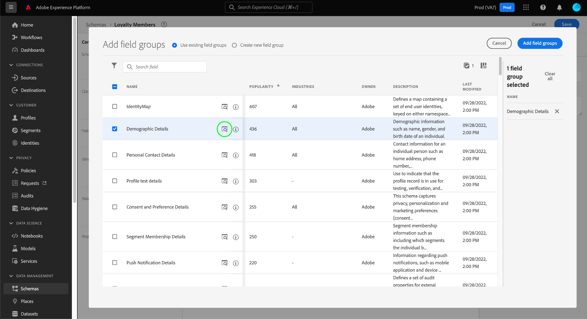

# [!DNL Schema Editor]을 사용하여 스키마 만들기

Adobe Experience Platform 사용자 인터페이스를 사용하면 [!DNL Schema Editor]이라는 대화형 시각적 캔버스에서 [!DNL Experience Data Model] (XDM) 스키마를 만들고 관리할 수 있습니다. 이 자습서에서는 [!DNL Schema Editor]을 사용하여 스키마를 만드는 방법을 설명합니다.

>[!NOTE]
>
>데모 목적으로 이 자습서의 단계에는 고객 충성도 프로그램의 구성원을 설명하는 예제 스키마를 만드는 작업이 포함됩니다. 이러한 단계를 사용하여 고유한 목적으로 다른 스키마를 생성할 수 있지만 먼저 예제 스키마 만들기 와 함께 수행하여 [!DNL Schema Editor] 의 기능을 학습하는 것이 좋습니다.

대신 [!DNL Schema Registry] API를 사용하여 스키마를 작성하려는 경우, [에서 자습서를 시작하기 전에 [[!DNL Schema Registry] 개발자 안내서](../api/getting-started.md)를 참조하여 API](create-schema-api.md)를 사용하여 스키마를 만드십시오.

## 시작하기

이 자습서에서는 스키마 만들기와 관련된 Adobe Experience Platform의 다양한 측면을 이해하고 있어야 합니다. 이 자습서를 시작하기 전에 다음 개념에 대한 설명서를 검토하십시오.

* [[!DNL Experience Data Model (XDM)]](../home.md):고객 경험 데이터를  [!DNL Platform] 구성하는 표준화된 프레임워크입니다.
   * [스키마 작성 기본 사항](../schema/composition.md):클래스, 스키마 필드 그룹, 데이터 유형 및 개별 필드를 비롯한 XDM 스키마 및 해당 빌딩 블록에 대한 개요입니다.
* [[!DNL Real-time Customer Profile]](../../profile/home.md):여러 소스에서 집계된 데이터를 기반으로 통합된 실시간 소비자 프로필을 제공합니다.

## [!UICONTROL 스키마] 작업 공간을 엽니다. {#browse}

[!DNL Platform] UI의 [!UICONTROL 스키마] 작업 영역은 [!DNL Schema Library]에 대한 시각화를 제공하므로 조직에서 사용할 수 있는 스키마를 관리할 수 있습니다. 작업 공간에는 이 자습서 전체에서 스키마를 작성할 수 있는 캔버스인 [!DNL Schema Editor]도 포함되어 있습니다.

[!DNL Experience Platform]에 로그인한 후 왼쪽 탐색에서 **[!UICONTROL 스키마]**&#x200B;를 선택하여 **[!UICONTROL 스키마]** 작업 영역을 엽니다. **[!UICONTROL 찾아보기]** 탭에는 사용자가 보고 사용자 지정할 수 있는 스키마 목록([!DNL Schema Library] 표시)이 표시됩니다. 이 목록에는 스키마의 기반이 되는 이름, 유형, 클래스 및 동작(레코드 또는 시계열)과 스키마가 마지막으로 수정된 날짜 및 시간이 포함됩니다.

자세한 내용은 UI](../ui/explore.md)에서 기존 XDM 리소스 탐색 의 안내서를 참조하십시오.[

## 스키마 만들기 및 이름 지정 {#create}

스키마 작성을 시작하려면 **[!UICONTROL 스키마]** 작업 영역의 오른쪽 상단 모서리에서 **[!UICONTROL 스키마 만들기]**&#x200B;를 선택합니다. 드롭다운 메뉴가 나타나서 코어 클래스 [!UICONTROL XDM 개별 프로필] 및 [!UICONTROL XDM ExperienceEvent] 중에서 선택할 수 있는 옵션을 제공합니다. 이러한 클래스가 사용자의 목적에 맞지 않는 경우 **[!UICONTROL 찾아보기]**&#x200B;를 선택하여 사용 가능한 다른 클래스에서 선택하거나 [새 클래스](#create-new-class)를 만들 수도 있습니다.

이 자습서를 사용하려면 **[!UICONTROL XDM 개별 프로필]**&#x200B;을(를) 선택합니다.

스키마를 기준으로 할 표준 XDM 클래스를 선택했으므로 **[!UICONTROL 필드 그룹 추가]** 대화 상자가 나타나서 스키마에 필드 추가를 즉시 시작할 수 있습니다. 지금은 **[!UICONTROL 취소]** 를 선택하여 대화 상자를 종료합니다.

[!DNL Schema Editor] 이 나타납니다. 스키마를 작성할 캔버스입니다. 제목 없는 스키마는 편집기에 도착할 때 해당 클래스를 기반으로 하는 모든 스키마에 포함된 표준 필드와 함께 캔버스의 **[!UICONTROL 구조]** 섹션에 자동으로 만들어집니다. 스키마에 대해 지정된 클래스도 **[!UICONTROL Composition]** 섹션의 **[!UICONTROL Class]** 아래에 나열됩니다.

>[!NOTE]
>
>스키마를 저장하기 전에 초기 구성 프로세스 중에 언제든지 [스키마](#change-class)의 클래스를 변경할 수 있지만, 이 작업은 매우 신중하게 수행해야 합니다. 필드 그룹은 특정 클래스와 호환되기 때문에 클래스를 변경하면 캔버스 및 추가한 필드가 재설정됩니다.

편집기 오른쪽의 필드를 사용하여 스키마에 대한 표시 이름과 선택적 설명을 제공합니다. 이름을 입력하면 새 스키마 이름을 반영하도록 캔버스가 업데이트됩니다.

스키마 이름을 결정할 때 고려해야 할 몇 가지 중요한 고려 사항이 있습니다.

* 나중에 스키마를 쉽게 찾을 수 있도록 스키마 이름은 짧고 설명적이어야 합니다.
* 스키마 이름은 고유해야 합니다. 즉, 나중에 다시 사용할 수 없도록 충분히 구체적이어야 합니다. 예를 들어, 조직에 다양한 브랜드에 대한 별도의 충성도 프로그램이 있는 경우 나중에 정의할 수 있는 다른 충성도 관련 스키마와 쉽게 구별하도록 하려면 스키마 &quot;Brand A 충성도 멤버&quot;를 지정하는 것이 좋습니다.
* 스키마 설명을 사용하여 스키마와 관련된 추가 컨텍스트 정보를 제공할 수도 있습니다.

이 자습서에서는 충성도 프로그램 멤버와 관련된 데이터를 수집하는 스키마를 사용하므로 스키마의 이름을 &quot;충성도 멤버&quot;로 지정합니다.

## 필드 그룹 {#field-group} 추가

이제 필드 그룹을 추가하여 스키마에 필드를 추가할 수 있습니다. 필드 그룹은 특정 개념을 설명하는 데 함께 사용되는 하나 이상의 필드 그룹입니다. 이 자습서에서는 필드 그룹을 사용하여 충성도 프로그램의 구성원을 설명하고 이름, 생일, 전화 번호, 주소 등의 주요 정보를 캡처합니다.

필드 그룹을 추가하려면 **[!UICONTROL 필드 그룹]** 하위 섹션에서 **[!UICONTROL 추가]**&#x200B;를 선택합니다.

사용 가능한 필드 그룹 목록을 표시하는 새 대화 상자가 나타납니다. 각 필드 그룹은 특정 클래스와 함께 사용하기 위한 것이므로 대화 상자에는 선택한 클래스(이 경우 [!DNL XDM Individual Profile] 클래스)와 호환되는 필드 그룹만 나열됩니다. 표준 XDM 클래스를 사용하는 경우 필드 그룹 목록이 사용 인기도에 따라 지능적으로 정렬됩니다.

목록에서 필드 그룹을 선택하면 오른쪽 레일에 필드 그룹이 표시됩니다. 원하는 경우 여러 필드 그룹을 선택하고, 각 필드 그룹을 오른쪽 레일의 목록에 추가한 후에 확인하면 됩니다. 또한 현재 선택한 필드 그룹의 오른쪽에 아이콘이 표시되어 제공된 필드의 구조를 미리 볼 수 있습니다.

필드 그룹을 미리 볼 때 오른쪽 레일에 필드 그룹의 스키마에 대한 자세한 설명이 제공됩니다. 제공된 캔버스에서 필드 그룹의 필드를 탐색할 수도 있습니다. 다른 필드를 선택하면 오른쪽 레일이 업데이트되어 해당 필드에 대한 세부 사항이 표시됩니다. 미리 보기를 마치면 **[!UICONTROL 뒤로]**&#x200B;를 선택하여 필드 그룹 선택 대화 상자로 돌아갑니다.

이 자습서에서 **[!UICONTROL 인구 통계 세부 정보]** 필드 그룹을 선택한 다음 **[!UICONTROL 필드 그룹 추가]**&#x200B;를 선택합니다.

스키마 캔버스가 다시 나타납니다. 이제 **[!UICONTROL 필드 그룹]** 섹션에는 &quot;[!UICONTROL 인구 통계 세부 정보]&quot;가 나열되며 **[!UICONTROL 구조]** 섹션에는 필드 그룹에서 제공하는 필드가 포함됩니다. **[!UICONTROL 필드 그룹]** 섹션 아래에서 필드 그룹의 이름을 선택하여 캔버스 내에서 제공하는 특정 필드를 강조 표시할 수 있습니다.

이 필드 그룹은 최상위 수준 이름 `person` 아래에 데이터 유형이 &quot;[!UICONTROL Person]&quot;인 여러 필드를 기여합니다. 이 필드 그룹은 이름, 생년월일 및 성별을 포함한 개인에 대한 정보를 설명합니다.

>[!NOTE]
>
>필드는 [!DNL Schema Registry] 내에 정의된 데이터 유형(일반적인 개념을 나타내는 필드 그룹)은 물론 스칼라 유형(문자열, 정수, 배열 또는 날짜 등)을 사용할 수 있습니다.

`name` 필드에는 &quot;[!UICONTROL 개인 이름]&quot;의 데이터 유형이 있습니다. 이는 일반적인 개념을 설명하고 이름, 성, 호칭 및 접미사와 같은 이름 관련 하위 필드를 포함하는 것을 의미합니다.

캔버스 내에서 다른 필드를 선택하여 스키마 구조에 기여하는 추가 필드를 표시합니다.

## 다른 필드 그룹 {#field-group-2} 추가

이제 동일한 단계를 반복하여 다른 필드 그룹을 추가할 수 있습니다. 이번에 **[!UICONTROL 필드 그룹 추가]** 대화 상자를 보면 &quot;[!UICONTROL 인구 통계 세부 정보]&quot; 필드 그룹이 회색으로 표시되어 그 옆에 있는 확인란을 선택할 수 없습니다. 따라서 현재 스키마에 이미 포함시킨 필드 그룹을 실수로 복제할 수 없습니다.

이 자습서의 경우 대화 상자에서 &quot;[!DNL Personal Contact Details]&quot; 필드 그룹을 선택한 다음 **[!UICONTROL 필드 그룹 추가]**&#x200B;를 선택하여 스키마에 추가합니다.

추가한 후에는 캔버스가 다시 나타납니다. &quot;[!UICONTROL 개인 연락처 세부 정보]&quot;는 이제 **[!UICONTROL 구성]** 섹션의 **[!UICONTROL 필드 그룹]** 아래에 나열되며, 홈 주소, 휴대폰 등의 필드를 **[!UICONTROL 구조]**&#x200B;에 추가했습니다.

`name` 필드와 유사하게 방금 추가한 필드는 다중 필드 개념을 나타냅니다. 예를 들어 `homeAddress`에는 &quot;[!UICONTROL 우편 주소]&quot;의 데이터 유형이 있고 `mobilePhone`에는 &quot;[!UICONTROL 전화 번호]&quot;의 데이터 유형이 있습니다. 이러한 각 필드를 선택하여 확장하고 데이터 유형에 포함된 추가 필드를 볼 수 있습니다.

## 사용자 지정 필드 그룹 {#define-field-group} 정의

&quot;[!UICONTROL 충성도 멤버]&quot; 스키마는 충성도 프로그램의 구성원과 관련된 데이터를 캡처하기 위한 것이므로 특정 충성도 관련 필드가 필요합니다.

스키마에 추가하여 충성도 프로그램과 관련된 공통 필드를 캡처할 수 있는 표준 [!UICONTROL 충성도 세부 정보] 필드 그룹이 있습니다. 표준 필드 그룹을 사용하여 스키마에서 캡처된 개념을 나타내는 것이 좋지만 표준 충성도 필드 그룹의 구조가 특정 충성도 프로그램에 대한 모든 관련 데이터를 캡처하지 못할 수 있습니다. 이 시나리오에서는 대신 이러한 필드를 캡처할 새 사용자 지정 필드 그룹을 정의하도록 선택할 수 있습니다.

**[!UICONTROL 필드 그룹 추가]** 대화 상자를 다시 열지만, 이번에는 맨 위에 있는 **[!UICONTROL 새 필드 그룹 만들기]**&#x200B;를 선택합니다. 그런 다음 필드 그룹에 대한 표시 이름과 설명을 제공해야 합니다.

클래스 이름과 마찬가지로 필드 그룹 이름은 필드 그룹이 스키마에 기여하는 것을 설명하는 짧고 간단해야 합니다. 이러한 매개 변수도 고유하므로 이름을 다시 사용할 수 없으므로 고유한지 확인해야 합니다.

이 자습서에서 새 필드 그룹의 이름을 &quot;충성도 세부 사항&quot;으로 지정합니다.

**[!UICONTROL 필드 그룹 추가]**&#x200B;를 선택하여 [!DNL Schema Editor]로 돌아갑니다. &quot;[!UICONTROL 충성도 세부 정보]&quot;는 이제 캔버스 왼쪽에 있는 **[!UICONTROL 필드 그룹]** 아래에 표시되어야 하지만 아직 연결된 필드가 없으므로 **[!UICONTROL 구조]** 아래에 새 필드가 표시되지 않습니다.

## 필드 그룹 {#field-group-fields}에 필드 추가

충성도 세부 사항 필드 그룹을 만들었으므로 이제 필드 그룹이 스키마에 기여할 필드를 정의해야 합니다.

시작하려면 **[!UICONTROL 필드 그룹]** 섹션에서 필드 그룹 이름을 선택합니다. 이렇게 하면 필드 그룹의 속성이 편집기의 오른쪽에 표시되고 **더하기(+)** 아이콘이 **[!UICONTROL 구조]** 아래에 스키마 이름 옆에 표시됩니다.

&quot;[!DNL Loyalty Members]&quot; 옆에 있는 **더하기(+)** 아이콘을 선택하여 구조에 새 노드를 만듭니다. 이 노드(이 예에서 `_tenantId`이라고 함)는 IMS 조직의 테넌트 ID를 나타내며 앞에 밑줄이 표시됩니다. 테넌트 ID가 있는지 여부는 추가하고 있는 필드가 조직의 네임스페이스에 포함되어 있음을 나타냅니다.

즉, 추가하려는 필드는 조직에 고유하며 조직만 액세스할 수 있는 특정 영역의 [!DNL Schema Registry]에 저장됩니다. 정의한 필드는 다른 표준 클래스, 필드 그룹, 데이터 유형 및 필드에서 이름이 있는 충돌을 방지하기 위해 항상 테넌트 네임스페이스에 추가해야 합니다.

이름이 지정된 노드 안에는 &quot;[!UICONTROL 새 필드]&quot;가 있습니다. &quot;[!UICONTROL 충성도 세부 정보]&quot; 필드 그룹의 시작입니다.

편집기 오른쪽의 컨트롤을 사용하여 충성도 관련 필드를 유지하는 데 사용할 &quot;[!UICONTROL Object]&quot; 형식의 `loyalty` 필드를 만들어 보십시오. 완료되면 **[!UICONTROL 적용]**&#x200B;을 선택합니다.

변경 사항이 적용되고 새로 만든 `loyalty` 개체가 나타납니다. 개체 옆에 있는 **더하기(+)** 아이콘을 선택하여 충성도 관련 필드를 추가합니다. &quot;[!UICONTROL 새 필드]&quot;가 나타나고 **[!UICONTROL 필드 속성]** 섹션이 캔버스 오른쪽에 표시됩니다.

각 필드에는 다음 정보가 필요합니다.

* **[!UICONTROL 필드 이름]:** 낙타 케이스로 기록된 필드의 이름입니다. 예:충성도 수준
* **[!UICONTROL 표시 이름]:** 제목 사례에 작성된 필드의 이름입니다. 예:충성도 수준
* **:**  필드의 데이터 유형입니다. 여기에는 기본 스칼라 유형과 [!DNL Schema Registry]에 정의된 데이터 유형이 포함됩니다. 예:[!UICONTROL String], [!UICONTROL 정수], [!UICONTROL 부울], [!UICONTROL 개인], [!UICONTROL 주소], [!UICONTROL 전화 번호] 등
* **[!UICONTROL 설명]:** 필드에 대한 선택적 설명은 문장 대소문자를 구분하고 최대 200자를 포함해야 합니다.

`Loyalty` 개체의 첫 번째 필드는 `loyaltyId` 라는 문자열입니다. 새 필드의 유형을 &quot;[!UICONTROL 문자열]&quot;로 설정할 때 **[!UICONTROL 필드 속성]** 섹션은 기본값, 형식 및 최대 길이를 포함하여 제한을 적용하기 위한 여러 옵션으로 채워집니다.

선택한 데이터 유형에 따라 다른 제한 옵션을 사용할 수 있습니다. `loyaltyId`은(는) 이메일 주소이므로 **[!UICONTROL 형식]** 드롭다운 메뉴에서 &quot;[!UICONTROL 이메일]&quot;을 선택합니다. **[!UICONTROL 적용]**&#x200B;을 선택하여 변경 사항을 적용합니다.

## 필드 그룹 {#field-group-fields-2}에 필드를 더 추가합니다

이제 `loyaltyId` 필드를 추가했으므로 추가 필드를 추가하여 다음과 같은 충성도 관련 정보를 캡처할 수 있습니다.

* 포인트(정수)
* 이후 멤버(날짜)

각 필드를 스키마에 추가하려면 `loyalty` 개체 옆에 있는 **더하기(+)** 아이콘을 선택하고 필요한 정보를 입력합니다.

완료되면 충성도 개체에는 충성도 ID, 포인트 및 멤버-이후의 필드가 포함됩니다.

## 필드 그룹에 열거형 필드 추가 {#enum}

[!DNL Schema Editor]에서 필드를 정의할 때 필드에 포함할 수 있는 데이터에 추가 제한을 제공하기 위해 기본 필드 유형에 적용할 수 있는 몇 가지 추가 옵션이 있습니다. 이러한 제약 조건에 대한 사용 사례는 다음 표에 설명되어 있습니다.

| 제한 | 설명 |
| --- | --- |
| [!UICONTROL 필수 여부] | 필드가 데이터 처리에 필수임을 나타냅니다. 이 필드를 포함하지 않는 이 스키마를 기반으로 데이터 세트에 업로드된 모든 데이터는 수집 시 실패합니다. |
| [!UICONTROL 어레이] | 필드에 각각 데이터 유형이 지정된 값의 배열이 포함되어 있음을 나타냅니다. 예를 들어 데이터 유형이 &quot;[!UICONTROL String]&quot;인 필드에 이 제약 조건을 사용하면 필드에 문자열 배열이 포함되도록 지정합니다. |
| [!UICONTROL 열거형] | 이 필드에는 가능한 값을 열거한 목록에서 값 중 하나가 포함되어야 함을 나타냅니다. |
| [!UICONTROL ID] | 이 필드가 ID 필드임을 나타냅니다. ID 필드에 대한 자세한 내용은 이 자습서](#identity-field)에서 [을 참조하십시오. |
| [!UICONTROL 관계] | 스키마 관계는 결합 스키마와 [!DNL Real-time Customer Profile]을 사용하여 유추할 수 있지만 동일한 클래스를 공유하는 스키마에만 적용됩니다. [!UICONTROL Relationship] 제약 조건은 이 필드가 다른 클래스를 기반으로 한 스키마의 기본 ID를 참조하고 두 스키마 간의 관계를 의미함을 나타냅니다. 자세한 내용은 [관계 정의](./relationship-ui.md)의 자습서를 참조하십시오. |

{style=&quot;table-layout:auto&quot;}

>[!NOTE]
>
>필수, ID 또는 관계 필드가 왼쪽 레일에 표시되므로 스키마의 복잡성에 관계없이 이러한 필드를 쉽게 찾을 수 있습니다.
>
>

이 자습서의 경우 스키마에 있는 [!DNL "loyalty"] 개체에는 고객의 &quot;충성도 수준&quot;을 설명하는 새 열거형 필드가 필요합니다. 여기서 값은 가능한 4개의 옵션 중 하나일 수 있습니다. 이 필드를 스키마에 추가하려면 `loyalty` 개체 옆의 **더하기(+)** 아이콘을 선택하고 **[!UICONTROL 필드 이름]** 및 **[!UICONTROL 표시 이름]**&#x200B;에 필요한 필드를 채웁니다. **[!UICONTROL Type]**&#x200B;에 대해 &quot;[!UICONTROL String]&quot;을 선택합니다.

**[!UICONTROL Array]**, **[!UICONTROL Enum]** 및 **[!UICONTROL Identity]**&#x200B;에 대한 확인란을 포함하여 해당 유형을 선택한 후에 필드에 대한 추가 확인란이 표시됩니다.

아래의 **[!UICONTROL 열거형 값]** 섹션을 열려면 **[!UICONTROL 열거형]** 확인란을 선택하십시오. 여기에서 허용되는 각 충성도 수준에 대해 **[!UICONTROL 값]**(camelCase)과 **[!UICONTROL Label]**(제목 케이스의 선택적 읽기 전용 이름)을 입력할 수 있습니다.

모든 필드 속성을 완료했으면 **[!UICONTROL 적용]**&#x200B;을 선택하여 &quot;[!DNL loyaltyLevel]&quot; 필드를 `loyalty` 개체에 추가합니다.

## 다중 필드 개체를 데이터 형식으로 변환 {#datatype}

이제 `loyalty` 개체에는 몇 개의 충성도 관련 필드가 포함되어 있으며, 다른 스키마에서 유용할 수 있는 일반적인 데이터 구조를 나타냅니다. [!DNL Schema Editor]을 사용하면 해당 객체의 구조를 데이터 유형으로 변환하여 재사용 가능한 다중 필드 객체를 쉽게 적용할 수 있습니다.

데이터 유형을 사용하면 여러 필드 구조를 일관성 있게 사용할 수 있으며 스키마 내의 어디에서든 사용할 수 있으므로 필드 그룹보다 더 유연하게 대처할 수 있습니다. 이 작업은 필드의 **[!UICONTROL Type]** 값을 [!DNL Schema Registry]에 정의된 데이터 유형의 값으로 설정하여 수행합니다.

`loyalty` 개체를 데이터 유형으로 변환하려면 **[!UICONTROL 구조]**&#x200B;에서 `loyalty` 필드를 선택한 다음 **[!UICONTROL 편집기 오른쪽의**[!UICONTROL &#x200B;필드 속성&#x200B;]**아래에서 새 데이터 형식]**&#x200B;으로 변환 을 선택합니다. 객체가 성공적으로 변환되었는지 확인하는 녹색 팝오버가 나타납니다.

이제 **[!UICONTROL 구조]** 아래에서 보면 `loyalty` 필드에 &quot;[!DNL Loyalty]&quot;의 데이터 유형이 있고 필드의 옆에 작은 잠금 아이콘이 있어서 개별 필드가 아니라 다중 필드 데이터 유형의 일부임을 알 수 있습니다.

향후 스키마에서 필드를 &quot;[!DNL Loyalty]&quot; 유형으로 할당할 수 있으며 ID, 로열티 수준, 이후의 멤버 및 포인트에 대한 필드가 자동으로 포함됩니다.

>[!NOTE]
>
>스키마 편집과 별도로 사용자 지정 데이터 유형을 만들고 편집할 수도 있습니다. 자세한 내용은 [데이터 유형 만들기 및 편집](../ui/resources/data-types.md)에 대한 안내서를 참조하십시오.

## 스키마 필드 검색 및 필터링

이제 스키마에 기본 클래스에서 제공하는 필드 외에 여러 필드 그룹이 포함됩니다. 더 큰 스키마로 작업하는 경우 왼쪽 레일의 필드 그룹 이름 옆에 있는 확인란을 선택하여 표시된 필드를 원하는 필드 그룹에서 제공하는 필드로만 필터링할 수 있습니다.

스키마에서 특정 필드를 찾고 있는 경우, 검색 창을 사용하여 표시되는 필드를 제공된 필드 그룹에 관계없이 이름별로 필터링할 수도 있습니다.

>[!IMPORTANT]
>
>검색 함수는 일치하는 필드를 표시할 때 선택한 필드 그룹 필터를 고려합니다. 검색 쿼리에 예상한 결과가 표시되지 않으면 관련 필드 그룹을 필터링하지 않았는지 다시 확인해야 할 수 있습니다.

## 스키마 필드를 ID 필드 {#identity-field}로 설정

스키마가 제공하는 표준 데이터 구조는 여러 소스에서 동일한 개인에게 속하는 데이터를 식별하는 데 활용할 수 있으므로 세그먼테이션, 보고, 데이터 과학 분석 등과 같은 다양한 다운스트림 사용 사례를 수행할 수 있습니다. 개별 ID를 기반으로 데이터를 결합하려면 적용 가능한 스키마 내에서 키 필드를 [!UICONTROL Identity] 필드로 표시해야 합니다.

[!DNL Experience Platform] 에서는 ID 확인란을 사용하여 ID 필드를  **** 쉽게 표시할 수  [!DNL Schema Editor]있습니다. 하지만 데이터의 특성을 기반으로 ID로 사용할 가장 적합한 필드를 결정해야 합니다.

예를 들어 동일한 &quot;충성도 수준&quot;에 속하는 충성도 프로그램 멤버가 수천 명 있을 수 있지만 충성도 프로그램의 각 멤버에는 고유한 `loyaltyId`(이 경우 개별 구성원의 이메일 주소)이 있습니다. `loyaltyId`이 각 멤버에 대한 고유 식별자임을 확인하면 ID 필드에 적합한 후보이지만 `loyaltyLevel`은(는) 아닙니다.

>[!IMPORTANT]
>
>아래 요약된 단계에서는 기존 스키마 필드에 ID 설명자를 추가하는 방법을 설명합니다. 스키마 자체의 구조 내에서 ID 필드를 정의하는 대신 `identityMap` 필드를 사용하여 ID 정보를 대신 포함할 수도 있습니다.
>
>`identityMap` 을 사용할 계획이라면 스키마에 추가하는 기본 ID를 직접 재정의한다는 점을 기억하십시오. 자세한 내용은 스키마 구성 안내서](../schema/composition.md#identityMap)의 [기본 사항 중 `identityMap`에 있는 섹션을 참조하십시오.

편집기의 **[!UICONTROL 구조]** 섹션에서 `loyaltyId` 필드를 선택하고 **[!UICONTROL 필드 속성]** 아래에 **[!UICONTROL ID]** 확인란이 표시됩니다. 확인란을 선택하고 옵션을 **[!UICONTROL 기본 ID]**&#x200B;로 설정합니다. 이 상자도 선택하십시오.

>[!NOTE]
>
>각 스키마에는 기본 ID 필드가 하나만 포함될 수 있습니다. 스키마 필드를 기본 ID로 설정하면 나중에 스키마의 다른 ID 필드를 기본 ID로 설정하려고 하면 오류 메시지가 표시됩니다.

다음으로, 드롭다운의 사전 정의된 네임스페이스 목록에서 **[!UICONTROL ID 네임스페이스]**&#x200B;를 제공해야 합니다. `loyaltyId`은(는) 고객의 이메일 주소이므로 드롭다운에서 &quot;[!UICONTROL 이메일]&quot;을 선택합니다. **[!UICONTROL 적용]**&#x200B;을 선택하여 `loyaltyId` 필드에 대한 업데이트를 확인합니다.

>[!NOTE]
>
>표준 네임스페이스 및 해당 정의 목록을 보려면 [[!DNL Identity Service] 설명서](../../identity-service/troubleshooting-guide.md#standard-namespaces)를 참조하십시오.

변경 사항을 적용한 후 `loyaltyId`에 대한 아이콘에 이제 ID 필드임을 나타내는 지문 기호가 표시됩니다.

이제 `loyaltyId` 필드에 수집된 모든 데이터를 사용하여 해당 개인을 식별하고 해당 고객의 단일 보기를 함께 결합합니다. [!DNL Experience Platform]에서 ID로 작업하는 방법에 대한 자세한 내용은 [[!DNL Identity Service]](../../identity-service/home.md) 설명서를 참조하십시오.

## [!DNL Real-time Customer Profile]에서 사용할 스키마를 사용하도록 설정 {#profile}

[[!DNL Real-time Customer Profile]](../../profile/home.md) 의 id 데이터 [!DNL Experience Platform] 를 활용하여 각 개별 고객을 전체적으로 확인할 수 있습니다. 이 서비스는 [!DNL Experience Platform]과 통합된 모든 시스템에서 고객이 타임스탬프가 지정된 계정과 고객 속성의 강력한 360° 프로필을 빌드합니다.

[!DNL Real-time Customer Profile]에서 사용할 수 있도록 스키마를 활성화하려면 기본 ID가 정의되어 있어야 합니다. 기본 ID를 먼저 정의하지 않고 스키마를 활성화하려고 하면 오류 메시지가 표시됩니다.

 

[!DNL Profile]에 사용할 &quot;충성도 멤버&quot; 스키마를 활성화하려면, 먼저 편집기의 **[!UICONTROL 구조]** 섹션에서 &quot;[!DNL Loyalty Members]&quot;을 선택합니다.

편집기 오른쪽에는 표시 이름, 설명 및 유형을 포함한 스키마에 대한 정보가 표시됩니다. 이 정보 외에 **[!UICONTROL 프로필]** 전환 단추가 있습니다.

**[!UICONTROL 프로필]**&#x200B;을 선택하면 팝오버가 나타나고 [!DNL Profile]에 대한 스키마를 활성화할지 확인하는 메시지가 나타납니다.

 

>[!WARNING]
>
>[!DNL Real-time Customer Profile]에 대해 스키마가 활성화되고 저장되면 비활성화할 수 없습니다.

**[!UICONTROL 활성화]**&#x200B;를 선택하여 선택 사항을 확인합니다. 원할 경우 **[!UICONTROL 프로필]** 전환을 다시 선택하여 스키마를 비활성화할 수 있지만 [!DNL Profile] 가 활성화된 상태에서 스키마가 저장되면 더 이상 비활성화할 수 없습니다.

## 다음 단계 및 추가 리소스

이제 스키마 작성을 완료했으므로 캔버스에서 전체 스키마를 볼 수 있습니다. **[!UICONTROL 저장]**&#x200B;을 선택하면 스키마가 [!DNL Schema Library]에 저장되고 [!DNL Schema Registry]에서 액세스할 수 있습니다.

이제 새 스키마를 사용하여 데이터를 [!DNL Platform]에 수집할 수 있습니다. 스키마를 사용하여 데이터를 수집하면 추가 변경만 수행할 수 있습니다. 스키마 버전 관리에 대한 자세한 내용은 스키마 구성](../schema/composition.md)의 [기본 사항 을 참조하십시오.

이제 UI](./relationship-ui.md)에서 스키마 관계를 정의하는 [의 자습서에 따라 &quot;충성도 멤버&quot; 스키마에 새 관계 필드를 추가할 수 있습니다.

&quot;충성도 멤버&quot; 스키마는 [!DNL Schema Registry] API를 사용하여 보고 관리할 수도 있습니다. API 작업을 시작하려면 [[!DNL Schema Registry API] 개발자 안내서](../api/getting-started.md)를 읽어 보십시오.

### 비디오 리소스

>[!WARNING]
>
>다음 비디오에 표시된 [!DNL Platform] UI가 만료되었습니다. 최신 UI 스크린샷 및 기능은 위의 설명서를 참조하십시오.

다음 비디오에서는 [!DNL Platform] UI에서 간단한 스키마를 만드는 방법을 보여줍니다.

>[!VIDEO](https://video.tv.adobe.com/v/27012?quality=12&learn=on)

다음 비디오에서는 필드 그룹 및 클래스 작업에 대한 이해를 돕기 위한 것입니다.

>[!VIDEO](https://video.tv.adobe.com/v/27013?quality=12&learn=on)

## 부록

다음 섹션에서는 [!DNL Schema Editor] 사용과 관련된 추가 정보를 제공합니다.

### 새 클래스 {#create-new-class} 만들기

[!DNL Experience Platform] 는 조직에 고유한 클래스를 기반으로 스키마를 정의할 수 있는 유연성을 제공합니다. 새 클래스를 만드는 방법에 대해 알아보려면 [UI](../ui/resources/classes.md#create)에서 클래스 만들기 및 편집에 대한 안내서를 참조하십시오.

### 스키마 {#change-class} 클래스 변경

스키마를 저장하기 전에 초기 구성 프로세스 중에 언제든지 스키마 클래스를 변경할 수 있습니다.

>[!WARNING]
>
>스키마에 대한 클래스 재지정은 매우 신중하게 수행해야 합니다. 필드 그룹은 특정 클래스와 호환되기 때문에 클래스를 변경하면 캔버스 및 추가한 필드가 재설정됩니다.

스키마의 클래스를 변경하는 방법에 대한 자세한 내용은 UI](../ui/resources/schemas.md)의 스키마 관리 안내서를 참조하십시오.[
