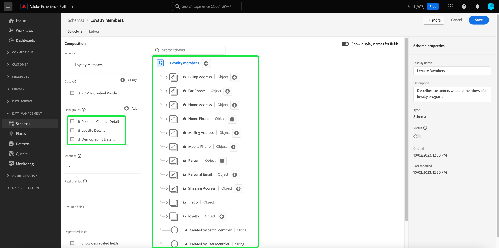

# 를 사용하여 스키마 만들기 [!DNL Schema Editor]

Adobe Experience Platform 사용자 인터페이스를 사용하여 를 만들고 관리할 수 있습니다 [!DNL Experience Data Model] (XDM) 스키마를 호출한 대화형 시각적 캔버스 [!DNL Schema Editor]. 이 자습서에서는 를 사용하여 스키마를 만드는 방법을 다룹니다. [!DNL Schema Editor].

데모 목적으로 이 자습서의 단계에는 고객 충성도 프로그램의 구성원을 설명하는 예제 스키마 생성이 포함됩니다. 이러한 단계를 사용하여 고유한 목적에 맞는 다른 스키마를 생성할 수 있지만 먼저 예제 스키마를 생성할 때 의 기능을 학습하는 것이 좋습니다 [!DNL Schema Editor].

>[!NOTE]
>
>CSV 데이터를 플랫폼으로 수집하는 경우 [해당 데이터를 AI가 생성한 권장 사항에 의해 생성된 XDM 스키마에 매핑합니다](../../ingestion/tutorials/map-csv/recommendations.md) (현재 Beta 버전). 직접 스키마를 생성할 필요가 없습니다.
>
>를 사용하여 스키마를 구성하려는 경우 [!DNL Schema Registry] API, 다음 읽기로 시작 [[!DNL Schema Registry] 개발자 안내서](../api/getting-started.md) 에 대한 자습서를 시도하기 전에 [api를 사용하여 스키마 만들기](create-schema-api.md).

## 시작하기

이 자습서에서는 스키마 만들기와 관련된 Adobe Experience Platform의 다양한 측면에 대한 작업 이해가 필요합니다. 이 자습서를 시작하기 전에 다음 개념에 대한 설명서를 검토하십시오.

* [[!DNL Experience Data Model (XDM)]](../home.md): 표준화된 프레임워크 [!DNL Platform] 고객 경험 데이터를 구성합니다.
   * [스키마 컴포지션 기본 사항](../schema/composition.md): 클래스, 스키마 필드 그룹, 데이터 유형 및 개별 필드를 포함한 XDM 스키마 및 해당 빌딩 블록의 개요입니다.
* [[!DNL Real-Time Customer Profile]](../../profile/home.md): 여러 소스의 집계 데이터를 기반으로 통합 실시간 소비자 프로필을 제공합니다.

## 를 엽니다. [!UICONTROL 스키마] 작업 영역 {#browse}

다음 [!UICONTROL 스키마] 의 작업 공간 [!DNL Platform] UI는 의 시각화를 제공합니다. [!DNL Schema Library]를 사용하여 조직에서 사용할 수 있는 스키마 관리를 볼 수 있습니다. 작업 공간에는 [!DNL Schema Editor]: 이 자습서 전체에서 스키마를 구성할 수 있는 캔버스입니다.

에 로그인한 후 [!DNL Experience Platform], 선택 **[!UICONTROL 스키마]** 을(를) 왼쪽 탐색에서 **[!UICONTROL 스키마]** 작업 영역. 다음 **[!UICONTROL 찾아보기]** 탭에는 스키마 목록(의 표시)이 표시됩니다. [!DNL Schema Library])을 클릭하여 제품에서 사용할 수 있습니다. 이 목록에는 스키마의 기반이 되는 이름, 유형, 클래스 및 동작(레코드 또는 시계열)과 스키마가 마지막으로 수정된 날짜 및 시간이 포함됩니다.

다음 안내서를 참조하십시오 [ui에서 기존 XDM 리소스 살펴보기](../ui/explore.md) 추가 정보.

## 스키마 만들기 및 이름 지정 {#create}

스키마 작성을 시작하려면 다음을 선택합니다. **[!UICONTROL 스키마 만들기]** 의 오른쪽 위 모서리 **[!UICONTROL 스키마]** 작업 영역.

![다음 [!UICONTROL 스키마] 작업 영역 [!UICONTROL 찾아보기] 탭 [!UICONTROL 스키마 만들기] 강조 표시됨.](../images/tutorials/create-schema/create-schema-button.png)

다음 [!UICONTROL 스키마 만들기] 워크플로가 나타납니다. 그런 다음 스키마의 기본 클래스를 선택합니다. 의 핵심 클래스 중에서 선택할 수 있습니다. [!UICONTROL XDM 개별 프로필] 및 [!UICONTROL XDM ExperienceEvent], 또는 [!UICONTROL 기타] 만약 이 수업들이 당신의 목적에 맞지 않는다면. 다음 [!UICONTROL 기타] 클래스 옵션을 사용하면 다음 중 하나를 수행할 수 있습니다. [새 클래스 만들기](#create-new-class) 또는 다른 기존 클래스 중에서 선택할 수 있습니다.

다음을 참조하십시오. [XDM 개별 프로필](../classes/individual-profile.md) 및 [XDM ExperienceEvent](../classes/experienceevent.md) 설명서입니다. 이 자습서에서는 다음을 선택하십시오. **[!UICONTROL XDM 개별 프로필]** 뒤에 오는 **[!UICONTROL 다음]**.

<!--  -->

<!-- You can  by selecting either **[!UICONTROL Individual Profile]**, **[!UICONTROL Experience Event]**, or **[!UICONTROL Other]**, followed by **[!UICONTROL Next]** to confirm your choice.  -->

![다음 [!UICONTROL 스키마 만들기] 을 사용한 워크플로우 [!UICONTROL XDM 개별 프로필] 옵션 및 [!UICONTROL 다음] 강조 표시됨.](../images/tutorials/create-schema/individual-profile-base-class.png)

클래스를 선택한 후 [!UICONTROL 이름 및 검토] 섹션이 나타납니다. 이 섹션에서는 스키마를 식별하기 위한 이름과 설명을 제공합니다. 스키마의 이름을 결정할 때 고려해야 할 몇 가지 중요한 사항이 있습니다.

* 나중에 스키마를 쉽게 찾을 수 있도록 스키마 이름은 짧고 설명적이어야 합니다.
* 스키마 이름은 고유해야 합니다. 즉, 나중에 다시 사용되지 않을 만큼 구체적이어야 합니다. 예를 들어 조직에 다른 브랜드에 대한 별도의 충성도 프로그램이 있는 경우 나중에 정의할 수 있는 다른 충성도 관련 스키마와 쉽게 구분할 수 있도록 스키마 이름을 &quot;브랜드 A 충성도 멤버&quot;로 지정하는 것이 좋습니다.
* 스키마 설명을 사용하여 스키마와 관련된 추가 컨텍스트 정보를 제공할 수도 있습니다.

이 자습서에서는 충성도 프로그램의 구성원과 관련된 데이터를 수집하기 위한 스키마를 구성하므로 스키마 이름이 &quot;로 지정됩니다.[!DNL Loyalty Members]&quot;.

&#x200B; 선택한 클래스와 스키마 구조를 검토하고 확인할 수 있도록 스키마의 기본 구조(클래스에서 제공)가 캔버스에 표시됩니다.

친숙한 사용자 입력 [!UICONTROL 스키마 표시 이름] 텍스트 필드에서 다음을 수행합니다. 그런 다음 스키마를 식별하는 데 도움이 되는 적절한 설명을 입력합니다. 스키마 구조를 검토하고 설정이 마음에 들면 을 선택합니다. **[!UICONTROL 완료]** 을 클릭하여 스키마를 만듭니다.

![다음 [!UICONTROL 이름 및 검토] 의 섹션 [!UICONTROL 스키마 만들기] 을 사용한 워크플로우 [!UICONTROL 스키마 표시 이름], [!UICONTROL 설명], 및 [!UICONTROL 완료] 강조 표시됨.](../images/ui/resources/schemas/name-and-review.png)

다음 [!DNL Schema Editor] 가 표시됩니다. 스키마를 구성할 캔버스입니다. 자체 제목 스키마는에서 자동으로 만들어집니다. **[!UICONTROL 구조]** 선택한 기본 클래스에 포함된 표준 필드와 함께 편집기에 도착할 때 캔버스의 섹션입니다. 스키마에 할당된 클래스도 아래에 나열됩니다. **[!UICONTROL 클래스]** 위치: **[!UICONTROL 컴포지션]** 섹션.

>[!NOTE]
>
>에서 스키마에 대한 표시 이름 및 설명(선택 사항)을 업데이트할 수 있습니다.  **[!UICONTROL 스키마 속성]** 사이드바. 새 이름을 입력하면 스키마의 새 이름을 반영하도록 캔버스가 자동으로 업데이트됩니다.

>[!NOTE]
>
>다음을 수행할 수 있습니다. [스키마 클래스 변경](#change-class) 스키마가 저장되기 전에 초기 구성 프로세스 중에 언제든지 이 작업을 수행할 수 있지만 주의하여 수행해야 합니다. 필드 그룹은 특정 클래스와만 호환되므로 클래스를 변경하면 캔버스와 추가한 모든 필드가 재설정됩니다.

## 필드 그룹 추가 {#field-group}

이제 필드 그룹을 추가하여 스키마에 필드를 추가할 수 있습니다. 필드 그룹은 특정 개념을 설명하는 데 종종 함께 사용되는 하나 이상의 필드 그룹입니다. 이 자습서에서는 필드 그룹을 사용하여 충성도 프로그램의 구성원을 설명하고 이름, 생일, 전화 번호, 주소 등의 주요 정보를 캡처합니다.

필드 그룹을 추가하려면 다음을 선택합니다 **[!UICONTROL 추가]** 다음에서 **[!UICONTROL 필드 그룹]** 하위 섹션.

사용 가능한 필드 그룹 목록을 표시하는 새 대화 상자가 나타납니다. 각 필드 그룹은 특정 클래스와 함께 사용하기 위한 것이므로 선택한 클래스와 호환되는 필드 그룹만 대화 상자에 나열됩니다(이 경우 [!DNL XDM Individual Profile] class). 표준 XDM 클래스를 사용하는 경우 필드 그룹 목록은 사용 빈도에 따라 지능적으로 정렬됩니다.

![다음 [!UICONTROL 필드 그룹 추가] 대화 상자.](../images/tutorials/create-schema/field-group-popularity.png)

왼쪽 레일에서 필터 중 하나를 선택하여 표준 필드 그룹 목록을 특정 목록으로 좁힐 수 있습니다 [업종](../schema/industries/overview.md) 소매, 금융 서비스, 의료 서비스 등 다양한 서비스를 제공합니다.

![다음 [!UICONTROL 필드 그룹 추가] 업계 필드 그룹이 강조 표시된 대화 상자.](../images/tutorials/create-schema/industry-field-groups.png)

목록에서 필드 그룹을 선택하면 오른쪽 레일에 표시됩니다. 원할 경우 여러 필드 그룹을 선택하고 확인하기에 앞서 각 필드 그룹을 오른쪽 레일의 목록에 추가할 수 있습니다. 또한 현재 선택한 필드 그룹의 오른쪽에 아이콘이 표시되어 제공되는 필드의 구조를 미리 볼 수 있습니다.

![다음 [!UICONTROL 필드 그룹 추가] 선택한 필드 그룹 미리 보기 아이콘이 강조 표시된 대화 상자.](../images/tutorials/create-schema/preview-field-group-button.png)

필드 그룹을 미리 볼 때 필드 그룹의 스키마에 대한 자세한 설명이 오른쪽 레일에 제공됩니다. 제공된 캔버스에서 필드 그룹의 필드를 탐색할 수도 있습니다. 다른 필드를 선택하면 오른쪽 레일이 업데이트되어 해당 필드에 대한 세부 정보가 표시됩니다. 선택 **[!UICONTROL 뒤로]** 미리 보기를 완료하여 필드 그룹 선택 대화 상자로 돌아가는 경우.

![다음 [!UICONTROL 필드 그룹 미리 보기] 인구 통계 세부 정보 필드 그룹을 미리 본 대화 상자.](../images/tutorials/create-schema/preview-field-group.png)

이 자습서에서 **[!UICONTROL 인구 통계 세부 정보]** 필드 그룹을 선택한 다음 **[!UICONTROL 필드 그룹 추가]**.

![다음 [!UICONTROL 필드 그룹 추가] 인구 통계 세부 정보 필드 그룹이 선택되어 있고 [!UICONTROL 필드 그룹 추가] 강조 표시됨.](../images/tutorials/create-schema/demographic-details.png)

스키마 캔버스가 다시 나타납니다. 다음 **[!UICONTROL 필드 그룹]** 섹션에 이제 &quot; 목록이 표시됩니다.[!UICONTROL 인구 통계 세부 정보]&quot; 및 **[!UICONTROL 구조]** 섹션에는 필드 그룹에서 기여한 필드가 포함됩니다. 아래에서 필드 그룹의 이름을 선택할 수 있습니다 **[!UICONTROL 필드 그룹]** 섹션을 통해 캔버스 내에서 제공하는 특정 필드를 강조 표시합니다.

이 필드 그룹은 최상위 수준 이름 아래에 여러 필드를 기여합니다. `person` (데이터 유형 포함)[!UICONTROL 개인]&quot;. 이 필드 그룹은 이름, 생년월일 및 성별을 포함하여 개인에 대한 정보를 설명합니다.

>[!NOTE]
>
>필드는 내에 정의된 데이터 형식(일반적인 개념을 나타내는 필드 그룹)뿐만 아니라 스칼라 형식(예: 문자열, 정수, 배열 또는 날짜)을 사용할 수 있습니다. [!DNL Schema Registry].

다음 사항에 주목하십시오. `name` 필드의 데이터 형식은 &quot;&quot;입니다[!UICONTROL 전체 이름]&quot;: 일반적인 개념을 설명하고 이름, 성, 경칭 및 접미사와 같은 이름 관련 하위 필드를 포함하는 것을 의미합니다.

캔버스 내에서 다른 필드를 선택하여 스키마 구조에 기여하는 추가 필드를 표시합니다.

## 더 많은 필드 그룹 추가 {#field-group-2}

이제 동일한 단계를 반복하여 다른 필드 그룹을 추가할 수 있습니다. 다음을 볼 때 **[!UICONTROL 필드 그룹 추가]** 이 대화 상자에서 &quot;[!UICONTROL 인구 통계 세부 정보]&quot;필드 그룹이 회색으로 표시되었으며 필드 그룹 옆에 있는 확인란을 선택할 수 없습니다. 이렇게 하면 이미 현재 스키마에 포함된 필드 그룹을 실수로 복제할 수 없습니다.

이 자습서에서는 표준 필드 그룹을 선택합니다 **[!UICONTROL 개인 연락처 세부 정보]** 및 **[!UICONTROL 고객 충성도 세부 정보]** 목록에서 을(를) 선택한 다음 **[!UICONTROL 필드 그룹 추가]** 를 클릭하여 스키마에 추가합니다.

![다음 [!UICONTROL 필드 그룹 추가] 두 개의 새 필드 그룹이 선택되고 [!UICONTROL 필드 그룹 추가] 강조 표시됨.](../images/tutorials/create-schema/more-field-groups.png)

아래에 추가된 필드 그룹이 나열된 캔버스가 다시 나타납니다. **[!UICONTROL 필드 그룹]** 다음에서 **[!UICONTROL 컴포지션]** 섹션 및 스키마 구조에 추가된 해당 합성 필드

## 사용자 정의 필드 그룹 정의 {#define-field-group}

다음 [!UICONTROL 고객 충성도 멤버] 스키마는 고객 충성도 프로그램의 멤버 및 표준과 관련된 데이터를 캡처하기 위한 것입니다. [!UICONTROL 고객 충성도 세부 정보] 스키마에 추가한 필드 그룹은 프로그램 유형, 포인트, 조인 날짜 등을 포함하여 이러한 기능 대부분을 제공합니다.

그러나 사용 사례를 달성하기 위해 표준 필드 그룹에서 다루지 않는 추가 사용자 정의 필드를 포함하려는 시나리오가 있을 수 있습니다. 사용자 정의 충성도 필드를 추가하는 경우 두 가지 옵션이 있습니다.

1. 이러한 필드를 캡처할 새 사용자 정의 필드 그룹을 만듭니다. 이 방법은 이 자습서에서 다룹니다.
1. 표준 확장 [!UICONTROL 고객 충성도 세부 정보] 사용자 정의 필드가 있는 필드 그룹. 이로 인해 [!UICONTROL 고객 충성도 세부 정보] 을(를) 사용자 정의 필드 그룹으로 변환하고, 원본 표준 필드 그룹을 더 이상 사용할 수 없습니다. 다음을 참조하십시오. [!UICONTROL 스키마] 에 대한 자세한 내용은 UI 안내서 를 참조하십시오. [표준 필드 그룹 구조에 사용자 정의 필드 추가](../ui/resources/schemas.md#custom-fields-for-standard-groups).

새 필드 그룹을 만들려면 **[!UICONTROL 추가]** 다음에서 **[!UICONTROL 필드 그룹]** 이전과 같은 하위 섹션이지만 이번에는 **[!UICONTROL 새 필드 그룹 만들기]** 표시되는 대화 상자의 상단 근처에 있습니다. 그런 다음 새 필드 그룹의 표시 이름과 설명을 입력하라는 메시지가 표시됩니다. 이 자습서의 경우 새 필드 그룹의 이름을 로 지정합니다.[!DNL Custom Loyalty Details]&quot;, 그런 다음 선택 **[!UICONTROL 필드 그룹 추가]**.

![다음 [!UICONTROL 필드 그룹 추가] 대화 상자 [!UICONTROL 새 필드 그룹 만들기], [!UICONTROL 표시 이름] 및 [!UICONTROL 설명] 강조 표시됨.](../images/tutorials/create-schema/create-new-field-group.png)

>[!NOTE]
>
>클래스 이름과 마찬가지로 필드 그룹 이름은 필드 그룹이 스키마에 기여할 내용을 설명하는 짧고 간단해야 합니다. 이러한 속성도 고유하므로 이름을 다시 사용할 수 없으므로 이름이 충분히 구체적인지 확인해야 합니다.

&quot;[!DNL Custom Loyalty Details]이제 &quot;&quot;가 아래에 표시되어야 합니다. **[!UICONTROL 필드 그룹]** 캔버스의 왼쪽에 있지만 아직 연결된 필드가 없으므로 아래에 새 필드가 표시되지 않습니다. **[!UICONTROL 구조]**.

## 필드 그룹에 필드 추가 {#field-group-fields}

이제 을(를) 만들었으므로[!DNL Custom Loyalty Details]&quot;필드 그룹, 필드 그룹이 스키마에 기여할 필드를 정의할 때입니다.

시작하려면 다음을 선택합니다 **더하기(+)** (캔버스에서 스키마 이름 옆에 있는 아이콘)

An &quot;[!UICONTROL 제목 없는 필드]&quot; 자리 표시자가 캔버스에 나타나고 오른쪽 레일이 업데이트되어 필드에 대한 구성 옵션이 표시됩니다.

![스키마 편집기 [!UICONTROL 제목 없는 필드] 및 스키마 [!UICONTROL 필드 속성] 강조 표시됨.](../images/tutorials/create-schema/untitled-field.png)

이 시나리오에서는 스키마에 개인의 현재 충성도 계층을 자세히 설명하는 오브젝트 유형 필드가 있어야 합니다. 오른쪽 레일의 컨트롤을 사용하여 `loyaltyTier` 유형이 &quot; &quot;인 필드[!UICONTROL 오브젝트]&quot;관련 필드를 보관하는 데 사용됩니다.

아래 **[!UICONTROL 할당 대상]**&#x200B;를 설정하는 경우 필드를 할당할 필드 그룹을 선택해야 합니다. 모든 스키마 필드는 클래스 또는 필드 그룹에 속하며 이 스키마는 표준 클래스를 사용하므로 필드 그룹을 선택하는 것이 유일한 옵션입니다. &quot; 이름을 입력하십시오.[!DNL Custom Loyalty Details]&quot;그런 다음 목록에서 필드 그룹을 선택합니다.

완료되면 다음을 선택합니다. **[!UICONTROL 적용]**.

![충성도 계층 개체가 스키마에 추가된 스키마 편집기 [!UICONTROL 필드 속성] 강조 표시됨.](../images/tutorials/create-schema/loyalty-tier-object.png)

변경 사항이 적용되고 새로 생성됩니다 `loyaltyTier` 개체가 나타납니다. 이 필드는 사용자 지정 필드이므로 조직의 테넌트 ID로 이름이 지정된 오브젝트 내에 밑줄(`_tenantId` 이 예제에서).

>[!NOTE]
>
>테넌트 ID 개체가 있으면 추가하는 필드가 조직의 네임스페이스에 포함되어 있음을 나타냅니다.
>
>즉, 추가하려는 필드는 조직에 고유하며 다음에 저장됩니다. [!DNL Schema Registry] 조직에서만 액세스할 수 있는 특정 영역. 정의하는 필드는 다른 표준 클래스, 필드 그룹, 데이터 형식 및 필드의 이름과 충돌을 방지하기 위해 항상 테넌트 네임스페이스에 추가되어야 합니다.

다음 항목 선택 **더하기(+)** 아이콘 옆에 있는 `loyaltyTier` 하위 필드 추가를 시작할 개체입니다. 새 필드 자리 표시자가 나타나고 **[!UICONTROL 필드 속성]** 섹션은 캔버스의 오른쪽에 표시됩니다.

각 필드에는 다음 정보가 필요합니다.

* **[!UICONTROL 필드 이름]:** 필드의 이름으로, camelCase로 작성하는 것이 좋습니다. 공백 문자는 허용되지 않습니다. 코드 및 기타 다운스트림 애플리케이션에서 필드를 참조하는 데 사용되는 이름입니다.
   * 예: loyaltyLevel
* **[!UICONTROL 표시 이름]:** 제목 대/소문자로 작성된 필드의 이름. 스키마를 보거나 편집할 때 캔버스에 표시되는 이름입니다.
   * 예: 충성도 수준
* **[!UICONTROL 유형]:** 필드의 데이터 유형입니다. 여기에는 기본 스칼라 유형과 [!DNL Schema Registry]. 예: [!UICONTROL 문자열], [!UICONTROL 정수], [!UICONTROL 부울], [!UICONTROL 개인], [!UICONTROL 주소], [!UICONTROL 전화 번호]등
* **[!UICONTROL 설명]:** 필드에 대한 선택적 설명은 최대 200자로 포함해야 합니다.

에 대한 첫 번째 필드 `loyaltyTier` 개체가 라는 문자열이 됩니다. `id`충성도 멤버의 현재 계층의 ID를 나타냅니다. 이 회사는 서로 다른 요인에 따라 각 고객에 대해 서로 다른 충성도 계층 포인트 임계값을 설정하므로 계층 ID는 각 충성도 멤버에 대해 고유합니다. 새 필드의 유형을 (으)로 설정[!UICONTROL 문자열]&quot; 및 **[!UICONTROL 필드 속성]** 섹션은 기본값, 형식 및 최대 길이를 포함한 구속 적용을 위한 여러 옵션으로 채워집니다.

다음 이후 `id` 은(는) 임의로 생성된 자유 형식 문자열이며, 더 이상 제약 조건이 필요하지 않습니다. 선택 **[!UICONTROL 적용]** 변경 사항을 적용합니다.

## 필드 그룹에 더 많은 필드 추가 {#field-group-fields-2}

을(를) 추가했으므로 `id` 필드에서 충성도 계층 정보를 캡처하기 위해 다음과 같은 필드를 추가할 수 있습니다.

* 현재 포인트 임계값(정수): 멤버가 현재 계층에 유지하기 위해 유지해야 하는 최소 충성도 포인트 수입니다.
* 다음 계층 포인트 임계값(정수): 다음 계층으로 졸업하기 위해 구성원이 발생해야 하는 충성도 포인트의 수입니다.
* 유효 날짜(날짜-시간): 충성도 멤버가 이 계층에 가입한 날짜입니다.

각 필드를 스키마에 추가하려면 **더하기(+)** 아이콘 옆에 있는 `loyalty` 필요한 정보를 입력합니다.

완료되면 `loyaltyTier` 개체에는 다음 필드가 포함됩니다. `id`, `currentThreshold`, `nextThreshold`, 및 `effectiveDate`.

## 필드 그룹에 열거형 필드 추가 {#enum}

에서 필드를 정의할 때 [!DNL Schema Editor]에는 필드에 포함될 수 있는 데이터에 대한 추가 제한을 제공하기 위해 기본 필드 유형에 적용할 수 있는 몇 가지 추가 옵션이 있습니다. 다음 표에서는 이러한 제한 사항의 사용 사례에 대해 설명합니다.

| 제한 | 설명 |
| --- | --- |
| [!UICONTROL 필수 여부] | 데이터 수집에 필드가 필요함을 나타냅니다. 이 필드를 포함하지 않는 이 스키마를 기반으로 한 데이터 세트에 업로드된 모든 데이터는 수집 시 실패합니다. |
| [!UICONTROL 배열] | 필드에 데이터 형식이 지정된 값의 배열이 포함되어 있음을 나타냅니다. 예를 들어 데이터 유형이 &quot;인 필드에 이 제약 조건을 사용합니다.[!UICONTROL 문자열]&quot;필드에 문자열 배열이 포함되도록 지정합니다. |
| [!UICONTROL 열거형 및 제안된 값] | 열거형은 이 필드에 가능한 값의 열거형 목록에 있는 값 중 하나를 포함해야 함을 나타냅니다. 또는 이 옵션을 사용하여 필드를 해당 값으로 제한하지 않고 문자열 필드에 대해 제안된 값 목록을 제공할 수도 있습니다. |
| [!UICONTROL 신원] | 이 필드가 ID 필드임을 나타냅니다. ID 필드에 대한 자세한 정보가 제공됩니다 [이 자습서의 뒷부분에서](#identity-field). |
| [!UICONTROL 관계] | 한편 스키마 관계는 유니온 스키마 및 의 사용을 통해 추론될 수 있다. [!DNL Real-Time Customer Profile], 이는 동일한 클래스를 공유하는 스키마에만 적용됩니다. 다음 [!UICONTROL 관계] 제약 조건은 이 필드가 다른 클래스를 기반으로 한 스키마의 기본 id를 참조하며 두 스키마 간의 관계를 암시함을 나타냅니다. 다음 튜토리얼 참조: [관계 정의](./relationship-ui.md) 추가 정보. |

{style="table-layout:auto"}

>[!NOTE]
>
>모든 필수, ID 또는 관계 필드가 왼쪽 레일의 해당 섹션에 나열되므로 스키마의 복잡성에 관계없이 이러한 필드를 쉽게 찾을 수 있습니다.

이 자습서의 경우 `loyaltyTier` 스키마의 객체에는 계층 클래스를 설명하는 새 열거형 필드가 필요합니다. 여기서 값은 네 가지 옵션 중 하나일 수 있습니다. 이 필드를 스키마에 추가하려면 **더하기(+)** 아이콘 옆에 있는 `loyaltyTier` 을(를) 개체화하고 필수 필드 입력 **[!UICONTROL 필드 이름]** 및 **[!UICONTROL 표시 이름]**. 대상 **[!UICONTROL 유형]**, 선택[!UICONTROL 문자열]&quot;.

![계층 클래스 개체가 추가되고 강조 표시된 스키마 편집기 [!UICONTROL 필드 속성].](../images/tutorials/create-schema/tier-class-type.png)

해당 유형을 선택한 후 필드에 대한 추가 확인란이 나타나며, 여기에는 **[!UICONTROL 배열]**, **[!UICONTROL 열거형 및 제안된 값]**, **[!UICONTROL 신원]**, 및 **[!UICONTROL 관계]**.

다음 항목 선택 **[!UICONTROL 열거형 및 제안된 값]** 확인란을 선택한 다음 을 선택합니다 **[!UICONTROL 열거형]**. 여기에서 다음을 입력할 수 있습니다. **[!UICONTROL 값]** (camelCase에서) 및 **[!UICONTROL 표시 이름]** 허용되는 각 충성도 계층 클래스에 대해 (제목 사례에서 읽기 쉬운 선택적 이름).

모든 필드 속성을 완료했으면 다음을 선택합니다 **[!UICONTROL 적용]** 을(를) 추가하려면 `tierClass` 필드 대상 `loyaltyTier` 개체.

![열거형 및 제안 값 필드 속성이 다음으로 완료됨 [!UICONTROL 적용] 강조 표시됨.](../images/tutorials/create-schema/tier-class-enum.png)

## 다중 필드 개체를 데이터 형식으로 변환 {#datatype}

다음 `loyaltyTier` 이제 오브젝트에는 여러 필드가 포함되어 있으며 다른 스키마에서 유용할 수 있는 일반적인 데이터 구조를 나타냅니다. 다음 [!DNL Schema Editor] 에서는 이러한 객체의 구조를 데이터 유형으로 변환하여 재사용 가능한 다중 필드 객체를 쉽게 적용할 수 있습니다.

데이터 유형을 사용하면 다중 필드 구조를 일관되게 사용할 수 있으며, 스키마 내의 모든 위치에서 사용할 수 있으므로 필드 그룹보다 더 유연합니다. 이 작업은 필드의 **[!UICONTROL 유형]** 에 정의된 모든 데이터 형식의 값 [!DNL Schema Registry].

변환 `loyaltyTier` 데이터 형식에 대한 개체에서 `loyaltyTier` 캔버스의 필드를 선택한 다음 을(를) 선택합니다. **[!UICONTROL 새 데이터 유형으로 전환]** 의 편집기 오른쪽 **[!UICONTROL 필드 속성]**.

![loyaltyTier 개체와 가 있는 스키마 편집기 [!UICONTROL 새 데이터 유형으로 전환] 강조 표시됨.](../images/tutorials/create-schema/convert-data-type.png)

객체가 성공적으로 전환되었음을 확인하는 알림이 표시됩니다. 이제 캔버스에서 다음을 확인할 수 있습니다. `loyaltyTier` 이제 필드에는 링크 아이콘이 있고 오른쪽 레일은 데이터 유형이 &quot;&quot;임을 나타냅니다.[!DNL Loyalty Tier]&quot;.

향후 스키마에서 필드를 &quot;&quot;로 할당할 수 있습니다.[!DNL Loyalty Tier]&quot;유형 및 에는 ID, 계층 클래스, 포인트 임계값 및 유효 일자에 대한 필드가 자동으로 포함됩니다.

>[!NOTE]
>
>스키마 편집과 별도로 사용자 지정 데이터 유형을 만들고 편집할 수도 있습니다. 다음 안내서를 참조하십시오 [데이터 유형 만들기 및 편집](../ui/resources/data-types.md) 추가 정보.

## 스키마 필드 검색 및 필터링

이제 스키마에는 기본 클래스에서 제공한 필드 외에도 여러 필드 그룹이 포함됩니다. 더 큰 스키마로 작업할 때 왼쪽 레일에서 필드 그룹 이름 옆에 있는 확인란을 선택하여 표시된 필드를 관심 있는 필드 그룹에서 제공한 필드로만 필터링할 수 있습니다.

스키마에서 특정 필드를 찾는 경우 검색 창을 사용하면 제공된 필드 그룹에 관계없이 표시된 필드를 이름별로 필터링할 수도 있습니다.

>[!IMPORTANT]
>
>검색 기능은 일치하는 필드를 표시할 때 선택한 필드 그룹 필터를 고려합니다. 검색 쿼리에 예상한 결과가 표시되지 않으면 관련 필드 그룹을 필터링하지 않는지 다시 확인해야 합니다.

## 스키마 필드를 ID 필드로 설정 {#identity-field}

스키마가 제공하는 표준 데이터 구조를 활용하여 여러 소스에서 동일한 개인에 속하는 데이터를 식별할 수 있으며, 세그멘테이션, 보고, 데이터 과학 분석 등과 같은 다양한 다운스트림 사용 사례를 허용할 수 있습니다. 개별 ID를 기반으로 데이터를 연결하려면 키 필드를 다음으로 표시해야 합니다. [!UICONTROL 신원] 적용 가능한 스키마 내의 필드입니다.

[!DNL Experience Platform] 를 사용하여 id 필드를 쉽게 표시 **[!UICONTROL 신원]** 의 확인란 [!DNL Schema Editor]. 그러나 데이터의 특성에 따라 ID로 사용할 가장 적합한 필드를 결정해야 합니다.

예를 들어, 동일한 충성도 수준에 속하는 수천 명의 충성도 프로그램 구성원과 동일한 실제 주소를 공유하는 여러 명의 충성도 프로그램 구성원이 있을 수 있습니다. 그러나 이 시나리오에서는 등록 시 고객 충성도 프로그램의 각 구성원이 자신의 개인 이메일 주소를 제공합니다. 개인 이메일 주소는 일반적으로 한 사람이 관리하기 때문에 필드는 `personalEmail.address` (제공: [!UICONTROL 개인 연락처 세부 정보] 필드 그룹)은 id 필드에 적합한 후보입니다.

>[!IMPORTANT]
>
>아래 설명된 단계는 기존 스키마 필드에 ID 설명자를 추가하는 방법을 다룹니다. 스키마 자체의 구조 내에서 ID 필드를 정의하는 대신 `identityMap` id 정보를 대신 포함할 필드입니다.
>
>다음을 사용할 계획인 경우 `identityMap`: 스키마에 직접 추가하는 모든 기본 id를 재정의합니다. 의 섹션을 참조하십시오. `identityMap` 다음에서 [스키마 컴포지션 안내서의 기본 사항](../schema/composition.md#identityMap) 추가 정보.

다음 항목 선택 `personalEmail.address` 캔버스의 필드 및 **[!UICONTROL 신원]** 확인란이 아래에 나타남 **[!UICONTROL 필드 속성]**. 상자와 옵션을 선택하여 다음과 같이 설정합니다. **[!UICONTROL 기본 ID]** 가 표시됩니다. 이 상자도 선택하십시오.

>[!NOTE]
>
>각 스키마에는 기본 ID 필드가 하나만 포함될 수 있습니다. 스키마 필드를 기본 ID로 설정하고 나면 나중에 스키마의 다른 ID 필드를 기본 ID로 설정하려고 하면 오류 메시지가 표시됩니다.

다음으로, 다음을 제공해야 합니다. **[!UICONTROL ID 네임스페이스]** 드롭다운의 사전 정의된 네임스페이스 목록에서 입니다. 이 필드는 고객의 이메일 주소이므로 &quot;[!UICONTROL 이메일]드롭다운에서 &quot;을 클릭합니다. 선택 **[!UICONTROL 적용]** 에 대한 업데이트를 확인하려면 `personalEmail.address` 필드.

>[!NOTE]
>
>표준 네임스페이스 및 해당 정의 목록은 다음을 참조하십시오. [[!DNL Identity Service] 설명서](../../identity-service/troubleshooting-guide.md#standard-namespaces).

변경 사항을 적용한 다음에 대한 아이콘 `personalEmail.address` 현재 id 필드임을 나타내는 지문 기호를 표시합니다. 필드는 아래의 왼쪽 레일에도 나열됩니다 **[!UICONTROL ID]**.

이제 모든 데이터가 `personalEmail.address` 필드는 해당 개인을 식별하고 해당 고객에 대한 단일 보기를 결합하는 데 사용됩니다. 에서 ID 작업에 대해 자세히 알아보려면 [!DNL Experience Platform], 다음을 검토하십시오. [[!DNL Identity Service]](../../identity-service/home.md) 설명서를 참조하십시오.

## 에서 사용할 스키마 활성화 [!DNL Real-Time Customer Profile] {#profile}

[[!DNL Real-Time Customer Profile]](../../profile/home.md) 에서 id 데이터 활용 [!DNL Experience Platform] 각 개별 고객을 전체적으로 파악할 수 있습니다. 이 서비스는 고객 속성의 강력한 360° 프로필과 과 통합된 모든 시스템에서 고객이 보유한 모든 상호 작용에 대한 타임스탬프가 지정된 계정을 빌드합니다. [!DNL Experience Platform].

스키마를에 사용할 수 있도록 설정 [!DNL Real-Time Customer Profile]에 기본 ID가 정의되어 있어야 합니다. 기본 ID를 먼저 정의하지 않고 스키마를 활성화하려고 하면 오류 메시지가 표시됩니다.

에서 사용할 &quot;충성도 멤버&quot; 스키마를 활성화하려면 [!DNL Profile], 캔버스에서 스키마 제목을 선택하는 것부터 시작합니다.

편집기의 오른쪽에는 표시 이름, 설명 및 유형을 포함한 스키마에 대한 정보가 표시됩니다. 이 정보 외에도 **[!UICONTROL 프로필]** 토글 단추.

선택 **[!UICONTROL 프로필]** 에 대해 스키마를 활성화할지 확인하는 팝오버가 나타납니다 [!DNL Profile].

>[!WARNING]
>
>다음에 대한 스키마가 활성화되면 [!DNL Real-Time Customer Profile] 저장되면 비활성화할 수 없습니다.

선택 **[!UICONTROL 사용]** 선택을 확인합니다. 다음을 선택할 수 있습니다. **[!UICONTROL 프로필]** 원하는 경우 다시 전환하여 스키마를 비활성화하지만 이후에 스키마가 저장되면 [!DNL Profile] 이(가) 활성화되었으므로 더 이상 비활성화할 수 없습니다.

## 추가 작업 {#more}

스키마 편집기 내에서 빠른 작업을 수행하여 스키마의 JSON 구조를 복사하거나, 실시간 고객 프로필에 대해 활성화되지 않았거나 관련 데이터 세트가 있는 경우 스키마를 삭제할 수도 있습니다. 선택 [!UICONTROL 자세히] 빠른 작업과 함께 드롭다운을 표시하려면 보기 맨 위에 놓습니다.

JSON 구조 복사 기능을 사용하면 스키마 및 데이터 파이프라인을 작성하는 동안 샘플 페이로드가 어떻게 표시되는지 확인할 수 있습니다. 특히 ID 맵과 같은 스키마에 복잡한 객체 맵 구조가 있는 경우에 유용합니다.

## 다음 단계 및 추가 리소스

스키마 작성을 완료했으므로 이제 캔버스에서 전체 스키마를 볼 수 있습니다. 선택 **[!UICONTROL 저장]** 스키마가 및에 저장됩니다. [!DNL Schema Library]를 사용하여 액세스할 수 있도록 설정 [!DNL Schema Registry].

이제 새 스키마를 사용하여 데이터를에 수집할 수 있습니다. [!DNL Platform]. 스키마를 사용하여 데이터를 수집한 후에는 추가 변경만 수행할 수 있습니다. 다음을 참조하십시오. [스키마 컴포지션 기본 사항](../schema/composition.md) 스키마 버전 관리에 대한 자세한 내용을 보려면.

이제 의 자습서를 따라갈 수 있습니다. [ui에서 스키마 관계 정의](./relationship-ui.md) 새 관계 필드를 &quot;충성도 멤버&quot; 스키마에 추가합니다.

&quot;충성도 멤버&quot; 스키마는 [!DNL Schema Registry] API. API 작업을 시작하려면 다음을 읽음으로써 시작합니다. [[!DNL Schema Registry API] 개발자 안내서](../api/getting-started.md).

### 비디오 리소스

>[!WARNING]
>
>다음 [!DNL Platform] 다음 비디오에 표시된 UI가 최신 상태가 아닙니다. 최신 UI 스크린샷 및 기능은 위의 설명서를 참조하십시오.

다음 비디오는 [!DNL Platform] UI.

>[!VIDEO](https://video.tv.adobe.com/v/27012?quality=12&learn=on)

다음 비디오는 현장 그룹 및 수업에 대한 이해를 강화하기 위한 것입니다.

>[!VIDEO](https://video.tv.adobe.com/v/27013?quality=12&learn=on)

## 부록

다음 섹션에서는 사용 방법에 대한 추가 정보 [!DNL Schema Editor].

### 새 클래스 만들기 {#create-new-class}

[!DNL Experience Platform] 는 조직에 고유한 클래스를 기반으로 스키마를 정의할 수 있는 유연성을 제공합니다. 새 클래스를 만드는 방법에 대해 알아보려면 의 안내서를 참조하십시오. [ui에서 클래스 만들기 및 편집](../ui/resources/classes.md#create).

### 스키마 클래스 변경 {#change-class}

스키마가 저장되기 전에 초기 작성 프로세스 동안 언제든지 스키마 클래스를 변경할 수 있습니다.

>[!WARNING]
>
>스키마에 대한 클래스 재할당은 매우 신중하게 수행해야 합니다. 필드 그룹은 특정 클래스와만 호환되므로 클래스를 변경하면 캔버스와 추가한 모든 필드가 재설정됩니다.

스키마 클래스를 변경하는 방법에 대해 알아보려면 의 안내서를 참조하십시오 [ui에서 스키마 관리](../ui/resources/schemas.md#change-class).
