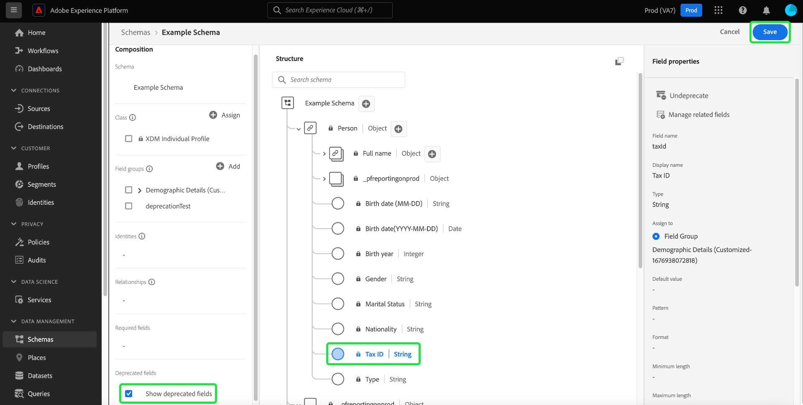

# UI에서 XDM 필드 사용 중단

XDM(Experience Data Model)은 데이터가 수집된 후 스키마 필드를 더 이상 사용하지 않음으로써 비즈니스 요구 사항이 변경될 때 데이터 모델을 유연하게 관리할 수 있도록 합니다. 원치 않는 필드는 더 이상 사용되지 않아 UI 보기에서 제거하고 다운스트림 UI에서 숨길 수 있습니다. 스키마 편집기의 확인란을 선택하면 더 이상 사용되지 않는 필드를 표시할 수 있으며 필요한 경우 해당 필드의 사용을 중단할 수도 있습니다.

사용되지 않는 필드는 기본적으로 UI에서 숨겨지므로 스키마 편집기에서 스키마를 간소화하고 원치 않는 필드가 세그먼트 빌더, 여정 디자이너 등의 다운스트림 종속성에 추가되지 않도록 합니다. 필드 사용 중단도 이전 버전과 호환됩니다. 세그먼트 및 쿼리와 같이 더 이상 사용되지 않는 필드를 사용하는 다른 시스템은 의도한 대로 계속 평가합니다. 더 이상 사용되지 않는 필드가 기존 세그먼트에서 사용되는 경우 정상적으로 처리됩니다. 즉, 필드는 세그먼트 빌더 캔버스에 예상대로 표시되거나 더 이상 사용되지 않는 필드에서 사용할 수 있는 데이터를 기반으로 평가됩니다. 기존 데이터 흐름에 부정적인 영향을 주지 않는 중단되지 않는 변경 사항입니다.

>[!NOTE]
>
>데이터를 스키마로 수집하기 전에 불필요한 필드 그룹을 제거할 수 있습니다. 다음에서 설명서를 참조하십시오. [스키마에서 필드 그룹을 제거하는 방법](../ui/resources/schemas.md#remove-fields) 추가 정보.

스키마에 데이터가 수집되면 더 이상 변경하지 않고 스키마에서 필드를 제거할 수 없습니다. 이 경우 를 사용하여 스키마 또는 사용자 지정 리소스 내의 원하지 않는 필드를 사용하지 않을 수 있습니다. [스키마 편집기](./create-schema-ui.md) 또는 [스키마 레지스트리 API](https://developer.adobe.com/experience-platform-apis/references/schema-registry/).

이 문서에서는 Experience Platform 사용자 인터페이스에서 스키마 편집기를 사용하여 다양한 XDM 리소스에 대한 필드를 사용하지 않는 방법을 다룹니다. API를 사용하여 XDM 필드를 사용하지 않는 방법에 대한 자세한 내용은 다음 자습서를 참조하십시오 [스키마 레지스트리 API를 사용하여 XDM 필드 사용 중단](./field-deprecation-api.md).

## 필드 사용 안 함 {#deprecate}

사용자 정의 필드를 사용하지 않으려면 편집할 스키마에 대한 스키마 편집기로 이동합니다. 에서 사용하지 않을 필드를 선택합니다. [!UICONTROL 구조] 캔버스의 섹션에 있는 마지막 항목이 **[!UICONTROL 사용하지 않음]** 다음에서 [!UICONTROL 필드 속성].

선택 사항을 확인하고 필드가 유니온 스키마의 UI 보기에서 제거되고 다운스트림 UI에서 숨겨짐을 알리는 대화 상자가 나타납니다. 작업을 완료하려면 을 선택합니다. **[!UICONTROL 확인]**.

이제 필드가 UI 보기에서 제거됩니다.

>[!NOTE]
>
>더 이상 사용되지 않으면 세그멘테이션 대시보드, Customer Journey Analytics 및 Adobe Journey Optimizer과 같은 다운스트림 UI에 더 이상 사용되지 않는 필드가 워크플로의 일부로 표시되지 않습니다. 그러나 다운스트림 UI에는 필요한 경우 더 이상 사용되지 않는 필드를 표시하고 더 이상 사용되지 않는 필드를 정상적으로 처리하는 옵션이 있습니다. 자세한 내용은 해당 설명서 를 참조하십시오. 더 이상 사용되지 않는 필드를 사용하는 쿼리 및 세그먼트는 예상대로 계속 실행됩니다.

## 사용되지 않는 필드 표시 {#show-deprecated}

이전에 더 이상 사용되지 않는 필드를 보려면 스키마 편집기에서 관련 스키마로 이동합니다. 다음 항목 선택 **[!UICONTROL 사용되지 않는 필드 표시]** 의 확인란 [!UICONTROL 컴포지션] 캔버스의 섹션입니다.

이제 사용되지 않는 필드가 UI 보기에 표시됩니다. 선택 **[!UICONTROL 저장]** 설정을 확인합니다.

## 필드 사용 중단 해제 {#undeprecate-fields}

더 이상 사용되지 않는 필드를 실행 취소하려면 먼저 [사용되지 않는 필드 표시](#show-deprecated) 위에서 설명한 대로 편집기의 사용 중단되는 필드를 선택합니다 [!UICONTROL 구조] 섹션. 그런 다음 을 선택합니다. **[!UICONTROL 사용하지 않음]** 다음에서 [!UICONTROL 필드 속성] 사이드바 뒤에 오는 **[!UICONTROL 저장]**.

다음 [!UICONTROL 필드 사용 중단 해제] 대화 상자가 나타납니다. 변경 사항을 확인하려면 다음을 선택합니다. **[!UICONTROL 확인]**.

![다음 [!UICONTROL 필드 사용 중단 해제] 확인 이 강조 표시된 대화 상자.](../images/tutorials/field-deprecation/undeprecate-field-dialog.png)

이제 필드가 UI 보기 및 다운스트림 UI에 표준으로 표시됩니다. 이제 필드를 사용하지 않는 옵션이 제공됩니다.

## 다음 단계

이 문서에서는 스키마 편집기 UI를 사용하여 XDM 필드를 사용하지 않는 방법을 다룹니다. 사용자 지정 리소스에 대한 필드 구성에 대한 자세한 내용은 [api에서 XDM 필드 정의](./custom-fields-api.md). 설명자 관리에 대한 자세한 내용은 [descriptors 끝점 안내서](../api/descriptors.md).
