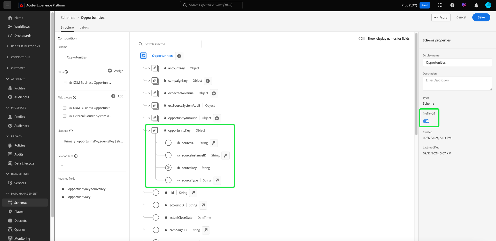

# Real-Time Customer Data Platform B2B Edition에서 두 스키마 간의 다대일 관계 정의 {#relationship-b2b}

>[!CONTEXTUALHELP]
>id="platform_xdm_b2b_reference_schema"
>title="참조 스키마"
>abstract="관계를 설정할 스키마를 선택합니다. 스키마 클래스에 따라 B2B 컨텍스트의 다른 엔티티와 기존 관계를 유지할 수도 있습니다. B2B 스키마 클래스를 상호 연관시키는 방법에 대한 자세한 내용은 설명서를 참조하십시오."

Adobe Real-time Customer Data Platform B2B 에디션은 다음과 같은 기본 B2B 데이터 엔티티를 캡처하는 여러 XDM(Experience Data Model) 클래스를 제공합니다 [계정](../classes/b2b/business-account.md), [기회](../classes/b2b/business-opportunity.md), [캠페인](../classes/b2b/business-campaign.md)등. 이러한 클래스를 기반으로 스키마를 빌드하고에서 사용할 수 있도록 설정 [실시간 고객 프로필](../../profile/home.md)를 사용하면 서로 다른 소스의 데이터를 통합 스키마라는 통합 표현으로 병합할 수 있습니다.

그러나 결합 스키마에는 동일한 클래스를 공유하는 스키마로 캡처된 필드만 포함될 수 있습니다. 여기서 스키마 관계가 시작됩니다. B2B 스키마에서 관계를 구현하면 이러한 비즈니스 엔티티가 서로 관련되는 방식을 설명하고 다운스트림 세그먼테이션 사용 사례에 여러 클래스의 속성을 포함할 수 있습니다.

다음 다이어그램은 기본 구현에서 서로 다른 B2B 클래스가 어떻게 서로 관련될 수 있는지에 대한 예를 제공합니다.

이 자습서에서는 Real-Time CDP B2B 에디션의 두 스키마 간의 다대일 관계를 정의하는 단계를 다룹니다.

>[!NOTE]
>
>Real-time Customer Data Platform B2B 에디션을 사용하지 않거나 일대일 관계를 만들려는 경우 다음 안내서를 참조하십시오. [일대일 관계 만들기](./relationship-ui.md) 대신,
>
>이 자습서에서는 Platform UI에서 B2B 스키마 간의 관계를 수동으로 설정하는 방법에 중점을 둡니다. B2B 소스 연결에서 데이터를 가져오는 경우 자동 생성 유틸리티를 사용하여 대신 필요한 스키마, ID 및 관계를 만들 수 있습니다. 자세한 내용은 B2B 네임스페이스 및 스키마에 대한 소스 설명서 를 참조하십시오. [자동 생성 유틸리티 사용](../../sources/connectors/adobe-applications/marketo/marketo-namespaces.md).

## 시작하기

이 튜토리얼을 사용하려면 다음을 이해할 수 있어야 합니다. [!DNL XDM System] 및 의 스키마 편집기 [!DNL Experience Platform] UI. 이 자습서를 시작하기 전에 다음 설명서를 검토하십시오.

* [Experience Platform의 XDM 시스템](../home.md): 의 XDM 및 그 구현 개요 [!DNL Experience Platform].
* [스키마 컴포지션 기본 사항](../schema/composition.md): XDM 스키마 빌딩 블록 소개.
* [를 사용하여 스키마 만들기 [!DNL Schema Editor]](create-schema-ui.md): UI에서 스키마를 구축하고 편집하는 방법에 대한 기본 사항을 다루는 튜토리얼입니다.

## 소스 및 참조 스키마 정의

관계에 정의될 두 개의 스키마를 이미 생성했을 것으로 예상됩니다. 이 튜토리얼은 데모용으로 비즈니스 기회 간 관계(&quot;에 정의됨)를 만듭니다.[!DNL Opportunities]&quot;스키마) 및 관련 비즈니스 계정(&quot;에 정의됨)[!DNL Accounts]&quot;스키마).

스키마 관계는 내의 전용 필드로 표시됩니다 **소스 스키마** 의 기본 id 필드를 참조하는 경우 **참조 스키마**. 다음 단계에서 &quot;[!DNL Opportunities]&quot;&quot;는 소스 스키마 역할을 하는 반면 &quot;[!DNL Accounts]&quot;는 참조 스키마 역할을 합니다.

### B2B 관계에서 ID 이해

>[!CONTEXTUALHELP]
>id="platform_xdm_b2b_identity_namespace"
>title="참조 신원 네임스페이스"
>abstract="참조 스키마의 기본 ID 필드에 대한 네임스페이스(유형)입니다. 관계에 참여하려면 참조 스키마에 기본 ID 필드가 설정되어 있어야 합니다. B2B 관계에서 ID에 대한 자세한 내용은 설명서를 참조하십시오."

관계를 설정하려면 참조 스키마에 정의된 기본 ID가 있어야 합니다. B2B 엔티티에 대한 기본 ID를 설정할 때 문자열 기반 엔티티 ID는 서로 다른 시스템 또는 위치에서 수집하는 경우 겹칠 수 있으며, 이로 인해 플랫폼에서 데이터 충돌이 발생할 수 있다는 점을 유의하십시오.

이를 위해 모든 표준 B2B 클래스에는 [[!UICONTROL B2B 소스] 데이터 유형](../data-types/b2b-source.md). 이 데이터 유형은 식별자의 소스에 대한 다른 컨텍스트 정보와 함께 B2B 엔티티의 문자열 식별자에 대한 필드를 제공합니다. 이 필드 중 하나, `sourceKey`는 데이터 유형의 다른 필드 값을 연결하여 엔티티에 대한 완전히 고유한 식별자를 생성합니다. 이 필드는 항상 B2B 엔티티 스키마의 기본 ID로 사용해야 합니다.

>[!NOTE]
>
>날짜 [xdm 필드를 ID로 설정](../ui/fields/identity.md)에서 id를 정의하려면 id 네임스페이스를 제공해야 합니다. Adobe에서 제공하는 표준 네임스페이스이거나 조직에서 정의한 사용자 정의 네임스페이스일 수 있습니다. 실제로 네임스페이스는 단순히 컨텍스트 문자열이며, ID 유형을 분류하는 데 조직에서 의미가 있는 경우 원하는 값으로 설정할 수 있습니다. 의 개요 보기 [id 네임스페이스](../../identity-service/namespaces.md) 추가 정보.

참조용으로 다음 섹션에서는 관계가 정의되기 전에 이 자습서에서 사용되는 각 스키마의 구조를 설명합니다. 스키마 구조에서 기본 ID가 정의된 위치와 기본 ID가 사용하는 사용자 정의 네임스페이스를 참고하십시오.

### [!DNL Opportunities] 스키마

소스 스키마 &quot;[!DNL Opportunities]&quot;은(는) [!UICONTROL XDM 비즈니스 영업 기회] 클래스. 클래스에서 제공하는 필드 중 하나, `opportunityKey`는 스키마에 대한 식별자 역할을 합니다. 특히 `sourceKey` 필드 아래 `opportunityKey` 이라는 사용자 지정 네임스페이스 아래에 있는 개체는 스키마의 기본 id로 설정됩니다. [!DNL B2B Opportunity].

아래에서 보는 바와 같이 **[!UICONTROL 스키마 속성]**, 이 스키마는에서 사용할 수 있도록 설정되었습니다. [!DNL Real-Time Customer Profile].

### [!DNL Accounts] 스키마

참조 스키마 &quot;[!DNL Accounts]&quot;은(는) [!UICONTROL XDM 계정] 클래스. 루트 레벨 `accountKey` 필드에는 `sourceKey` 라는 사용자 지정 네임스페이스에서 기본 ID로 작동 [!DNL B2B Account]. 이 스키마는 프로필에서도 사용할 수 있도록 설정되었습니다.

## 소스 스키마에 대한 관계 필드 정의 {#relationship-field}

>[!CONTEXTUALHELP]
>id="platform_xdm_b2b_relationship_name_current"
>title="현재 스키마의 관계 이름"
>abstract="현재 스키마에서 참조 스키마(예: “관련 계정”)까지 관계를 설명하는 레이블입니다. 프로필 및 세분화에서 이 레이블을 사용하여 관련 B2B 엔티티의 데이터에 컨텍스트를 제공합니다. B2B 스키마 관계 빌드에 대한 자세한 내용은 설명서를 참조하십시오."

>[!CONTEXTUALHELP]
>id="platform_xdm_b2b_relationship_name_reference"
>title="참조 스키마의 관계 이름"
>abstract="참조 스키마에서 현재 스키마(예: “관련 기회”)까지 관계를 설명하는 레이블입니다. 프로필 및 세분화에서 이 레이블을 사용하여 관련 B2B 엔티티의 데이터에 컨텍스트를 제공합니다. B2B 스키마 관계 빌드에 대한 자세한 내용은 설명서를 참조하십시오."

두 스키마 간의 관계를 정의하려면 소스 스키마에 참조 스키마의 기본 ID를 나타내는 전용 필드가 있어야 합니다. 표준 B2B 클래스는 일반적으로 관련된 비즈니스 엔터티를 위한 전용 소스 키 필드를 포함합니다. 예를 들어 [!UICONTROL XDM 비즈니스 영업 기회] 클래스에는 관련 계정의 소스 키 필드가 포함되어 있습니다(`accountKey`) 및 관련 캠페인(`campaignKey`). 그러나 다른 항목을 추가할 수도 있습니다 [!UICONTROL B2B 소스] 기본 구성 요소 이상이 필요한 경우 사용자 정의 필드 그룹을 사용하여 스키마에 필드를 추가합니다.

>[!NOTE]
>
>현재 소스 스키마에서 참조 스키마까지 다대일 및 일대일 관계만 정의할 수 있습니다. 일대다 관계의 경우 &quot;다&quot;를 나타내는 관계 필드를 스키마에 정의해야 합니다.

관계 필드를 설정하려면 화살표 아이콘()을 클릭하여 제품에서 사용할 수 있습니다. 의 경우 [!DNL Opportunities] 스키마, 다음 `accountKey.sourceKey` 목표는 계정과 다대일 관계를 설정하는 것이므로 필드입니다.

관계에 대한 세부 사항을 지정할 수 있는 대화 상자가 나타납니다. 관계 유형은 자동으로 다음으로 설정됩니다. **[!UICONTROL 다대일]**.

아래 **[!UICONTROL 참조 스키마]**&#x200B;검색 창에서 참조 스키마의 이름을 찾을 수 있습니다. 참조 스키마 이름을 강조 표시하면 **[!UICONTROL 참조 ID 네임스페이스]** 필드는 스키마 기본 id의 네임스페이스로 자동으로 업데이트됩니다.

아래 **[!UICONTROL 현재 스키마의 관계 이름]** 및 **[!UICONTROL 참조 스키마의 관계 이름]**&#x200B;를 사용하면 소스 및 참조 스키마 컨텍스트에서 관계에 대한 친숙한 이름을 각각 제공할 수 있습니다. 완료되면 다음을 선택합니다. **[!UICONTROL 저장]** 변경 사항을 적용하고 스키마를 저장합니다.

이제 관계 필드가 이전에 제공한 친숙한 이름으로 표시되어 캔버스가 다시 나타납니다. 쉽게 참조할 수 있도록 왼쪽 레일 아래에 관계 이름도 나열됩니다.

참조 스키마의 구조를 보면 스키마의 기본 ID 필드 옆에 관계 마커가 나타나고 왼쪽 레일에 표시됩니다.

## 다음 단계

이 자습서에 따라 를 사용하여 두 스키마 간에 다대일 관계를 생성했습니다 [!DNL Schema Editor]. 이러한 스키마를 기반으로 하는 데이터 세트를 사용하여 데이터를 수집하고 해당 데이터가 프로필 데이터 저장소에서 활성화되면 두 스키마의 속성을 사용할 수 있습니다. [다중 클래스 세그먼테이션 사용 사례](../../rtcdp/segmentation/b2b.md).
