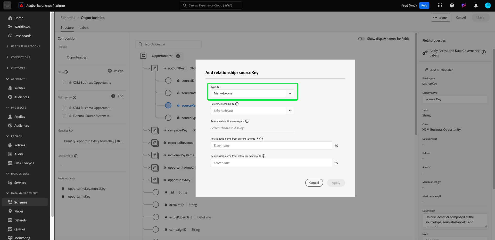

# Real-Time Customer Data Platform B2B 에디션에서 두 스키마 간의 다대일 관계 정의 {#relationship-b2b}

>[!CONTEXTUALHELP]
>id="platform_xdm_b2b_reference_schema"
>title="참조 스키마"
>abstract="관계를 설정할 스키마를 선택합니다. 스키마 클래스에 따라 B2B 컨텍스트의 다른 엔티티와 기존 관계를 유지할 수도 있습니다. B2B 스키마 클래스를 상호 연관시키는 방법에 대한 자세한 내용은 설명서를 참조하십시오."

Adobe Real-Time Customer Data Platform B2B edition은 [계정](../classes/b2b/business-account.md), [기회](../classes/b2b/business-opportunity.md), [캠페인](../classes/b2b/business-campaign.md) 등을 포함하여 기본 B2B 데이터 엔터티를 캡처하는 여러 XDM(Experience Data Model) 클래스를 제공합니다. 이러한 클래스를 기반으로 스키마를 빌드하고 [실시간 고객 프로필](../../profile/home.md)에서 사용할 수 있도록 활성화하면 서로 다른 소스의 데이터를 통합 스키마라는 통합 표현으로 병합할 수 있습니다.

그러나 결합 스키마에는 동일한 클래스를 공유하는 스키마로 캡처된 필드만 포함될 수 있습니다. 여기서 스키마 관계가 시작됩니다. B2B 스키마에서 관계를 구현하면 이러한 비즈니스 엔티티가 서로 관련되는 방식을 설명하고 다운스트림 세그먼테이션 사용 사례에 여러 클래스의 속성을 포함할 수 있습니다.

다음 다이어그램은 기본 구현에서 서로 다른 B2B 클래스가 어떻게 서로 관련될 수 있는지에 대한 예를 제공합니다.

이 자습서에서는 Real-Time CDP B2B edition에서 두 스키마 간의 다대일 관계를 정의하는 단계를 다룹니다.

>[!NOTE]
>
>Real-Time Customer Data Platform B2B edition을 사용하지 않거나 일대일 관계를 만들려면 [일대일 관계 만들기](./relationship-ui.md)에 대한 안내서를 대신 참조하십시오.
>
>이 자습서에서는 Experience Platform UI에서 B2B 스키마 간의 관계를 수동으로 설정하는 방법에 중점을 둡니다. B2B 소스 연결에서 데이터를 가져오는 경우 자동 생성 유틸리티를 사용하여 대신 필요한 스키마, ID 및 관계를 만들 수 있습니다. [자동 생성 유틸리티 사용](../../sources/connectors/adobe-applications/marketo/marketo-namespaces.md)에 대한 자세한 내용은 B2B 네임스페이스 및 스키마에 대한 소스 설명서를 참조하십시오.

## 시작

이 자습서에서는 [!DNL Experience Platform] UI의 [!DNL XDM System] 및 스키마 편집기에 대한 작업 이해를 필요로 합니다. 이 자습서를 시작하기 전에 다음 설명서를 검토하십시오.

* [Experience Platform의 XDM 시스템](../home.md): XDM 및 [!DNL Experience Platform]의 구현에 대한 개요입니다.
* [스키마 컴포지션 기본 사항](../schema/composition.md): XDM 스키마 빌딩 블록 소개.
* [을(를) 사용하여 스키마를 만듭니다 [!DNL Schema Editor]](create-schema-ui.md): UI에서 스키마를 만들고 편집하는 방법에 대한 기본 사항을 다루는 튜토리얼입니다.

## 소스 및 참조 스키마 정의

관계에 정의될 두 개의 스키마를 이미 생성했을 것으로 예상됩니다. 이 자습서에서는 데모용으로 비즈니스 기회(&quot;[!DNL Opportunities]&quot; 스키마에 정의됨)와 관련 비즈니스 계정(&quot;[!DNL Accounts]&quot; 스키마에 정의됨) 간의 관계를 만듭니다.

스키마 관계는 **참조 스키마**&#x200B;의 기본 ID 필드를 참조하는 **소스 스키마** 내의 전용 필드로 표시됩니다. 다음 단계에서 &quot;[!DNL Opportunities]&quot;은(는) 소스 스키마 역할을 하지만 &quot;[!DNL Accounts]&quot;은(는) 참조 스키마 역할을 합니다.

### B2B 관계에서 ID 이해

>[!CONTEXTUALHELP]
>id="platform_xdm_b2b_identity_namespace"
>title="참조 ID 네임스페이스"
>abstract="참조 스키마의 기본 ID 필드에 대한 네임스페이스(유형)입니다. 관계에 참여하려면 참조 스키마에 기본 ID 필드가 설정되어 있어야 합니다. B2B 관계에서 ID에 대한 자세한 내용은 설명서를 참조하십시오."

관계를 설정하려면 참조 스키마에 정의된 기본 ID가 있어야 합니다. B2B 엔티티에 대한 기본 ID를 설정할 때 문자열 기반 엔티티 ID는 서로 다른 시스템 또는 위치에서 수집하는 경우 겹칠 수 있으며, 이로 인해 Experience Platform에서 데이터 충돌이 발생할 수 있다는 점을 유의하십시오.

이를 위해 모든 표준 B2B 클래스에는 [[!UICONTROL B2B Source] 데이터 형식](../data-types/b2b-source.md)을 준수하는 &quot;key&quot; 필드가 포함되어 있습니다. 이 데이터 유형은 식별자의 소스에 대한 다른 컨텍스트 정보와 함께 B2B 엔티티의 문자열 식별자에 대한 필드를 제공합니다. 이러한 필드 중 하나인 `sourceKey`은(는) 데이터 형식의 다른 필드 값을 연결하여 엔터티에 대해 완전히 고유한 식별자를 생성합니다. 이 필드는 항상 B2B 엔티티 스키마의 기본 ID로 사용해야 합니다.

>[!NOTE]
>
>[XDM 필드를 ID로 설정](../ui/fields/identity.md)할 때 아래에서 ID를 정의할 ID 네임스페이스를 제공해야 합니다. Adobe에서 제공하는 표준 네임스페이스 또는 조직에서 정의한 사용자 지정 네임스페이스가 될 수 있습니다. 실제로 네임스페이스는 단순히 컨텍스트 문자열이며, ID 유형을 분류하는 데 조직에서 의미가 있는 경우 원하는 값으로 설정할 수 있습니다. 자세한 내용은 [ID 네임스페이스](../../identity-service/features/namespaces.md)에 대한 개요를 참조하십시오.

참조용으로 다음 섹션에서는 관계가 정의되기 전에 이 자습서에서 사용되는 각 스키마의 구조를 설명합니다. 스키마 구조에서 기본 ID가 정의된 위치와 기본 ID가 사용하는 사용자 정의 네임스페이스를 참고하십시오.

### 영업 기회 스키마

소스 스키마 &quot;[!DNL Opportunities]&quot;이(가) [!UICONTROL XDM 비즈니스 영업 기회] 클래스를 기반으로 합니다. 클래스에서 제공하는 필드 중 하나(`opportunityKey`)가 스키마의 식별자 역할을 합니다. 특히 `opportunityKey` 개체 아래의 `sourceKey` 필드는 [!DNL B2B Opportunity]&#x200B;(이)라는 사용자 지정 네임스페이스에서 스키마의 기본 ID로 설정됩니다.

**[!UICONTROL 필드 속성]**&#x200B;에서 볼 수 있듯이 이 스키마는 [!DNL Real-Time Customer Profile]에서 사용할 수 있도록 설정되었습니다.

### [!DNL Accounts] 스키마

참조 스키마 &quot;[!DNL Accounts]&quot;은(는) [!UICONTROL XDM 계정] 클래스를 기반으로 합니다. 루트 수준 `accountKey` 필드에는 [!DNL B2B Account]이라는 사용자 지정 네임스페이스에서 기본 ID 역할을 하는 `sourceKey`이(가) 포함되어 있습니다. 이 스키마는 프로필에서도 사용할 수 있도록 설정되었습니다.

## 소스 스키마에 대한 관계 필드 정의 {#relationship-field}

>[!CONTEXTUALHELP]
>id="platform_xdm_b2b_relationship_name_current"
>title="현재 스키마의 관계 이름"
>abstract="현재 스키마에서 참조 스키마(예: “관련 계정”)까지 관계를 설명하는 레이블입니다. 프로필 및 세분화에서 이 레이블을 사용하여 관련 B2B 엔티티의 데이터에 컨텍스트를 제공합니다. B2B 스키마 관계 빌드에 대한 자세한 내용은 설명서를 참조하십시오."

>[!CONTEXTUALHELP]
>id="platform_xdm_b2b_relationship_name_reference"
>title="참조 스키마의 관계 이름"
>abstract="참조 스키마에서 현재 스키마(예: “관련 기회”)까지 관계를 설명하는 레이블입니다. 프로필 및 세분화에서 이 레이블을 사용하여 관련 B2B 엔티티의 데이터에 컨텍스트를 제공합니다. B2B 스키마 관계 빌드에 대한 자세한 내용은 설명서를 참조하십시오."

두 스키마 간의 관계를 정의하려면 소스 스키마에 참조 스키마의 기본 ID를 나타내는 전용 필드가 있어야 합니다. 표준 B2B 클래스는 일반적으로 관련된 비즈니스 엔터티를 위한 전용 소스 키 필드를 포함합니다. 예를 들어 [!UICONTROL XDM 비즈니스 영업 기회] 클래스에는 관련 계정(`accountKey`) 및 관련 캠페인(`campaignKey`)에 대한 소스 키 필드가 포함되어 있습니다. 그러나 기본 구성 요소 이상이 필요한 경우 사용자 지정 필드 그룹을 사용하여 다른 [!UICONTROL B2B Source] 필드를 스키마에 추가할 수도 있습니다.

>[!NOTE]
>
>현재 소스 스키마에서 참조 스키마까지 다대일 및 일대일 관계만 정의할 수 있습니다. 일대다 관계의 경우 &quot;다&quot;를 나타내는 관계 필드를 스키마에 정의해야 합니다.

관계 필드를 설정하려면 캔버스 내에서 해당 필드를 선택한 다음 [!UICONTROL 스키마 속성] 사이드바에서 **[!UICONTROL 관계 추가]**&#x200B;를 선택하십시오. [!DNL Opportunities] 스키마의 경우 계정과 다대일 관계를 설정하는 것이 목표이므로 `accountKey.sourceKey` 필드입니다.

[!UICONTROL 관계 추가] 대화 상자가 나타납니다. 이 대화 상자를 사용하여 관계 세부 사항을 지정합니다. 관계 유형은 기본적으로 **[!UICONTROL 다대일]**(으)로 설정됩니다.

**[!UICONTROL 참조 스키마]**&#x200B;에서 검색 창 또는 드롭다운 메뉴를 사용하여 참조 스키마의 이름을 찾습니다. 참조 스키마의 이름을 강조 표시하면 **[!UICONTROL 참조 ID 네임스페이스]** 필드가 참조 스키마의 기본 ID의 네임스페이스로 자동 업데이트됩니다.

>[!NOTE]
>
>사용 가능한 참조 스키마 목록은 적합한 스키마만 포함하도록 필터링됩니다. 스키마 **must**&#x200B;에 할당된 기본 ID가 있으며 B2B 클래스 또는 개별 프로필 클래스여야 합니다. 잠재 고객 클래스 스키마에는 관계가 있을 수 없습니다.

**[!UICONTROL 현재 스키마의 관계 이름]** 및 **[!UICONTROL 참조 스키마의 관계 이름]**&#x200B;에서 소스 및 참조 스키마 컨텍스트의 관계에 대해 알기 쉬운 이름을 각각 지정하십시오. 완료되면 **[!UICONTROL 적용]**&#x200B;을 선택하여 변경 내용을 확인하고 관계를 저장합니다.

>[!NOTE]
>
>관계 이름은 35자 이하여야 합니다.

이제 관계 필드가 이전에 제공한 친숙한 이름으로 표시되어 캔버스가 다시 나타납니다. 쉽게 참조할 수 있도록 왼쪽 레일에 관계 이름도 나열됩니다.

참조 스키마의 구조를 보면 스키마의 기본 ID 필드 옆에 관계 마커가 나타나고 왼쪽 레일에 표시됩니다.

## B2B 스키마 관계 편집 {#edit-schema-relationship}

스키마 관계가 설정되면 소스 스키마에서 관계 필드를 선택한 후 **[!UICONTROL 관계 편집]**&#x200B;을 선택합니다.

>[!NOTE]
>
>연결된 관계를 모두 보려면 참조 스키마에서 기본 ID 필드를 선택한 다음 [!UICONTROL 관계 보기]를 선택하십시오.
>>{width="100" zoomable="yes"}

[!UICONTROL 관계 편집] 대화 상자가 나타납니다. 이 대화 상자에서 참조 스키마 및 관계 이름을 변경하거나 관계를 삭제할 수 있습니다. 다대일 관계 유형은 변경할 수 없습니다.

데이터 무결성을 유지하고 세그먼테이션 및 기타 프로세스에서 중단을 방지하려면 연결된 데이터 세트와의 스키마 관계를 관리할 때 다음 지침을 고려하십시오.

* 스키마가 데이터 세트와 연결된 경우 세그먼테이션에 부정적인 영향을 줄 수 있으므로 관계를 직접 삭제하지 마십시오. 대신 관계를 제거하기 전에 연결된 데이터 세트를 삭제하십시오.
* 기존 관계를 먼저 삭제하지 않으면 참조 스키마를 변경할 수 없습니다. 그러나 연결된 데이터 세트와의 관계를 삭제하면 의도하지 않은 결과가 발생할 수 있으므로 주의해서 이 작업을 수행해야 합니다.
* 기존 연결된 데이터 세트를 사용하여 스키마에 새 관계를 추가하는 것은 의도한 대로 작동하지 않을 수 있으며 잠재적인 충돌을 초래할 수 있습니다.

## 관계 필터링 및 검색 {#filter-and-search}

[!UICONTROL 스키마] 작업 영역의 [!UICONTROL 관계] 탭에서 스키마 내의 특정 관계를 필터링하고 검색할 수 있습니다. 이 보기를 사용하여 관계를 빠르게 찾고 관리할 수 있습니다. 필터링 옵션에 대한 자세한 지침은 [스키마 리소스 탐색](../ui/explore.md#lookup)에 대한 문서를 참조하십시오.

## 다음 단계

이 자습서에 따라 [!DNL Schema Editor]을(를) 사용하여 두 스키마 간에 다대일 관계를 만들었습니다. 이러한 스키마를 기반으로 하는 데이터 세트를 사용하여 데이터를 수집했으며 해당 데이터가 프로필 데이터 저장소에서 활성화되면 [다중 클래스 세그먼테이션 사용 사례](../../rtcdp/segmentation/b2b.md)에 대해 두 스키마의 특성을 사용할 수 있습니다.
