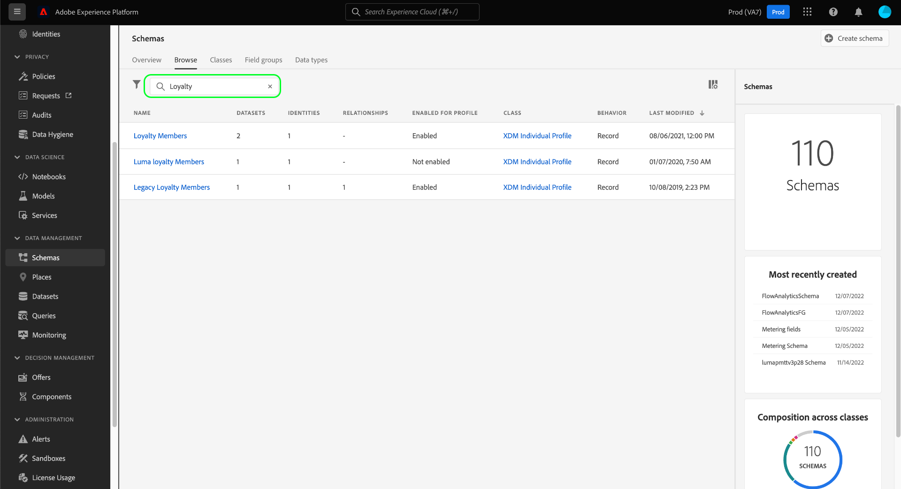
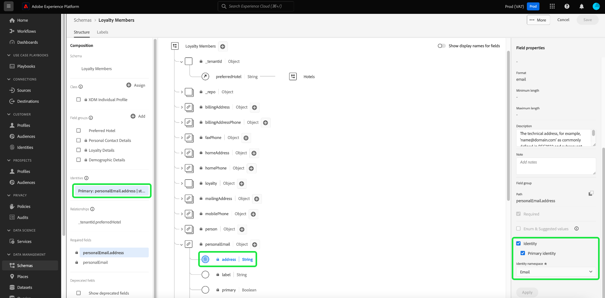

# UI에서 XDM 리소스 살펴보기

Adobe Experience Platform에서 모든 XDM(Experience Data Model) 리소스는 [!DNL Schema Library]에는 Adobe에서 제공하는 표준 리소스와 조직에서 정의한 사용자 정의 리소스가 포함되어 있습니다. Experience Platform UI에서는 [!DNL Schema Library]. UI에서는 이러한 XDM 리소스에서 제공하는 각 필드의 예상 데이터 유형 및 사용 사례에 대한 정보를 제공하므로 이 기능은 데이터 수집을 계획하고 준비할 때 특히 유용합니다.

이 자습서에서는 Experience Platform UI에서 기존 스키마, 클래스, 필드 그룹 및 데이터 유형을 탐색하는 단계를 설명합니다.

## XDM 리소스 조회 {#lookup}

플랫폼 UI에서 **[!UICONTROL 스키마]** 을 클릭합니다. 다음 [!UICONTROL 스키마] 작업 공간에서 **[!UICONTROL 찾아보기]** 탐색하기 위한 추가 전용 탭과 함께 조직의 기존 XDM 리소스를 모두 탐색하려면 탭을 클릭합니다. **[!UICONTROL 클래스]**, **[!UICONTROL 필드 그룹]**, 및 **[!UICONTROL 데이터 유형]** 특히,

설정 [!UICONTROL 찾아보기] 탭에서 필터 아이콘()를 클릭하여 나열된 결과를 좁히기 위해 왼쪽 레일에 컨트롤을 표시합니다.

예를 들어 Adobe이 제공하는 표준 데이터 유형만 표시하도록 목록을 필터링하려면 을(를) 선택합니다 **[!UICONTROL 데이터 유형]** 및 **[!UICONTROL Adobe]** 아래에 **[!UICONTROL 유형]** 및 **[!UICONTROL 소유자]** 섹션을 참조하십시오.

다음 **[!UICONTROL 프로필에 포함됨]** 토글 기능을 사용하면 결과를 필터링하여 을 통해 을 사용하도록 설정된 스키마에 사용된 리소스만 표시할 수 있습니다 [실시간 고객 프로필](../../profile/home.md).

검색 창에서 검색 결과를 더 좁힐 수도 있습니다. 검색어를 검색할 때 상위 항목은 검색 쿼리와 이름이 일치하는 리소스를 나타냅니다. 아래의 이 항목 아래에 있습니다. **[!UICONTROL 표준 필드]**, 쿼리와 일치하는 필드를 포함하는 모든 리소스가 나열됩니다. 이렇게 하면 사전 리소스 이름을 알지 않고도 포함하는 데이터 유형에 따라 XDM 리소스를 검색할 수 있습니다.

검색 결과에 표시되는 리소스는 먼저 제목 일치별로 정렬된 다음 설명별로 정렬됩니다. 따라서 이러한 범주 중 하나에서 일치하는 단어가 더 많을수록 리소스가 목록에 더 많이 나타납니다.

>[!NOTE]
>
>표준 XDM 리소스의 경우 검색 기능은 를 포함하는 개별 필드만 반환합니다 `xdm` 네임스페이스. 다른 네임스페이스(예: 테넌트 ID)에 있는 필드는 사용자 지정 리소스에 포함된 경우에만 반환됩니다.

탐색할 리소스를 찾으면 목록에서 해당 이름을 선택하여 캔버스에서 해당 구조를 확인합니다.

## 캔버스에서 XDM 리소스 살펴보기 {#explore}

리소스를 선택하면 해당 구조가 캔버스에서 열립니다.

하위 속성을 포함하는 모든 객체 유형 필드는 캔버스에 처음 표시될 때 기본적으로 축소됩니다. 필드의 하위 속성을 표시하려면 해당 이름 옆에 있는 아이콘을 선택합니다.

### 시스템 생성 필드 {#system-fields}

일부 필드 이름에는 밑줄( 예: ) `_repo` 및 `_id`. 이는 데이터가 수집될 때 시스템에서 자동으로 생성하고 할당할 필드의 자리 표시자를 나타냅니다.

따라서 이러한 필드는 대부분 Platform으로 섭취할 때 데이터 구조에서 제외해야 합니다. 이 규칙의 주요 예외는 [`_{TENANT_ID}` 필드](../api/getting-started.md#know-your-tenant_id): 조직에서 생성한 모든 XDM 필드의 이름은 로 지정해야 합니다.

### 데이터 유형 {#data-types}

캔버스에 표시된 각 필드에 대해 해당 데이터 유형이 해당 이름 옆에 표시되어 필드가 수집해야 하는 데이터 유형을 한눈에 나타냅니다.

대괄호(`[]`)은 해당 특정 데이터 유형의 배열을 나타냅니다. 예를 들어 **[!UICONTROL 문자열]\[]** 필드에 문자열 값의 배열이 필요함을 나타냅니다. 데이터 유형 **[!UICONTROL 결제 항목]\[]** 는 [!UICONTROL 결제 항목] 데이터 유형.

배열 필드가 객체 유형을 기반으로 하는 경우 캔버스에서 해당 아이콘을 선택하여 각 배열 항목에 대한 예상 속성을 표시할 수 있습니다.

### [!UICONTROL 필드 속성] {#field-properties}

캔버스에서 필드의 이름을 선택하면 오른쪽 레일이 업데이트되어 해당 필드에 대한 세부 사항이 표시됩니다 **[!UICONTROL 필드 속성]**. 여기에는 필드의 의도된 사용 사례, 기본값, 패턴, 형식, 필드 필수 여부 등이 포함될 수 있습니다.

검사하는 필드가 열거형 필드인 경우 오른쪽 레일에는 필드가 받을 허용 가능한 값도 표시됩니다.

### ID 필드 {#identity}

ID 필드가 포함된 스키마를 검사할 때 이러한 필드는 스키마에 제공하는 클래스 또는 필드 그룹 아래의 왼쪽 레일에 나열됩니다. 왼쪽 레일에서 ID 필드 이름을 선택하여 중첩된 심도에 관계없이 캔버스에서 필드를 표시합니다.

캔버스에서 ID 필드가 지문 아이콘으로 강조 표시됩니다(). ID 필드의 이름을 선택하면 ID 필드의 이름과 같은 추가 정보를 볼 수 있습니다. [id 네임스페이스](../../identity-service/namespaces.md) 및 필드가 스키마의 기본 ID인지 여부를 결정합니다.

>[!NOTE]
>
>다음 안내서를 참조하십시오. [id 필드 정의](./fields/identity.md) id 필드 및 다운스트림 Platform 서비스와의 관계에 대한 자세한 내용을 참조하십시오.

### 관계 필드 {#relationship}

관계 필드가 포함된 스키마를 검사하는 경우 필드는 아래의 왼쪽 레일에 나열됩니다 **[!UICONTROL 관계]**. 왼쪽 레일에서 관계 필드 이름을 선택하여 중첩된 심도에 관계없이 캔버스에서 필드를 표시합니다.

관계 필드는 캔버스에서 고유하게 강조 표시되어 필드가 참조하는 대상 스키마의 이름을 표시합니다. 관계 필드의 이름을 선택하는 경우 오른쪽 레일에서 대상 스키마의 기본 ID의 ID 네임스페이스를 볼 수 있습니다.

>[!NOTE]
>
>다음에서 자습서를 참조하십시오. [ui에서 관계 만들기](../tutorials/relationship-ui.md) xdm 스키마에서 관계 사용에 대한 자세한 내용은 를 참조하십시오.

## 다음 단계

이 문서에서는 Experience Platform UI에서 기존 XDM 리소스를 탐색하는 방법을 다룹니다. 의 여러 기능에 대한 자세한 내용은 [!UICONTROL 스키마] 작업 공간 및 [!DNL Schema Editor]를 참조하고 [[!UICONTROL 스키마] 작업 공간 개요](./overview.md).
