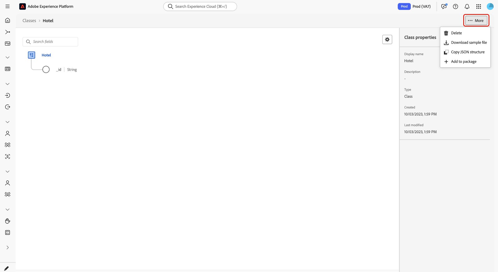
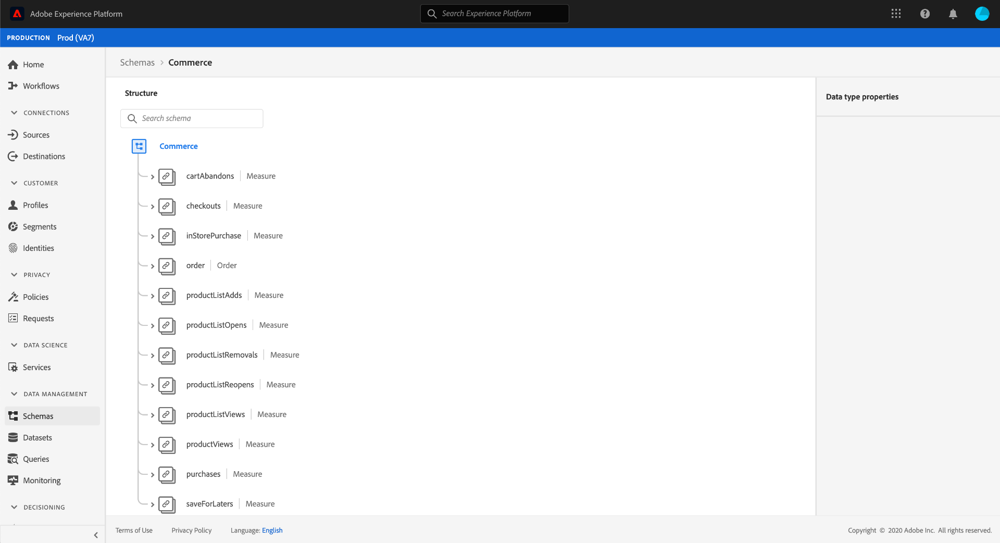
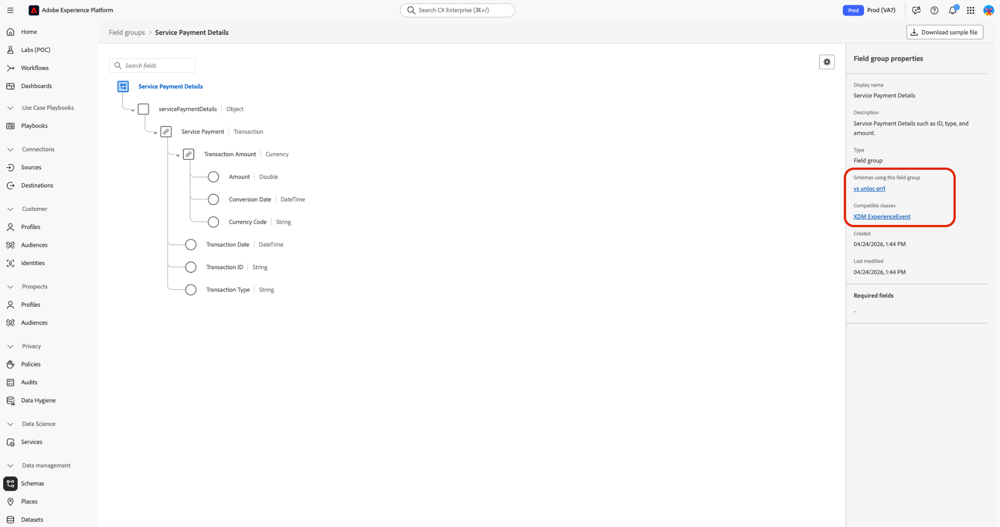

# UI에서 스키마 리소스 살펴보기

Adobe Experience Platform에서 XDM(Experience Data Model) 스키마 리소스는 Adobe에서 제공하는 표준 리소스 및 조직에서 정의한 사용자 지정 리소스를 포함하여 [!DNL Schema Library]에 저장됩니다. Experience Platform UI에서는 [!DNL Schema Library]에서 기존 스키마, 클래스, 필드 그룹 또는 데이터 형식의 구조 및 필드를 볼 수 있습니다. UI는 이러한 XDM 리소스에서 제공하는 각 필드의 예상 데이터 유형 및 사용 사례에 대한 정보를 제공하므로 데이터 수집을 계획하고 준비할 때 특히 유용합니다.

이 자습서에서는 Experience Platform UI에서 기존 스키마, 클래스, 필드 그룹 및 데이터 유형을 탐색하는 단계를 다룹니다.

## 스키마 리소스 조회 {#lookup}

Experience Platform UI의 왼쪽 탐색에서 **[!UICONTROL Schemas]**&#x200B;을(를) 선택합니다. [!UICONTROL Schemas] 작업 영역에서는 조직의 모든 스키마를 탐색할 수 있는 **[!UICONTROL Browse]** 탭과 **[!UICONTROL Classes]**, **[!UICONTROL Field groups]**, **[!UICONTROL Data types]** 및 **[!UICONTROL Relationships]**&#x200B;을(를) 각각 탐색하기 위한 추가 전용 탭을 제공합니다.

필터 아이콘()은 나열된 결과를 좁히기 위해 왼쪽 레일에 컨트롤을 표시합니다. 리소스 필터는 **[!UICONTROL Browse]** 및 **[!UICONTROL Relationships]** 탭에서 각각 스키마 및 관계에 사용할 수 있습니다. **[!UICONTROL Field groups]** 탭에서 [필드 그룹 메타데이터 및 필터링](#field-group-metadata-and-filtering)에 설명된 필터를 사용하여 호환 가능한 클래스 및 업계 태그로 목록의 범위를 좁힙니다.

[!UICONTROL Schemas] 작업 영역의 [!UICONTROL Browse] 탭에서 스키마 인벤토리를 필터링할 수 있습니다. **[!UICONTROL Included in Profile]** 전환을 사용하여 [실시간 고객 프로필](../../profile/home.md)에서 사용할 수 있도록 설정된 스키마만 표시합니다. **[!UICONTROL Show adhoc schemas]** 토글을 사용하여 단일 데이터 집합에서만 사용할 수 있도록 네임스페이스가 지정된 필드를 사용하여 만든 스키마 목록을 필터링합니다.

![필터 패널이 강조 표시된 [!UICONTROL Schemas] 작업 영역 [!UICONTROL Browse] 탭입니다.](../images/ui/explore/filters.png)

[!UICONTROL Schemas] 작업 영역의 [!UICONTROL Relationship] 탭에서 4가지 기준을 기반으로 관계 목록을 필터링할 수 있습니다. 필터에는 [!UICONTROL Source schema], [!UICONTROL Destination schema], [!UICONTROL Source class] 및 [!UICONTROL Destination class]이(가) 포함됩니다. 아래 표에는 필터에 대한 설명이 나와 있습니다.

| 필터 | 설명 |
|-----------------------------------|------------|
| [!UICONTROL Source schema] | 선택한 스키마가 시작점이거나 &quot;원본&quot;인 모든 관계를 보려면 [!UICONTROL Source schema] 드롭다운 메뉴에서 스키마를 선택하십시오. |
| [!UICONTROL Destination schema] | 선택한 스키마가 대상 또는 &quot;대상&quot;인 모든 관계를 보려면 [!UICONTROL Destination schema] 드롭다운 메뉴에서 스키마를 선택하십시오. |
| [!UICONTROL Source class] | 시작하는 스키마의 클래스를 기준으로 관계를 필터링하려면 [!UICONTROL Source class] 드롭다운 메뉴에서 클래스를 선택하십시오. |
| [!UICONTROL Destination class] | 특정 클래스의 스키마로 끝나는 관계를 표시하려면 [!UICONTROL Destination class] 드롭다운 메뉴에서 클래스를 선택하십시오. |

{style="table-layout:auto"}

검색 창을 사용하여 결과의 범위를 더 좁힐 수도 있습니다.

검색 결과에 표시되는 리소스는 제목 일치 항목별로 정렬된 다음 설명 일치 항목별로 정렬됩니다. 이 범주 중 하나에서 단어가 더 많이 일치할수록 높은 리소스가 목록에 나타납니다.

탐색할 리소스를 찾으면 목록에서 해당 이름을 선택하여 캔버스에서 해당 구조를 확인합니다.

## 스키마, 클래스, 필드 그룹 및 데이터 유형(작업 및 삭제)을 관리합니다 {#xdm-resource-actions}

XDM 리소스를 관리하거나 삭제해야 할 때 또는 작업(예: 삭제)을 사용할 수 없고 그 이유를 파악해야 할 때 이 섹션을 사용합니다.

### 작업을 찾을 위치(인라인 및 세부 사항 페이지) {#where-to-find-actions}

리소스 삭제, 내보내기 또는 복사와 같은 작업을 수행하려면 다음 진입점 중 하나를 사용합니다.

**[!UICONTROL Browse]**, **[!UICONTROL Classes]**, **[!UICONTROL Field groups]** 및 **[!UICONTROL Data types]** 탭에서 관리 작업을 다음 두 위치에서 사용할 수 있습니다.

- **테이블의 인라인**: 각 리소스 행에는 사용 가능한 작업에 직접 액세스할 수 있는 작업 메뉴(예: **[!UICONTROL …]**)가 있습니다.

- **리소스 세부 사항 보기**: 세부 사항 보기의 전체 작업에 액세스하려면 **사용자 지정(테넌트 정의)** 리소스를 선택해야 합니다. 표준(Adobe 제공) 리소스에는 제한된 작업이 있으며, 삭제, JSON 구조 복사 또는 패키지에 추가와 같은 옵션이 표시되지 않습니다. 인벤토리에서 사용자 지정 리소스를 선택하여 세부 정보 보기를 연 다음 페이지 헤더의 **[!UICONTROL More]** 메뉴를 사용하여 사용 가능한 동일한 작업에 액세스합니다.

이러한 작업은 지원되는 리소스 유형(스키마, 클래스, 필드 그룹 및 데이터 유형)에 대한 두 진입점 모두에서 일관됩니다.

### 사용 가능한 작업 {#available-actions}

리소스 유형 및 권한에 따라, 다음 작업을 사용할 수 있습니다.

- **[!UICONTROL Delete]** — 제한에서 허용하는 경우 조직에서 사용자 지정 리소스를 영구적으로 제거합니다. 삭제가 차단되면 [제약 조건](#delete-constraints)을 참조하세요.
- **[!UICONTROL Download sample file]** — 리소스 구조를 기반으로 샘플 데이터 파일을 생성합니다. 단계별: [샘플 XDM 데이터 생성](./sample.md).
- **[!UICONTROL Copy JSON structure]** — 재사용, 내보내기 또는 검사를 위해 리소스 정의를 JSON 형식으로 복사합니다. 단계별: [XDM 스키마 내보내기](./export.md).
- **[!UICONTROL Add to package]** — 샌드박스 간 내보내기 또는 가져오기를 위해 샌드박스 패키지에 리소스를 포함합니다. 단계별: [개체를 패키지로 내보내기](../../sandboxes/ui/sandbox-tooling.md#export-objects).

다음은 다양한 리소스 유형에 적용됩니다.

- **사용자 지정(테넌트 정의)** 스키마, 클래스, 필드 그룹 및 데이터 형식의 경우 위의 모든 작업을 사용할 수 있습니다.
- **표준(Adobe 정의)** 클래스, 필드 그룹 및 데이터 형식의 경우:
   - **[!UICONTROL Download sample file]**&#x200B;만 사용할 수 있습니다.
   - **삭제**, **JSON 구조 복사** 및 **패키지에 추가**&#x200B;를 사용할 수 없습니다.

### 비헤이비어 삭제 {#delete-behavior}

더 이상 필요하지 않은 사용자 지정 리소스를 제거하려면 **[!UICONTROL Delete]** 작업을 사용하십시오.

>[!IMPORTANT]
>
> 리소스를 삭제하면 조직에서 영구적으로 제거되며 실행 취소할 수 없습니다. 사용, 권한 또는 시스템 제한으로 인해 일부 리소스를 삭제할 수 없습니다.

리소스를 삭제하려면

1. 테이블에서 리소스를 찾거나 해당 세부 사항 보기를 엽니다.
2. 작업 메뉴(**[!UICONTROL …]** 또는 **[!UICONTROL More]**)를 선택합니다.
3. **[!UICONTROL Delete]**&#x200B;를 선택합니다.
4. **[!UICONTROL Delete]**&#x200B;을(를) 다시 선택하여 대화 상자에서 작업을 확인합니다.

리소스는 확인 후 조직에서 영구적으로 제거됩니다.

리소스에 대해 삭제를 사용할 수 없는 경우 작업을 수행할 수 없는 이유를 설명하는 도구 설명이 있는 옵션이 비활성화되어 표시됩니다.

### 제한(데이터 세트, 프로필, RBAC, 테넌트 및 전역) {#delete-constraints}

**[!UICONTROL Delete]**&#x200B;과(와) 같은 작업을 사용할 수 없거나 사용할 수 없는 경우 일반적으로 다음 조건 중 하나로 인해 발생합니다.

- **권한(RBAC)**: 관리 작업을 수행하려면 **[!UICONTROL Manage Schemas]**&#x200B;과 같은 필수 권한이 있어야 합니다. 권한이 없으면 도구 설명에 작업이 비활성화된 상태로 표시됩니다. 권한 구성 방법을 알아보려면 [액세스 제어 UI 개요](../../access-control/ui/overview.md)를 참조하세요.

- **데이터 집합 연결**: 하나 이상의 데이터 집합에서 사용하는 리소스(데이터 집합과 연결된 스키마 등)는 삭제할 수 없습니다. 데이터 집합 종속성을 식별하고 제거하려면 [데이터 집합 삭제](../../catalog/datasets/user-guide.md#delete)를 참조하십시오.

- **프로필 활성화**: 실시간 고객 프로필에 대해 활성화된 스키마를 삭제할 수 없습니다. 프로필 활성화가 스키마에 미치는 영향에 대한 자세한 내용은 [실시간 고객 프로필 활성화 계획](../schema/profile-enablement-planning.md)을 참조하세요.

- **테넌트와 전역 리소스**: 테넌트 정의(사용자 지정) 리소스는 삭제할 수 있지만(제약 조건에 따라) 표준(Adobe 제공) 클래스, 필드 그룹 및 데이터 형식은 삭제할 수 없습니다.

이러한 제한 사항은 UI에 직접 반영됩니다. 작업을 사용할 수 없으면 비활성화된 것으로 표시되며 특정 제한 사항을 설명하는 도구 설명이 포함됩니다.

리소스를 삭제할 수 없는 경우 위의 조건을 검토하여 권한을 업데이트해야 하는지, 종속성을 제거해야 하는지 또는 데이터 모델을 조정해야 하는지 확인하십시오.

캔버스에서 추가 스키마 편집 워크플로에 대한 내용은 [UI에서 스키마 만들기 및 편집](./resources/schemas.md)을 참조하십시오.

## 캔버스에서 XDM 리소스 살펴보기 {#explore}

리소스를 선택하면 해당 구조가 캔버스에서 열립니다.

하위 속성을 포함하는 모든 오브젝트 유형 필드는 캔버스에 처음 나타날 때 기본적으로 축소됩니다. 필드의 하위 속성을 표시하려면 해당 이름 옆에 있는 아이콘을 선택합니다.

### 표준 클래스 및 필드 그룹 표시기 {#standard-class-and-field-group-indicator}

스키마 편집기 내에서 표준(Adobe에서 생성한) 클래스와 필드 그룹은 자물쇠 아이콘()으로 표시됩니다. 자물쇠는 클래스 또는 필드 그룹 이름 옆의 왼쪽 레일과 시스템 생성 리소스의 일부인 스키마 다이어그램의 필드 옆에 나타납니다.

지침은 [표준 필드 그룹에 사용자 지정 필드 추가](./resources/schemas.md) 설명서를 참조하십시오. 표준 클래스는 편집할 수 없습니다.

### 시스템 생성 필드 {#system-fields}

일부 필드 이름은 밑줄(`_repo` 및 `_id`)로 표시됩니다. 이는 데이터가 수집될 때 시스템이 자동으로 생성하고 지정하는 필드의 자리 표시자를 나타냅니다.

따라서 Experience Platform으로 수집할 때 이러한 필드의 대부분을 데이터 구조에서 제외해야 합니다. 이 규칙의 주요 예외는 [`_{TENANT_ID}` 필드](../api/getting-started.md#know-your-tenant_id)입니다. 조직에서 만든 모든 XDM 필드는 아래에 네임스페이스가 지정되어야 합니다.

### 데이터 유형 {#data-types}

캔버스에 표시된 각 필드의 이름 옆에는 해당 데이터 형식이 표시되어 필드에 수집될 데이터 형식을 한눈에 나타냅니다.

대괄호(`[]`)가 추가된 모든 데이터 형식은 해당 특정 데이터 형식의 배열을 나타냅니다. 예를 들어, 데이터 형식 **[!UICONTROL String]\[]**&#x200B;은(는) 필드에 문자열 값의 배열이 필요함을 나타냅니다. **[!UICONTROL Payment Item]\[]**&#x200B;의 데이터 형식은 [!UICONTROL Payment Item] 데이터 형식을 준수하는 개체 배열을 나타냅니다.

배열 필드가 오브젝트 유형을 기반으로 하는 경우 캔버스에서 해당 아이콘을 선택하여 각 배열 항목에 대한 예상 속성을 표시할 수 있습니다.

### [!UICONTROL Field properties] {#field-properties}

캔버스에서 필드 이름을 선택하면 오른쪽 레일이 업데이트되어 **[!UICONTROL Field properties]** 아래에 해당 필드에 대한 세부 정보가 표시됩니다. 여기에는 필드의 의도된 사용 사례, 기본값, 패턴, 형식, 필드가 필요한지 여부 등에 대한 설명이 포함될 수 있습니다. 필드 그룹을 탐색하는 경우 선택한 필드에 대한 레이블 관련 세부 정보도 여기에 표시될 수 있습니다. [구조 보기의 레이블](#field-group-labels-in-structure)을 참조하십시오.

검사하려는 필드가 열거형 필드인 경우 오른쪽 레일에는 필드에서 받을 수 있는 값도 표시됩니다.

### ID 필드 {#identity}

ID 필드가 포함된 스키마를 검사할 때 이러한 필드는 스키마에 제공하는 클래스 또는 필드 그룹 아래의 왼쪽 레일에 나열됩니다. 중첩된 깊이에 관계없이 캔버스에 필드를 표시하려면 왼쪽 레일에서 ID 필드 이름을 선택합니다.

캔버스에서 ID 필드가 지문 아이콘()으로 강조 표시됩니다. ID 필드의 이름을 선택하면 [ID 네임스페이스](../../identity-service/features/namespaces.md) 및 필드가 스키마의 기본 ID인지 여부와 같은 추가 정보를 볼 수 있습니다.

>[!NOTE]
>
>ID 필드 및 다운스트림 Experience Platform 서비스와의 관계에 대한 자세한 내용은 [ID 필드 정의](./fields/identity.md)에 대한 안내서를 참조하십시오.

### 관계 필드 {#relationship}

관계 필드가 포함된 스키마를 검사하는 경우 필드가 **[!UICONTROL Relationships]** 아래의 왼쪽 레일에 나열됩니다. 중첩된 깊이에 관계없이 캔버스에 필드를 표시하려면 왼쪽 레일에서 관계 필드 이름을 선택합니다. 캔버스에서는 관계 필드도 고유하게 강조 표시되어 필드가 연결하는 참조 스키마의 이름을 표시합니다. B2B 기능이 있는 조직의 경우 사용자 지정 관계 이름을 쓸 수 있으며, 이러한 경우 캔버스에 표시됩니다.

참조 스키마의 기본 ID에 대한 ID 네임스페이스를 보려면 관계 필드를 선택한 다음 [!UICONTROL Field properties] 사이드바에서 **[!UICONTROL Edit relationship]**&#x200B;을(를) 선택합니다. 관계의 매개 변수가 표시되는 [!UICONTROL Edit relationship] 대화 상자에 표시됩니다.

XDM 스키마에서의 관계 사용에 대한 자세한 내용은 [UI에서 관계 만들기](../tutorials/relationship-ui.md)에 대한 자습서를 참조하십시오.

## 필드 그룹 탐색: 사용 및 메타데이터 {#explore-field-groups}

필드 그룹을 탐색하려면 **[!UICONTROL Schemas]** > **[!UICONTROL Field groups]**(으)로 이동합니다. **[!UICONTROL Field groups]** 탭에서 추가 기능을 통해 호환성, 필수 필드(수집 요구 사항을 적용) 및 거버넌스 신호와 같이 스키마 전체에서 필드 그룹이 사용되는 위치와 필드 그룹이 포함하는 내용을 이해할 수 있습니다.

이러한 기능을 사용하면 변경 전에 영향을 평가하고 스키마 디자인 중에 관련 필드 그룹을 보다 효율적으로 식별할 수 있습니다.

### 필드 그룹에 대한 스키마 사용 보기 {#view-schema-usage-for-field-groups}

**[!UICONTROL Field groups]** 테이블에서 세부 정보 보기를 열 필드 그룹을 선택합니다. 캔버스는 필드 그룹 구조를 표시하도록 업데이트되고, 속성 레일에는 선택한 리소스에 대한 추가 정보가 표시됩니다.

#### 이 필드 그룹을 사용하는 스키마

오른쪽 속성 레일의 **[!UICONTROL Schemas using this field group]** 섹션에는 현재 필드 그룹을 포함하는 스키마가 나열됩니다.

- 필드 그룹이 3개 이하의 스키마에서 사용되는 경우 모든 스키마 이름이 표시됩니다.
- 세 개 이상의 스키마에서 사용하는 경우 전체 목록을 보는 옵션과 함께 일부 이름만 표시됩니다.

스키마 이름을 선택하여 새 탭에서 세부 사항 보기를 열고 해당 스키마 내에서 필드 그룹이 어떻게 구현되는지 검사합니다.

#### 더 많은 전체 스키마 목록 보기

인라인으로 표시할 수 있는 것보다 많은 스키마가 있는 경우 **[!UICONTROL View more]**&#x200B;을(를) 선택하여 전체 대화 상자를 엽니다.

필드 그룹을 사용하는 스키마의 전체 목록이 표시된 **[!UICONTROL Schemas using this field group]** 대화 상자가 나타납니다.

**[!UICONTROL Schemas using this field group]** 대화 상자에서 다음 작업을 수행할 수 있습니다.

- 필드 그룹을 사용하는 모든 스키마 찾아보기
- 큰 결과 세트를 통한 페이지
- 스키마를 선택하여 새 탭에서 세부 사항 보기를 엽니다.

스키마 이름, 클래스 및 기타 속성과 같은 스키마 세부 정보를 볼 수 있습니다.

이 워크플로는 **영향 분석 및 탐색만**&#x200B;하기 위한 것입니다. 스키마나 필드 그룹은 수정하지 않습니다. 스키마 구조를 변경하려면 [UI에서 스키마 만들기 및 편집](./resources/schemas.md)을 참조하세요.

### 필드 그룹 메타데이터 및 필터링 {#field-group-metadata-and-filtering}

**[!UICONTROL Field groups]** 탭은 필드 그룹을 선택하기 전에 찾고 평가하는 데 도움이 되는 메타데이터 및 필터링 도구를 제공합니다.

#### 테이블 및 필터 찾아보기

필드 그룹 인벤토리 테이블에는 필드 그룹을 적용할 수 있는 클래스를 나타내는 **[!UICONTROL Compatible classes]**&#x200B;과(와) 같이 목록 보기에서 직접 메타데이터를 표시하는 추가 열이 포함되어 있습니다. 필드 그룹은 나타내는 데이터(예: 레코드 기반 또는 시계열 데이터)의 동작을 기반으로 나열된 호환 클래스 중 하나를 사용하는 스키마에만 추가할 수 있습니다. 필드 그룹이 모든 클래스와 호환되는 경우 테이블에 **[!UICONTROL All]**&#x200B;이(가) 표시될 수 있습니다. **[!UICONTROL Industry tags]** 검색을 위해 필드 그룹을 분류하는 데 도움이 됩니다.

목록을 세분화하려면 필터 아이콘()을 선택하여 왼쪽 레일에서 필터 패널을 엽니다. 다음 이미지는 왼쪽 레일에서 열려 있는 필터 패널을 보여 줍니다.

필터 패널에서 다음 작업을 수행할 수 있습니다.

- **[!UICONTROL Compatible classes]** — 드롭다운을 사용하여 클래스 호환성을 기준으로 필드 그룹을 필터링합니다.
- **[!UICONTROL Industry tags]** — 확인란을 사용하여 하나 이상의 산업 범주를 기준으로 필터링합니다.

탐색하는 동안 표에서 행을 선택하여 정보 레일을 업데이트합니다. 정보 레일에는 호환 가능한 클래스 및 업계 태그와 같은 메타데이터가 표시되므로 필드 그룹을 열지 않고도 주요 세부 사항을 검토할 수 있습니다.

#### 필드 그룹 세부 정보 메타데이터

필드 그룹을 열면 속성 레일에 리소스와 연결된 추가 메타데이터가 표시됩니다.

속성 레일에는 다음 메타데이터가 표시될 수 있습니다.

- **[!UICONTROL Compatible classes]** — 필드 그룹이 확장할 수 있는 클래스
- **[!UICONTROL Required attributes]** — 데이터를 수집하는 동안 필드 그룹에 필요할 때 유효한 값을 가져야 하는 속성입니다. 요구 사항은 데이터 구조에 따라 다르며 필수 값이 없거나 잘못된 레코드를 확인하지 못합니다
- **[!UICONTROL Labels]** — 레이블이 필드 그룹 수준에 표시되지 않습니다. **[!UICONTROL Field properties]** 레일에서 레이블 세부 정보를 볼 필드 선택

이 정보는 필드 그룹을 사용하거나 수정하기 전에 제한 및 요구 사항을 이해하는 데 도움이 됩니다.

#### 구조 보기의 레이블

필드 그룹이 캔버스에서 열려 있는 경우 구조에서 직접 레이블 정보를 볼 수 있습니다. 설정 아이콘()을 선택합니다. 캔버스 도구 모음에서 **[!UICONTROL Show labels on tree]**&#x200B;을(를) 사용하여 캔버스의 필드에 레이블 표시기를 표시할 수 있습니다.

**[!UICONTROL Field properties]** 레일에서 해당 필드에 적용된 레이블을 포함하여 레이블 세부 정보를 보려면 캔버스에서 필드를 선택하십시오.

레이블은 카테고리별로 그룹화되고(예: ID 및 중요 레이블), 데이터에 적용되는 거버넌스 또는 액세스 관련 제한에 대한 가시성을 제공합니다.

이러한 표시기는 가시성만을 위한 것이며 스키마 구조를 변경하지는 않습니다. 자세한 내용은 [스키마에 대한 데이터 사용 레이블 관리](../tutorials/labels.md)를 참조하십시오.

## 다음 단계

이 문서에서는 Experience Platform UI에서 기존 XDM 리소스를 탐색하는 방법을 다룹니다. [!UICONTROL Schemas] 작업 영역과 [!DNL Schema Editor]의 다양한 기능에 대한 자세한 내용은 [[!UICONTROL Schemas] 작업 영역 개요](./overview.md)를 참조하십시오.
