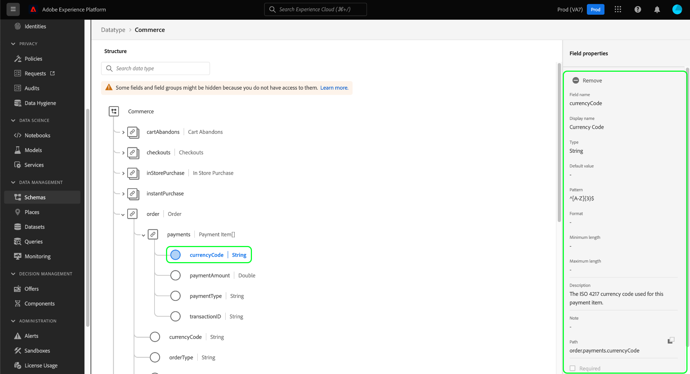

# UI에서 스키마 리소스 살펴보기

Adobe Experience Platform에서 XDM(Experience Data Model) 스키마 리소스는 Adobe에서 제공하는 표준 리소스 및 조직에서 정의한 사용자 지정 리소스를 포함하여 [!DNL Schema Library]에 저장됩니다. Experience Platform UI에서는 [!DNL Schema Library]에서 기존 스키마, 클래스, 필드 그룹 또는 데이터 형식의 구조 및 필드를 볼 수 있습니다. UI는 이러한 XDM 리소스에서 제공하는 각 필드의 예상 데이터 유형 및 사용 사례에 대한 정보를 제공하므로 데이터 수집을 계획하고 준비할 때 특히 유용합니다.

이 자습서에서는 Experience Platform UI에서 기존 스키마, 클래스, 필드 그룹 및 데이터 유형을 탐색하는 단계를 다룹니다.

## 스키마 리소스 조회 {#lookup}

Experience Platform UI의 왼쪽 탐색에서 **[!UICONTROL 스키마]**&#x200B;를 선택합니다. [!UICONTROL 스키마] 작업 영역에서는 조직의 모든 스키마를 탐색할 수 있는 **[!UICONTROL 찾아보기]** 탭과 **[!UICONTROL 클래스]**, **[!UICONTROL 필드 그룹]**, **[!UICONTROL 데이터 형식]** 및 **[!UICONTROL 관계]**&#x200B;를 각각 탐색할 수 있는 추가 전용 탭을 제공합니다.

필터 아이콘()은 나열된 결과를 좁히기 위해 왼쪽 레일에 컨트롤을 표시합니다. 리소스 필터는 **[!UICONTROL 찾아보기]** 및 **[!UICONTROL 관계]** 탭에서 각각 스키마 및 관계에 사용할 수 있습니다.

[!UICONTROL 스키마] 작업 영역의 [!UICONTROL 찾아보기] 탭에서 스키마 인벤토리를 필터링할 수 있습니다. **[!UICONTROL 프로필에 포함됨]** 토글을 사용하여 [실시간 고객 프로필](../../profile/home.md)에서 사용할 수 있도록 설정된 스키마만 표시합니다. **[!UICONTROL 임시 스키마 표시]** 전환을 사용하여 단일 데이터 집합에서만 사용할 수 있도록 네임스페이스가 지정된 필드를 사용하여 만든 스키마 목록을 필터링합니다.

![필터 패널이 강조 표시된 [!UICONTROL 스키마] 작업 영역 [!UICONTROL 찾아보기] 탭](../images/ui/explore/filters.png)

[!UICONTROL 스키마] 작업 영역의 [!UICONTROL 관계] 탭에서 네 가지 조건을 기반으로 관계 목록을 필터링할 수 있습니다. 필터에는 [!UICONTROL Source 스키마], [!UICONTROL 대상 스키마], [!UICONTROL Source 클래스] 및 [!UICONTROL 대상 클래스]이 포함됩니다. 아래 표에는 필터에 대한 설명이 나와 있습니다.

| 필터 | 설명 |
|-----------------------------------|------------|
| [!UICONTROL Source 스키마] | 선택한 스키마가 시작점이거나 &quot;소스&quot;인 모든 관계를 보려면 [!UICONTROL Source 스키마] 드롭다운 메뉴에서 스키마를 선택하십시오. |
| [!UICONTROL 대상 스키마] | 선택한 스키마가 대상 또는 &quot;대상&quot;인 모든 관계를 보려면 [!UICONTROL 대상 스키마] 드롭다운 메뉴에서 스키마를 선택하십시오. |
| [!UICONTROL Source 클래스] | 시작하는 스키마의 클래스를 기준으로 관계를 필터링하려면 [!UICONTROL Source 클래스] 드롭다운 메뉴에서 클래스를 선택하십시오. |
| [!UICONTROL 대상 클래스] | 특정 클래스의 스키마로 끝나는 관계를 표시하려면 [!UICONTROL 대상 클래스] 드롭다운 메뉴에서 클래스를 선택하십시오. |

{style="table-layout:auto"}

검색 창을 사용하여 결과의 범위를 더 좁힐 수도 있습니다.

검색 결과에 표시되는 리소스는 제목 일치 항목별로 정렬된 다음 설명 일치 항목별로 정렬됩니다. 이 범주 중 하나에서 단어가 더 많이 일치할수록 높은 리소스가 목록에 나타납니다.

탐색할 리소스를 찾으면 목록에서 해당 이름을 선택하여 캔버스에서 해당 구조를 확인합니다.

## 캔버스에서 XDM 리소스 살펴보기 {#explore}

리소스를 선택하면 해당 구조가 캔버스에서 열립니다.

하위 속성을 포함하는 모든 오브젝트 유형 필드는 캔버스에 처음 나타날 때 기본적으로 축소됩니다. 필드의 하위 속성을 표시하려면 해당 이름 옆에 있는 아이콘을 선택합니다.

### 표준 클래스 및 필드 그룹 표시기 {#standard-class-and-field-group-indicator}

스키마 편집기 내에서 표준(Adobe에서 생성한) 클래스와 필드 그룹은 자물쇠 아이콘( 질문에 답합니다. 자물쇠는 클래스 또는 필드 그룹 이름 옆의 왼쪽 레일과 시스템 생성 리소스의 일부인 스키마 다이어그램의 필드 옆에 나타납니다.

지침은 [표준 필드 그룹에 사용자 지정 필드 추가](./resources/schemas.md) 설명서를 참조하십시오. 표준 클래스는 편집할 수 없습니다.

### 시스템 생성 필드 {#system-fields}

일부 필드 이름은 밑줄(`_repo` 및 `_id`)로 표시됩니다. 이는 데이터가 수집될 때 시스템이 자동으로 생성하고 지정하는 필드의 자리 표시자를 나타냅니다.

따라서 Experience Platform으로 수집할 때 이러한 필드의 대부분을 데이터 구조에서 제외해야 합니다. 이 규칙의 주요 예외는 [`_{TENANT_ID}` 필드](../api/getting-started.md#know-your-tenant_id)입니다. 조직에서 만든 모든 XDM 필드는 아래에 네임스페이스가 지정되어야 합니다.

### 데이터 유형 {#data-types}

캔버스에 표시된 각 필드의 이름 옆에는 해당 데이터 형식이 표시되어 필드에 수집될 데이터 형식을 한눈에 나타냅니다.

대괄호(`[]`)가 추가된 모든 데이터 형식은 해당 특정 데이터 형식의 배열을 나타냅니다. 예를 들어, 데이터 형식 **[!UICONTROL String]\[]**&#x200B;은 필드에 문자열 값의 배열이 필요함을 나타냅니다. **[!UICONTROL 결제 항목]\[]**&#x200B;의 데이터 형식은 [!UICONTROL 결제 항목] 데이터 형식을 따르는 개체 배열을 나타냅니다.

배열 필드가 오브젝트 유형을 기반으로 하는 경우 캔버스에서 해당 아이콘을 선택하여 각 배열 항목에 대한 예상 속성을 표시할 수 있습니다.

### [!UICONTROL 필드 속성] {#field-properties}

캔버스에서 필드 이름을 선택하면 오른쪽 레일이 업데이트되어 **[!UICONTROL 필드 속성]** 아래에 해당 필드에 대한 세부 정보가 표시됩니다. 여기에는 필드의 의도된 사용 사례, 기본값, 패턴, 형식, 필드가 필요한지 여부 등에 대한 설명이 포함될 수 있습니다.

검사하려는 필드가 열거형 필드인 경우 오른쪽 레일에는 필드에서 받을 수 있는 값도 표시됩니다.

### ID 필드 {#identity}

ID 필드가 포함된 스키마를 검사할 때 이러한 필드는 스키마에 제공하는 클래스 또는 필드 그룹 아래의 왼쪽 레일에 나열됩니다. 중첩된 깊이에 관계없이 캔버스에 필드를 표시하려면 왼쪽 레일에서 ID 필드 이름을 선택합니다.

캔버스에서 ID 필드가 지문 아이콘()으로 강조 표시됩니다. ID 필드의 이름을 선택하면 [ID 네임스페이스](../../identity-service/features/namespaces.md) 및 필드가 스키마의 기본 ID인지 여부와 같은 추가 정보를 볼 수 있습니다.

>[!NOTE]
>
>ID 필드 및 다운스트림 Experience Platform 서비스와의 관계에 대한 자세한 내용은 [ID 필드 정의](./fields/identity.md)에 대한 안내서를 참조하십시오.

### 관계 필드 {#relationship}

관계 필드가 포함된 스키마를 검사하는 경우 필드가 **[!UICONTROL 관계]** 아래의 왼쪽 레일에 나열됩니다. 중첩된 깊이에 관계없이 캔버스에 필드를 표시하려면 왼쪽 레일에서 관계 필드 이름을 선택합니다. 캔버스에서는 관계 필드도 고유하게 강조 표시되어 필드가 연결하는 참조 스키마의 이름을 표시합니다. B2B 기능이 있는 조직의 경우 사용자 지정 관계 이름을 쓸 수 있으며, 이러한 경우 캔버스에 표시됩니다.

참조 스키마의 기본 ID에 대한 ID 네임스페이스를 보려면 관계 필드를 선택한 다음 [!UICONTROL 필드 속성] 사이드바에서 **[!UICONTROL 관계 편집]**&#x200B;을 선택합니다. 관계의 매개 변수가 표시되는 [!UICONTROL 관계 편집] 대화 상자에 표시됩니다.

XDM 스키마에서의 관계 사용에 대한 자세한 내용은 [UI에서 관계 만들기](../tutorials/relationship-ui.md)에 대한 자습서를 참조하십시오.

## 다음 단계

이 문서에서는 Experience Platform UI에서 기존 XDM 리소스를 탐색하는 방법을 다룹니다. [!UICONTROL 스키마] 작업 영역과 [!DNL Schema Editor]의 다양한 기능에 대한 자세한 내용은 [[!UICONTROL 스키마] 작업 영역 개요](./overview.md)를 참조하십시오.
