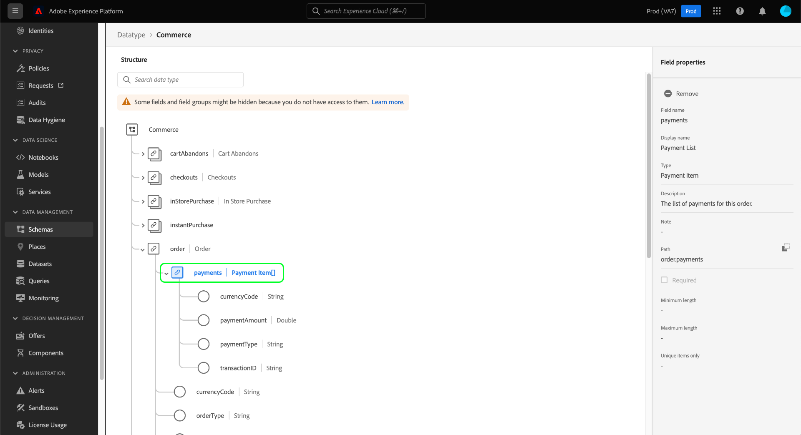

# UI에서 스키마 리소스 살펴보기

Adobe Experience Platform에서 모든 XDM(Experience Data Model) 스키마 리소스는 [!DNL Schema Library]Adobe에서 제공하는 표준 리소스 및 조직에서 정의한 사용자 정의 리소스를 포함합니다. Experience Platform UI에서 기존 스키마, 클래스, 필드 그룹 또는 데이터 유형의 구조 및 필드를 [!DNL Schema Library]. UI는 이러한 XDM 리소스에서 제공하는 각 필드의 예상 데이터 유형 및 사용 사례에 대한 정보를 제공하므로 데이터 수집을 계획하고 준비할 때 특히 유용합니다.

이 자습서에서는 Experience Platform UI에서 기존 스키마, 클래스, 필드 그룹 및 데이터 유형을 탐색하는 단계를 다룹니다.

## 스키마 리소스 조회 {#lookup}

Platform UI에서 를 선택합니다. **[!UICONTROL 스키마]** 왼쪽 탐색. 다음 [!UICONTROL 스키마] workspace에서 다음을 제공합니다. **[!UICONTROL 찾아보기]** 탐색을 위한 추가 전용 탭과 함께 조직의 모든 스키마를 탐색하는 탭입니다 **[!UICONTROL 클래스]**, **[!UICONTROL 필드 그룹]**, 및 **[!UICONTROL 데이터 유형]** 각각.

필터 아이콘()는 나열된 결과를 좁히기 위해 왼쪽 레일에 컨트롤을 표시합니다. 표시되는 컨트롤은 나열되는 리소스 유형에 따라 다릅니다.

예를 들어 Adobe에서 제공하는 표준 데이터 유형만 표시하도록 목록을 필터링하려면 다음을 선택합니다. **[!UICONTROL 데이터 유형]** 및 **[!UICONTROL Adobe]** 다음 아래에 **[!UICONTROL 유형]** 및 **[!UICONTROL 소유자]** 각각 섹션.

다음 **[!UICONTROL 프로필에 포함됨]** 토글을 사용하면 결과를 필터링하여에서 사용할 수 있도록 설정된 스키마에서 사용되는 리소스만 표시할 수 있습니다. [실시간 고객 프로필](../../profile/home.md). 다음 **[!UICONTROL 임시 스키마 표시]** 전환 필터는 단일 데이터 세트에서만 사용할 수 있도록 네임스페이스가 지정된 필드로 생성된 스키마 목록을 필터링합니다.

![다음 [!UICONTROL 스키마] 작업 영역 [!UICONTROL 찾아보기] 필터 패널이 강조 표시된 탭입니다.](../images/ui/explore/filter.png)

에 리소스를 나열할 때 **[!UICONTROL 클래스]**, **[!UICONTROL 필드 그룹]**, 또는 **[!UICONTROL 데이터 유형]** 탭을 사용하여 다음을 선택할 수 있습니다. **[!UICONTROL Adobe]** 표준 리소스만 표시하려면 **[!UICONTROL 고객]** 조직에서 생성한 리소스만 표시합니다.

검색 창을 사용하여 결과의 범위를 더 좁힐 수도 있습니다.

검색 결과에 표시되는 리소스는 제목 일치 항목별로 정렬된 다음 설명 일치 항목별로 정렬됩니다. 이 범주 중 하나에서 단어가 더 많이 일치할수록 높은 리소스가 목록에 나타납니다.

탐색할 리소스를 찾으면 목록에서 해당 이름을 선택하여 캔버스에서 해당 구조를 확인합니다.

## 캔버스에서 XDM 리소스 살펴보기 {#explore}

리소스를 선택하면 해당 구조가 캔버스에서 열립니다.

하위 속성을 포함하는 모든 오브젝트 유형 필드는 캔버스에 처음 나타날 때 기본적으로 축소됩니다. 필드의 하위 속성을 표시하려면 해당 이름 옆에 있는 아이콘을 선택합니다.

### 시스템 생성 필드 {#system-fields}

일부 필드 이름은 다음과 같이 밑줄 앞에 추가됩니다. `_repo` 및 `_id`. 이는 데이터가 수집될 때 시스템이 자동으로 생성하고 지정하는 필드의 자리 표시자를 나타냅니다.

따라서 이러한 필드의 대부분은 플랫폼으로 수집할 때 데이터 구조에서 제외해야 합니다. 이 규칙의 주요 예외는 다음과 같습니다. [`_{TENANT_ID}` 필드](../api/getting-started.md#know-your-tenant_id): 조직 아래에 생성된 모든 XDM 필드의 이름은 로 지정되어야 합니다.

### 데이터 유형 {#data-types}

캔버스에 표시된 각 필드의 이름 옆에는 해당 데이터 형식이 표시되어 필드에 수집될 데이터 형식을 한눈에 나타냅니다.

대괄호( )가 붙은 모든 데이터 형식`[]`)는 특정 데이터 유형의 배열을 나타냅니다. (예: 데이터 유형: **[!UICONTROL 문자열]\[]** 필드에 문자열 값의 배열이 필요함을 나타냅니다. 의 데이터 유형 **[!UICONTROL 결제 항목]\[]** 는 다음을 준수하는 객체 배열을 나타냅니다. [!UICONTROL 결제 항목] 데이터 유형.

배열 필드가 오브젝트 유형을 기반으로 하는 경우 캔버스에서 해당 아이콘을 선택하여 각 배열 항목에 대한 예상 속성을 표시할 수 있습니다.

### [!UICONTROL 필드 속성] {#field-properties}

캔버스에서 필드의 이름을 선택하면 오른쪽 레일이 업데이트되어 아래에 해당 필드에 대한 세부 사항이 표시됩니다 **[!UICONTROL 필드 속성]**. 여기에는 필드의 의도된 사용 사례, 기본값, 패턴, 형식, 필드가 필요한지 여부 등에 대한 설명이 포함될 수 있습니다.

검사하려는 필드가 열거형 필드인 경우 오른쪽 레일에는 필드에서 받을 수 있는 값도 표시됩니다.

### ID 필드 {#identity}

ID 필드가 포함된 스키마를 검사할 때 이러한 필드는 스키마에 제공하는 클래스 또는 필드 그룹 아래의 왼쪽 레일에 나열됩니다. 중첩된 깊이에 관계없이 캔버스에 필드를 표시하려면 왼쪽 레일에서 ID 필드 이름을 선택합니다.

캔버스에서 ID 필드가 지문 아이콘( )으로 강조 표시됩니다.). ID 필드의 이름을 선택하면 [id 네임스페이스](../../identity-service/features/namespaces.md) 필드가 스키마의 기본 ID인지 여부를 나타냅니다.

>[!NOTE]
>
>다음 안내서를 참조하십시오 [id 필드 정의](./fields/identity.md) id 필드 및 다운스트림 플랫폼 서비스와의 관계에 대한 자세한 내용

### 관계 필드 {#relationship}

관계 필드가 포함된 스키마를 검사하는 경우 아래 왼쪽 레일에 필드가 나열됩니다 **[!UICONTROL 관계]**. 중첩된 깊이에 관계없이 캔버스에 필드를 표시하려면 왼쪽 레일에서 관계 필드 이름을 선택합니다.

캔버스에서는 관계 필드도 고유하게 강조 표시되어 필드가 연결하는 참조 스키마의 이름을 표시합니다. 관계 필드의 이름을 선택하면 오른쪽 레일에서 참조 스키마 기본 ID의 ID 네임스페이스를 볼 수 있습니다.

>[!NOTE]
>
>다음 튜토리얼 참조: [ui에서 관계 만들기](../tutorials/relationship-ui.md) xdm 스키마에서의 관계 사용에 대한 자세한 내용.

## 다음 단계

이 문서에서는 Experience Platform UI에서 기존 XDM 리소스를 탐색하는 방법을 다룹니다. 의 다양한 기능에 대한 자세한 내용은 [!UICONTROL 스키마] 작업 영역 및 [!DNL Schema Editor], 다음을 참조하십시오. [[!UICONTROL 스키마] 작업 영역 개요](./overview.md).
