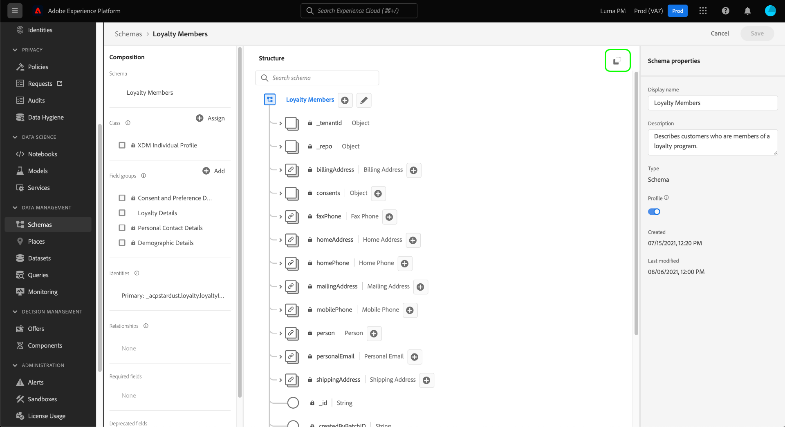

# UI에서 XDM 스키마 내보내기

스키마 라이브러리 내의 모든 리소스는 IMS 조직 내의 특정 샌드박스에 포함되어 있습니다. 샌드박스와 IMS 조직 간에 XDM(Experience Data Model) 리소스를 공유할 수 있습니다.

이러한 요구 사항을 충족하려면 [!UICONTROL 스키마] Adobe Experience Platform UI의 작업 영역에서 스키마 라이브러리 내의 모든 스키마에 대한 내보내기 페이로드를 생성할 수 있습니다. 그런 다음 스키마 레지스트리 API 호출에 이 페이로드를 사용하여 스키마(및 모든 종속 리소스)를 타겟 샌드박스 및 IMS 조직에 가져올 수 있습니다.

>[!NOTE]
>
>스키마 레지스트리 API를 사용하여 클래스, 스키마 필드 그룹 및 데이터 유형을 포함한 스키마 외에 다른 리소스를 내보낼 수도 있습니다. 자세한 내용은 [끝점 내보내기 안내서](../api/export.md) 추가 정보.

## 전제 조건

Platform UI를 통해 XDM 리소스를 내보낼 수 있지만, 스키마 레지스트리 API를 사용하여 이러한 리소스를 다른 샌드박스 또는 IMS 조직으로 가져와서 워크플로우를 완료해야 합니다. 다음 안내서를 참조하십시오. [스키마 레지스트리 API 시작](../api/getting-started.md) 을 참조하십시오.

## 내보내기 페이로드 생성

플랫폼 UI에서 **[!UICONTROL 스키마]** 을 클릭합니다. 내 [!UICONTROL 스키마] 작업 공간에서 내보낼 스키마를 찾아 [!DNL Schema Editor].

>[!TIP]
>
>다음 안내서를 참조하십시오. [xdm 리소스 탐색](./explore.md) 찾고 있는 XDM 리소스를 찾는 방법에 대한 자세한 내용을 참조하십시오.

스키마를 연 후에는 **[!UICONTROL JSON 복사]** 아이콘 ()을 클릭하여 제품에서 사용할 수 있습니다.



스키마 구조를 기반으로 생성된 JSON 페이로드를 클립보드에 복사합니다. 에 대해[!DNL Loyalty Members]위에 표시된 &quot;스키마, 다음 JSON이 생성됩니다.

```json
[
  {
    "$id": "https://ns.adobe.com/<XDM_TENANTID_PLACEHOLDER>/mixins/9ecfd881d0053568d277b792e4d24c6b70ffa7782bd31265",
    "meta:altId": "_<XDM_TENANTID_PLACEHOLDER>.mixins.9ecfd881d0053568d277b792e4d24c6b70ffa7782bd31265",
    "meta:resourceType": "mixins",
    "version": "1.0",
    "title": "Loyalty details",
    "type": "object",
    "description": "",
    "definitions": {
      "customFields": {
        "type": "object",
        "properties": {
          "_<XDM_TENANTID_PLACEHOLDER>": {
            "type": "object",
            "properties": {
              "loyalty": {
                "title": "Loyalty",
                "description": "",
                "type": "object",
                "isRequired": false,
                "required": [
                  
                ],
                "properties": {
                  "loyaltyId": {
                    "title": "Loyalty ID",
                    "description": "",
                    "type": "string",
                    "isRequired": false,
                    "required": [
                      
                    ],
                    "meta:xdmType": "string"
                  },
                  "memberSince": {
                    "title": "Member Since",
                    "description": "",
                    "type": "string",
                    "isRequired": false,
                    "required": [
                      
                    ],
                    "format": "date",
                    "meta:xdmType": "date"
                  },
                  "points": {
                    "title": "Points",
                    "description": "",
                    "type": "integer",
                    "isRequired": false,
                    "required": [
                      
                    ],
                    "meta:xdmType": "int"
                  },
                  "loyaltyLevel": {
                    "title": "Loyalty Level",
                    "description": "",
                    "type": "string",
                    "isRequired": false,
                    "required": [
                      
                    ],
                    "enum": [
                      "platinum",
                      "gold",
                      "silver",
                      "bronze"
                    ],
                    "meta:enum": {
                      "platinum": "Platinum",
                      "gold": "Gold",
                      "silver": "Silver",
                      "bronze": "Bronze"
                    },
                    "meta:xdmType": "string"
                  }
                },
                "meta:xdmType": "object"
              }
            },
            "meta:xdmType": "object"
          }
        },
        "meta:xdmType": "object"
      }
    },
    "allOf": [
      {
        "$ref": "#/definitions/customFields",
        "type": "object",
        "meta:xdmType": "object"
      }
    ],
    "meta:extensible": true,
    "meta:abstract": true,
    "meta:intendedToExtend": [
      
    ],
    "meta:xdmType": "object",
    "meta:sandboxId": "1bd86660-c5da-11e9-93d4-6d5fc3a66a8e",
    "meta:sandboxType": "production"
  },
  {
    "$id": "https://ns.adobe.com/<XDM_TENANTID_PLACEHOLDER>/schemas/1e5a739ded8fd1d766a0e06e881a38031874dddd1c7020ad",
    "meta:altId": "_<XDM_TENANTID_PLACEHOLDER>.schemas.1e5a739ded8fd1d766a0e06e881a38031874dddd1c7020ad",
    "meta:resourceType": "schemas",
    "version": "1.4",
    "title": "Loyalty Members",
    "type": "object",
    "description": "Describes customers who are members of a loyalty program.",
    "allOf": [
      {
        "$ref": "https://ns.adobe.com/xdm/context/profile",
        "type": "object",
        "meta:xdmType": "object"
      },
      {
        "$ref": "https://ns.adobe.com/xdm/context/profile-person-details",
        "type": "object",
        "meta:xdmType": "object"
      },
      {
        "$ref": "https://ns.adobe.com/xdm/context/profile-personal-details",
        "type": "object",
        "meta:xdmType": "object"
      },
      {
        "$ref": "https://ns.adobe.com/<XDM_TENANTID_PLACEHOLDER>/mixins/9ecfd881d0053568d277b792e4d24c6b70ffa7782bd31265",
        "type": "object",
        "meta:xdmType": "object"
      },
      {
        "$ref": "https://ns.adobe.com/xdm/mixins/profile-consents",
        "type": "object",
        "meta:xdmType": "object"
      }
    ],
    "meta:extensible": false,
    "meta:abstract": false,
    "meta:extends": [
      "https://ns.adobe.com/xdm/context/profile-person-details",
      "https://ns.adobe.com/xdm/context/profile-personal-details",
      "https://ns.adobe.com/xdm/common/auditable",
      "https://ns.adobe.com/xdm/data/record",
      "https://ns.adobe.com/xdm/context/profile",
      "https://ns.adobe.com/<XDM_TENANTID_PLACEHOLDER>/mixins/9ecfd881d0053568d277b792e4d24c6b70ffa7782bd31265",
      "https://ns.adobe.com/xdm/mixins/profile-consents"
    ],
    "meta:xdmType": "object",
    "meta:class": "https://ns.adobe.com/xdm/context/profile",
    "meta:sandboxId": "1bd86660-c5da-11e9-93d4-6d5fc3a66a8e",
    "meta:sandboxType": "production",
    "meta:immutableTags": [
      
    ]
  }
]
```

페이로드는 배열 형태를 취하며 각 배열 항목은 내보낼 사용자 지정 XDM 리소스를 나타내는 개체입니다. 위의 예에서[!DNL Loyalty details]&quot; 사용자 지정 필드 그룹 및 &quot;[!DNL Loyalty Members]&quot; 스키마가 포함됩니다. 모든 샌드박스 및 IMS 조직에서 이 리소스를 사용할 수 있으므로 스키마에 사용되는 모든 핵심 리소스는 내보내기에 포함되지 않습니다.

조직의 테넌트 ID의 각 인스턴스는 `<XDM_TENANTID_PLACEHOLDER>` ( 페이로드)를 참조하십시오. 다음 단계에서 스키마를 가져오는 위치에 따라 이러한 자리 표시자가 적절한 테넌트 ID 값으로 자동 교체됩니다.

## API를 사용하여 리소스 가져오기

스키마에 대한 내보내기 JSON을 복사했으면 을 POST 요청에 대한 페이로드로 사용할 수 있습니다 `/rpc/import` 스키마 레지스트리 API의 끝점입니다. 자세한 내용은 [끝점 가져오기 안내서](../api/import.md) 원하는 IMS 조직 및 샌드박스로 스키마를 전송하도록 호출을 구성하는 방법에 대한 자세한 내용은

## 다음 단계

이 안내서를 따라 XDM 스키마를 다른 IMS 조직 또는 샌드박스로 성공적으로 내보냈습니다. 의 기능에 대한 자세한 내용은 [!UICONTROL 스키마] UI에서 [[!UICONTROL 스키마] UI 개요](./overview.md).
