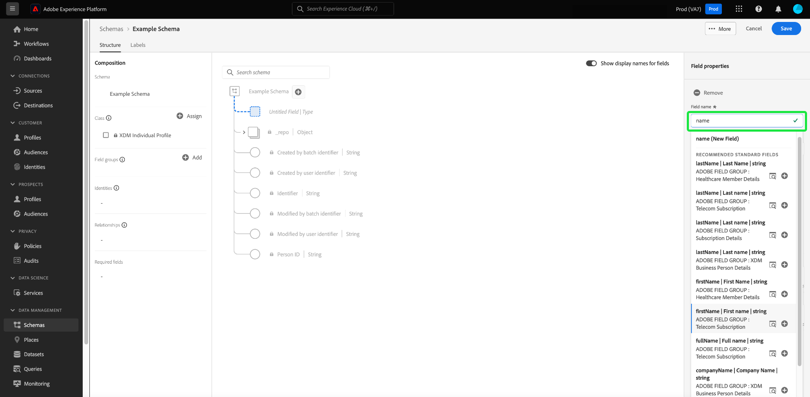

# 스키마 편집기의 필드 기반 워크플로

Adobe Experience Platform은 XDM(경험 데이터 모델) 스키마에서 사용하기 위해 강력한 표준화된 [필드 그룹](../schema/composition.md#field-group) 집합을 제공합니다. 이러한 필드 그룹의 구조 및 의미 체계는 플랫폼의 다양한 세분화 사용 사례 및 기타 다운스트림 애플리케이션을 충족하도록 세심하게 조정됩니다. 고유한 비즈니스 요구 사항을 해결하기 위해 사용자 정의 필드 그룹을 정의할 수도 있습니다.

스키마에 필드 그룹을 추가하면 해당 스키마는 해당 그룹에 포함된 모든 필드를 상속합니다. 그러나 이제 필요하지 않은 관련 필드 그룹의 다른 필드를 포함할 필요 없이 스키마에 개별 필드를 추가할 수 있습니다.

이 안내서에서는 Platform UI의 스키마에 개별 필드를 추가하는 다양한 방법을 다룹니다.

## 전제 조건

이 자습서에서는 사용자가 [XDM 스키마의 구성](../schema/composition.md)과 Platform UI에서 스키마 편집기를 사용하는 방법을 잘 알고 있다고 가정합니다. 계속하려면 이 안내서를 계속하기 전에 [새 스키마를 만들고](./resources/schemas.md)표준 클래스에 할당하는 프로세스를 시작해야 합니다.

## 표준 필드 그룹에서 추가된 필드 제거 {#remove-field-group}

스키마에 표준 필드 그룹을 추가한 후에는 필요하지 않은 표준 필드를 제거할 수 있습니다.

>[!NOTE]
>
>표준 필드 그룹에서 필드를 제거하면 작업 중인 스키마에만 영향을 주고 필드 그룹 자체에는 영향을 주지 않습니다. 한 스키마에서 표준 필드를 제거하면 동일한 필드 그룹을 사용하는 다른 모든 스키마에서 해당 필드를 계속 사용할 수 있습니다.

다음 예제에서는 표준 필드 그룹 **[!UICONTROL 인구 통계 세부 정보]**&#x200B;을(를) 스키마에 추가했습니다. `maritalStatus`과(와) 같은 단일 필드를 제거하려면 캔버스에서 필드를 선택한 다음 오른쪽 레일에서 **[!UICONTROL 제거]**&#x200B;를 선택하십시오.

제거할 필드가 여러 개인 경우 필드 그룹을 전체적으로 관리할 수 있습니다. 캔버스에서 그룹에 속하는 필드를 선택한 다음 오른쪽 레일에서 **[!UICONTROL 관련 필드 관리]**&#x200B;를 선택합니다.

해당 필드 그룹의 구조를 보여 주는 대화 상자가 나타납니다. 여기에서 제공된 확인란을 사용하여 필요한 필드를 선택하거나 선택 취소할 수 있습니다. 만족하면 **[!UICONTROL 확인]**&#x200B;을 선택하세요.

![필드 그룹 다이어그램과 [확인]이 강조 표시된 관련 필드 관리 대화 상자입니다.](../images/ui/field-based-workflows/select-fields.png)

스키마 구조에 선택한 필드만 있는 캔버스가 다시 나타납니다.

## 스키마에 직접 표준 필드 추가

해당 필드 그룹을 미리 알 필요 없이 표준 필드 그룹의 필드를 스키마에 직접 추가할 수 있습니다. 스키마에 표준 필드를 추가하려면 캔버스에서 스키마 이름 옆에 있는 더하기(**+**) 아이콘을 선택합니다. **[!UICONTROL 제목 없는 필드]** 자리 표시자가 스키마 구조와 오른쪽 레일 업데이트에 표시되어 필드를 구성할 컨트롤을 표시합니다.

**[!UICONTROL 필드 이름]**&#x200B;에서 추가하려는 필드 이름을 입력하세요. 시스템은 쿼리와 일치하는 표준 필드를 자동으로 검색하고 해당 필드가 속한 필드 그룹을 포함하여 **[!UICONTROL 권장 표준 필드]**&#x200B;에 나열합니다.

일부 표준 필드는 동일한 이름을 공유하지만 구조는 출신 필드 그룹에 따라 달라질 수 있습니다. 표준 필드가 필드 그룹 구조의 상위 오브젝트 내에 중첩된 경우 하위 필드가 추가되면 상위 필드도 스키마에 포함됩니다.

표준 필드 옆에 있는 미리 보기 아이콘()을 선택하여 해당 필드 그룹의 구조를 보고 중첩 방법을 더 잘 이해합니다. 스키마에 표준 필드를 추가하려면 더하기 아이콘()을 선택합니다.

캔버스는 필드 그룹 구조 내에 중첩된 상위 필드를 포함하여 스키마에 추가된 표준 필드를 표시하도록 업데이트됩니다. 필드 그룹의 이름은 왼쪽 레일의 **[!UICONTROL 필드 그룹]** 아래에 나열됩니다. 같은 필드 그룹의 필드를 더 추가하려면 오른쪽 레일에서 **[!UICONTROL 관련 필드 관리]**&#x200B;를 선택하십시오.

## 사용자 정의 필드를 스키마에 직접 추가

표준 필드의 워크플로우와 마찬가지로 사용자 정의 필드를 스키마에 직접 추가할 수도 있습니다.

스키마의 루트 수준에 필드를 추가하려면 캔버스에서 스키마 이름 옆에 있는 더하기(**+**) 아이콘을 선택합니다. **[!UICONTROL 제목 없는 필드]** 자리 표시자가 스키마 구조와 오른쪽 레일 업데이트에 표시되어 필드를 구성할 컨트롤을 표시합니다.

추가하려는 필드 이름을 입력하면 일치하는 표준 필드 검색이 자동으로 시작됩니다. 대신 새 사용자 지정 필드를 만들려면 **([!UICONTROL 새 필드])**&#x200B;이(가) 추가된 최상위 옵션을 선택하십시오.

여기에서 필드에 대한 표시 이름 및 데이터 유형을 입력합니다. **[!UICONTROL 필드 그룹 할당]**&#x200B;에서 연결할 새 필드에 대한 필드 그룹을 선택해야 합니다. 필드 그룹의 이름을 입력하세요. 이전에 [사용자 지정 필드 그룹을 만든 경우](./resources/field-groups.md#create)이 드롭다운 목록에 표시됩니다. 또는 필드에 고유한 이름을 입력하여 대신 새 필드 그룹을 만들 수 있습니다.

>[!WARNING]
>
>기존 사용자 정의 필드 그룹을 선택하는 경우 변경 사항을 저장한 후 해당 필드 그룹을 사용하는 다른 스키마도 새로 추가된 필드를 상속합니다. 이러한 이유로 이 전달 유형을 원하는 경우에만 기존 필드 그룹을 선택합니다. 그렇지 않으면 대신 새 사용자 정의 필드 그룹을 만들도록 선택해야 합니다.

완료되면 **[!UICONTROL 적용]**&#x200B;을 선택합니다.

새 필드가 캔버스에 추가되고 표준 XDM 필드와의 충돌을 방지하기 위해 [테넌트 ID](../api/getting-started.md#know-your-tenant_id) 아래에 네임스페이스가 지정됩니다. 새 필드를 연결한 필드 그룹은 왼쪽 레일의 **[!UICONTROL 필드 그룹]** 아래에도 나타납니다.

>[!NOTE]
>
>선택한 사용자 정의 필드 그룹에서 제공하는 나머지 필드는 기본적으로 스키마에서 제거됩니다. 이러한 필드 중 일부를 스키마에 추가하려면 그룹에 속한 필드를 선택한 다음 오른쪽 레일에서 **[!UICONTROL 관련 필드 관리]**&#x200B;를 선택하십시오.

### 표준 필드 그룹 구조에 사용자 정의 필드 추가

작업 중인 스키마에 표준 필드 그룹에서 제공하는 개체 유형 필드가 있는 경우 해당 표준 개체에 사용자 지정 필드를 추가할 수 있습니다. 개체의 루트 옆에 있는 더하기(**+**) 아이콘을 선택합니다.

>[!IMPORTANT]
>
>한 스키마의 필드 그룹에 추가된 모든 필드는 해당 필드 그룹을 사용하는 다른 모든 스키마에도 표시됩니다.

사용자 지정 필드 추가에 대한 자세한 내용은 [UI 안내서에서 스키마 만들기 및 편집](./resources/schemas.md#custom-fields-for-standard-groups)을 참조하십시오.

## 다음 단계

이 안내서에서는 Platform UI의 스키마 편집기를 위한 새로운 필드 기반 워크플로우에 대해 다룹니다. UI에서 스키마를 관리하는 방법에 대한 자세한 내용은 [UI 개요](./overview.md)를 참조하십시오.
