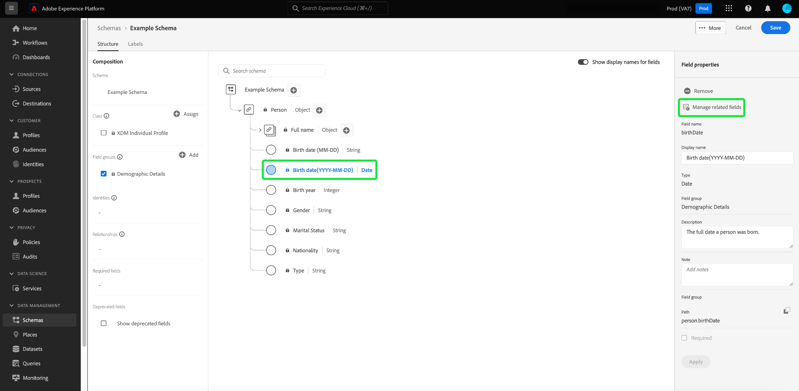

# 스키마 편집기(베타)의 필드 기반 워크플로우

>[!IMPORTANT]
>
>이 베타 문서에 설명된 워크플로우는 이제 일반적으로 Adobe Experience Platform에서 사용할 수 있습니다. 스키마 편집기의 필드 기반 워크플로우에 대한 최신 지침은 [스키마 UI 안내서](./resources/schemas.md) 을 가리키도록 업데이트하는 것이 좋습니다. 이 안내서는 곧 제거됩니다.

Adobe Experience Platform은 강력한 표준화된 일련의 를 제공합니다 [필드 그룹](../schema/composition.md#field-group) xdm(Experience 데이터 모델) 스키마에서 사용할 수 있습니다. 이러한 필드 그룹의 구조와 의미 체계는 Platform의 다양한 세그멘테이션 사용 사례 및 기타 다운스트림 애플리케이션을 충족하도록 신중하게 조정됩니다. 고유한 비즈니스 요구 사항을 해결하기 위해 고유한 사용자 지정 필드 그룹을 정의할 수도 있습니다.

스키마에 필드 그룹을 추가하면 해당 스키마는 해당 그룹에 포함된 모든 필드를 상속합니다. 그러나 이제 반드시 사용하지 않을 수 있는 관련 필드 그룹의 다른 필드를 포함할 필요 없이 스키마에 개별 필드를 추가할 수 있습니다.

이 안내서에서는 Platform UI에서 스키마에 개별 필드를 추가하는 다양한 방법을 다룹니다.

## 전제 조건

이 자습서에서는 사용자가 [XDM 스키마 구성](../schema/composition.md) 및 플랫폼 UI에서 스키마 편집기를 사용하는 방법. 따라서 다음을 수행해야 합니다 [새 스키마 만들기](./resources/schemas.md) 이 안내서를 계속하기 전에 표준 클래스에 할당할 수 있습니다.

## 표준 필드 그룹에서 추가한 필드 제거 {#remove-field-group}

스키마에 표준 필드 그룹을 추가한 후에는 필요하지 않은 표준 필드를 제거할 수 있습니다.

>[!NOTE]
>
>표준 필드 그룹에서 필드를 제거하면 작업 중인 스키마에만 영향을 주며 필드 그룹 자체에는 영향을 주지 않습니다. 하나의 스키마에서 표준 필드를 제거하면 동일한 필드 그룹을 사용하는 다른 모든 스키마에서 해당 필드를 계속 사용할 수 있습니다.

다음 예에서는 표준 필드 그룹입니다 **[!UICONTROL 인구 통계 세부 정보]** 가 스키마에 추가되었습니다. 다음과 같은 단일 필드를 제거하려면 `taxId`캔버스에서 필드를 선택한 다음 을 선택합니다 **[!UICONTROL 제거]** 오른쪽 레일에 있습니다.

제거할 필드가 여러 개 있으면 필드 그룹을 전체적으로 관리할 수 있습니다. 캔버스에서 그룹에 속하는 필드를 선택한 다음 을 선택합니다 **[!UICONTROL 관련 필드 관리]** 오른쪽 레일에 있습니다.

해당 필드 그룹의 구조를 보여 주는 대화 상자가 나타납니다. 여기에서 제공된 확인란을 사용하여 필요한 필드를 선택하거나 선택 취소할 수 있습니다. 만족하면 을 선택합니다 **[!UICONTROL 확인]**.

스키마 구조에 선택된 필드만 있는 캔버스가 다시 나타납니다.

## 스키마에 표준 필드 직접 추가

표준 필드 그룹의 필드를 스키마에 직접 추가할 수 있지만, 해당 필드 그룹을 미리 알지 않아도 됩니다. 스키마에 표준 필드를 추가하려면 더하기(**+**) 아이콘을 클릭하여 제품에서 사용할 수 있습니다. An **[!UICONTROL 제목 없는 필드]** 자리 표시자가 스키마 구조에 나타나고 오른쪽 레일이 업데이트되어 필드를 구성할 컨트롤을 표시합니다.

아래 **[!UICONTROL 필드 이름]**&#x200B;을 입력하여 추가할 필드의 이름을 입력합니다. 시스템은 쿼리와 일치하는 표준 필드를 자동으로 검색하여 **[!UICONTROL 권장 표준 필드]**&#x200B;에는 해당 필드가 속한 필드 그룹을 포함합니다.

일부 표준 필드는 이름이 같지만 필드 그룹에 따라 구조가 달라질 수 있습니다. 표준 필드가 필드 그룹 구조의 상위 개체 내에 중첩된 경우 하위 필드가 추가되면 상위 필드도 스키마에 포함됩니다.

미리 보기 아이콘()을 클릭하여 표준 필드 그룹의 구조를 보고 중첩할 방법을 보다 잘 이해할 수 있습니다. 스키마에 표준 필드를 추가하려면 더하기 아이콘().

캔버스는 필드 그룹 구조 내에 중첩된 상위 필드를 비롯하여 스키마에 추가된 표준 필드를 표시하도록 업데이트됩니다. 필드 그룹의 이름도 아래에 나열됩니다 **[!UICONTROL 필드 그룹]** 왼쪽 레일에 있습니다. 동일한 필드 그룹에서 필드를 더 추가하려면 을 선택합니다 **[!UICONTROL 관련 필드 관리]** 오른쪽 레일에 있습니다.

## 스키마에 사용자 지정 필드 직접 추가

표준 필드의 워크플로우와 유사하게, 스키마에 직접 사용자 지정 필드를 추가할 수도 있습니다.

스키마의 루트 수준에 필드를 추가하려면 더하기(**+**) 아이콘을 클릭하여 제품에서 사용할 수 있습니다. An **[!UICONTROL 제목 없는 필드]** 자리 표시자가 스키마 구조에 나타나고 오른쪽 레일이 업데이트되어 필드를 구성할 컨트롤을 표시합니다.

추가할 필드의 이름에 입력을 시작하면 시스템이 자동으로 일치하는 표준 필드 검색을 시작합니다. 대신 새 사용자 지정 필드를 만들려면 다음에 첨부된 위쪽 옵션을 선택합니다 **([!UICONTROL 새 필드])**.

여기에서 필드의 표시 이름 및 데이터 유형을 제공합니다. 아래 **[!UICONTROL 필드 그룹 할당]**&#x200B;를 채울 새 필드에 대해 필드 그룹을 선택해야 합니다. 필드 그룹의 이름을 입력하고 이전에 입력한 경우 [사용자 지정 필드 그룹 생성](./resources/field-groups.md#create) 드롭다운 목록에 나타납니다. 또는 필드에 고유한 이름을 입력하여 대신 새 필드 그룹을 만들 수 있습니다.

>[!WARNING]
>
>기존 사용자 지정 필드 그룹을 선택하는 경우, 해당 필드 그룹을 사용하는 다른 모든 스키마도 변경 사항을 저장한 후 새로 추가한 필드를 상속합니다. 이러한 이유로 이 유형의 전달을 원하는 경우에만 기존 필드 그룹을 선택합니다. 그렇지 않으면 대신 새 사용자 지정 필드 그룹을 만들도록 선택해야 합니다.

완료되면 을 선택합니다 **[!UICONTROL 적용]**.

새 필드가 캔버스에 추가되고, 이름순으로 표시됩니다 [임차인 ID](../api/getting-started.md#know-your-tenant_id) 표준 XDM 필드와 충돌하지 않도록 합니다. 새 필드와 연결한 필드 그룹이 아래에 표시됩니다 **[!UICONTROL 필드 그룹]** 왼쪽 레일에 있습니다.

>[!NOTE]
>
>선택한 사용자 지정 필드 그룹에서 제공하는 나머지 필드는 기본적으로 스키마에서 제거됩니다. 이러한 필드 중 일부를 스키마에 추가하려면 그룹에 속하는 필드를 선택한 다음 을 선택합니다 **[!UICONTROL 관련 필드 관리]** 오른쪽 레일에 있습니다.

### 표준 필드 그룹의 구조에 사용자 지정 필드 추가

작업 중인 스키마에 표준 필드 그룹에서 제공하는 객체 유형 필드가 있는 경우 해당 표준 객체에 고유한 사용자 지정 필드를 추가할 수 있습니다. 더하기(**+**)를 클릭하여 제품에서 사용할 수 있습니다.

변경 사항을 적용한 후 표준 개체 내의 테넌트 ID 네임스페이스 아래에 새 필드가 나타납니다. 이러한 중첩 네임스페이스는 동일한 필드 그룹을 사용하는 다른 스키마에서 변경 사항을 중단하지 않도록 필드 그룹 자체 내에서 필드 이름 충돌을 방지합니다.

## 다음 단계

이 안내서에서는 플랫폼 UI의 스키마 편집기에 대한 새로운 필드 기반 워크플로우를 다룹니다. UI에서의 스키마 관리에 대한 자세한 내용은 [UI 개요](./overview.md).
