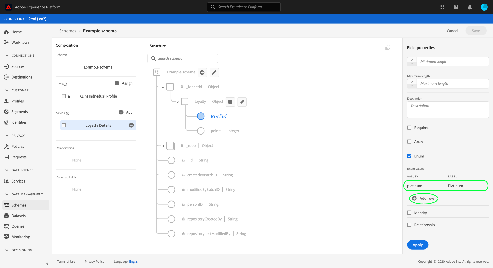

# UI에서 열거형 필드 정의 {#enum}

>[!CONTEXTUALHELP]
>id="platform_xdm_enumsuggestedvalue"
>title="열거형 및 추천 값"
>abstract="열거형은 미리 정의된 값 세트와 일치하는 데이터만 수집하도록 문자열 필드를 제한합니다. 또는, 수집을 제한하지 않고 대신 세그먼테이션에서 선택할 수 있는 속성을 정의하는 데 권장되는 값 세트를 정의할 수 있습니다. 자세한 내용은 설명서를 참조하십시오."

XDM(Experience Data Model)에서 열거형 필드는 허용 가능한 값의 사전 정의된 목록으로 제한되는 필드를 나타냅니다.

When [새 필드 정의](./overview.md#define) Adobe Experience Platform 사용자 인터페이스에서 를 선택하여 열거형 필드로 설정할 수 있습니다 **[!UICONTROL 열거형]** 오른쪽 레일에 있는 확인란.

열거형의 값 제약 조건을 지정할 수 있도록 확인란을 선택하면 추가 컨트롤이 나타납니다. 아래에 **[!UICONTROL 값]** 열에서 필드를 다음으로 제한하려는 정확한 값을 제공해야 합니다. 이 값은 [!UICONTROL 유형] 열거형 필드에 대해 을(를) 선택했습니다. 또한, 다음과 같이 사용자에게 친숙한 기능을 제공할 수도 있습니다 **[!UICONTROL 레이블]** 제한에도 적용됩니다.

열거형에 추가 제약 조건을 추가하려면 **[!UICONTROL 행 추가]**.

원하는 제한 및 선택적 레이블을 열거형에 계속 추가합니다. 완료되면 을 선택합니다 **[!UICONTROL 적용]** 스키마에 변경 사항을 적용하려면

캔버스가 변경 사항을 반영하도록 업데이트됩니다. 나중에 이 스키마를 탐색할 때 오른쪽 레일 내에서 열거형 필드에 대한 제한을 보고 편집할 수 있습니다.

## 다음 단계

이 안내서에서는 UI에서 열거형 필드를 정의하는 방법을 다룹니다. 다음 사항에 대한 개요를 참조하십시오. [ui에서 필드 정의](./overview.md#special) 에서 다른 XDM 필드 유형을 정의하는 방법을 알아봅니다. [!DNL Schema Editor].
