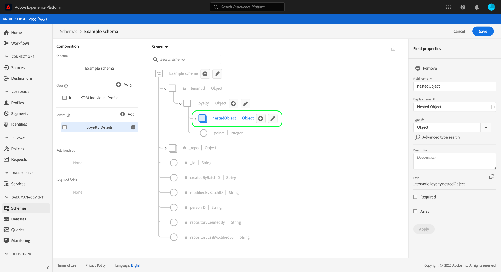

# UI에서 개체 필드 정의

Adobe Experience Platform을 사용하면 XDM(사용자 지정 경험 데이터 모델) 클래스, 스키마 필드 그룹 및 데이터 유형의 구조를 완전히 사용자 정의할 수 있습니다. 사용자 정의 XDM 리소스에 관련 필드를 구성하고 중첩하기 위해 추가 하위 필드를 포함할 수 있는 객체 유형 필드를 정의할 수 있습니다.

Adobe Experience Platform 사용자 인터페이스에서 [새 필드](./overview.md#define)을 정의할 때 **[!UICONTROL Type]** 드롭다운을 사용하고 목록에서 &quot;[!UICONTROL Object]&quot;을 선택합니다.

**[!UICONTROL Apply]**&#x200B;을 선택하여 스키마에 객체를 추가합니다. 캔버스가 업데이트되어 객체에 하위 필드를 편집하고 추가하는 컨트롤을 포함하여 [!UICONTROL Object] 데이터 유형이 적용된 새 필드를 표시합니다.

하위 필드를 추가하려면 캔버스의 개체 필드 옆에 있는 **더하기(+)** 아이콘을 선택합니다. 오른쪽 레일에 하위 필드를 구성하는 컨트롤이 있는 새 필드가 개체 아래에 나타납니다.

하위 필드를 구성하고 **[!UICONTROL Apply]**&#x200B;을 선택하면 동일한 프로세스를 사용하여 객체에 필드를 계속 추가할 수 있습니다. 또한 객체 자체인 하위 필드를 추가할 수 있으므로 원하는 만큼 필드를 중첩할 수 있습니다.

개체 구성을 완료하면 여러 클래스 및 필드 그룹에서 해당 구조를 다시 사용할 수 있습니다. 이 경우 객체를 데이터 유형으로 변환하도록 선택할 수 있습니다. 자세한 내용은 데이터 유형 UI 안내서의 [개체를 데이터 유형](../resources/data-types.md#convert)으로 변환하는 섹션을 참조하십시오.

## 다음 단계

이 안내서에서는 UI에서 개체 필드를 정의하는 방법에 대해 설명합니다. [!DNL Schema Editor]에서 다른 XDM 필드 유형을 정의하는 방법을 알아보려면 [UI](./overview.md#special)의 필드 정의에 대한 개요를 참조하십시오.
