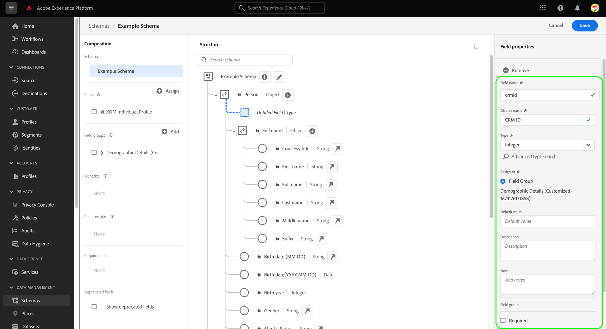

# UI에서 XDM 필드 정의

Adobe Experience Platform 사용자 인터페이스의 [!DNL Schema Editor]을 사용하면 XDM(사용자 지정 경험 데이터 모델) 클래스 및 혼합에서 자신의 필드를 정의할 수 있습니다. 이 안내서에서는 각 필드 유형에 대해 사용 가능한 구성 옵션을 포함하여 UI에서 XDM 필드를 정의하는 단계를 설명합니다.

## 전제 조건

이 가이드를 사용하려면 XDM 시스템에 대한 작업 이해가 필요합니다. Experience Platform 에코시스템 내의 XDM 역할에 대한 소개를 보려면 [XDM 개요](../../home.md), 클래스 및 혼합이 XDM 스키마에 필드를 기여하는 방법에 대해 알아보려면 [스키마 작성 기본 사항](../../schema/composition.md)을 참조하십시오.

이 안내서는 필요하지 않지만 [!DNL Schema Editor]의 다양한 기능에 익숙해지려면 [UI](../../tutorials/create-schema-ui.md)에서 스키마 작성의 자습서를 따르는 것이 좋습니다.

## {#select-resource}에 필드를 추가할 리소스를 선택합니다.

UI에서 새 XDM 필드를 정의하려면 먼저 [!DNL Schema Editor] 내에 스키마를 열어야 합니다. [!DNL Schema Library]에서 현재 사용할 수 있는 스키마에 따라 [새 스키마](../resources/schemas.md#create) 또는 [편집할 기존 스키마를 선택할 수 있습니다](../resources/schemas.md#edit).

[!DNL Schema Editor]이(가) 열려 있으면 왼쪽 레일을 사용하여 필드를 정의할 클래스나 믹싱을 선택합니다. 리소스가 조직에서 정의한 사용자 지정 리소스인 경우 필드를 추가하거나 편집할 수 있는 컨트롤이 캔버스에 표시됩니다. 이러한 컨트롤은 스키마 이름 옆에 나타나고 선택한 클래스 또는 mixin 아래에 정의된 모든 개체 유형 필드도 나타납니다.

>[!NOTE]
>
>선택한 클래스 또는 혼합이 Adobe에서 제공하는 핵심 리소스이면 편집할 수 없으므로 위에 표시된 컨트롤이 나타나지 않습니다. 필드를 추가하려는 스키마가 핵심 XDM 클래스를 기반으로 하고 사용자 정의 믹스를 포함하지 않는 경우 [새 믹신](../resources/mixins.md#create)을 만들어 대신 스키마에 추가할 수 있습니다.

리소스에 새 필드를 추가하려면 캔버스에서 스키마의 이름 옆에 있는 **더하기(+)** 아이콘을 선택하거나 아래의 필드를 정의할 객체 유형 필드 옆에 있는 아이콘을 선택합니다.

## 리소스 {#define}에 대한 필드 정의

**plus (+)** 아이콘을 선택하면 고유한 테넌트 ID에 이름이 지정된 루트 수준 개체(아래 예에서 `_tenantId`로 표시됨) 내에 있는 캔버스에 **[!UICONTROL New field]**&#x200B;가 나타납니다. 사용자 정의 클래스 및 혼합을 통해 스키마에 추가되는 모든 필드는 Adobe에서 제공하는 클래스 및 혼합에서 다른 필드와의 충돌을 방지하기 위해 이 네임스페이스 내에 자동으로 배치됩니다.

**[!UICONTROL Field properties]** 오른쪽 레일에서 새 필드의 세부 정보를 구성할 수 있습니다. 각 필드에 다음 정보가 필요합니다.

| 필드 속성 | 설명 |
| --- | --- |
| [!UICONTROL Field name] | 필드의 고유한 수사적 이름입니다. 스키마를 저장한 후에는 필드 이름을 변경할 수 없습니다.  그 이름은 낙타케이스로 쓰는 것이 이상적이다. 여기에는 영숫자, 대시 또는 밑줄 문자가 포함될 수 있지만 **은 밑줄로 시작할 수 없습니다.**<ul><li>**정답**:  `fieldName`</li><li>**허용 가능:** `field_name2`,  `Field-Name`,  `field-name_3`</li><li>**오답**:  `_fieldName`</li></ul> |
| [!UICONTROL Display name] | 그 필드의 인간적인 이름. |
| [!UICONTROL Type] | 필드에 포함할 데이터의 유형입니다. 이 드롭다운 메뉴에서 XDM에서 지원하는 [표준 스칼라 형식](../../schema/field-constraints.md) 또는 이전에 [!DNL Schema Registry]에 정의된 다중 필드 [데이터 유형](../resources/data-types.md) 중 하나를 선택할 수 있습니다.  기존 데이터 유형 **[!UICONTROL Advanced type search]** 을 검색 및 필터링하고 원하는 유형을 더 쉽게 찾을 수도 있습니다. |

필드의 의도한 사용 사례에 대해 더 많은 컨텍스트를 제공하기 위해 선택적 사람이 읽을 수 있는 **[!UICONTROL Description]**&#x200B;을 필드에 제공할 수도 있습니다.

>[!NOTE]
>
>필드에 대해 선택한 **[!UICONTROL Type]**&#x200B;에 따라 오른쪽 레일에 추가 구성 컨트롤이 나타날 수 있습니다. 이러한 컨트롤에 대한 자세한 내용은 [유형별 필드 속성](#type-specific-properties)의 섹션을 참조하십시오.
>
>오른쪽 레일에는 특수 필드 유형을 지정하는 확인란도 제공됩니다. 자세한 내용은 [특수 필드 유형](#special)의 섹션을 참조하십시오.

필드 구성이 완료되면 **[!UICONTROL Apply]**&#x200B;을 선택합니다.

캔버스가 업데이트되어 필드의 이름 및 유형이 표시되고 오른쪽 레일에는 다른 속성과 함께 필드의 경로가 나열됩니다.

위 단계를 계속 수행하여 스키마에 필드를 더 추가할 수 있습니다. 스키마가 저장되면 기본 클래스와 믹스도 변경 내용이 있는 경우 저장됩니다.

>[!NOTE]
>
>한 스키마의 mixins 또는 클래스에 대한 모든 변경 사항은 해당 스키마를 사용하는 다른 모든 스키마에 반영됩니다.

## 유형별 필드 속성 {#type-specific-properties}

새 필드를 정의할 때 필드에 대해 선택하는 **[!UICONTROL Type]**&#x200B;에 따라 오른쪽 레일에 추가 구성 옵션이 나타날 수 있습니다. 다음 표에서는 이러한 추가 필드 속성에 대해 호환 가능한 유형과 함께 설명합니다.

| 필드 속성 | 호환 가능한 유형 | 설명 |
| --- | --- | --- |
| [!UICONTROL Default value] | [!UICONTROL String], [!UICONTROL Double], [!UICONTROL Long], [!UICONTROL Integer], [!UICONTROL Short], [!UICONTROL Byte], [!UICONTROL Boolean] | 수집 중에 다른 값이 제공되지 않을 경우 이 필드에 할당되는 기본값입니다. 이 값은 필드의 선택한 유형을 준수해야 합니다. |
| [!UICONTROL Pattern] | [!UICONTROL String] | 통합 중에 수락하려면 이 필드의 값이 일치해야 하는 [정규 표현식](https://developer.mozilla.org/en-US/docs/Web/JavaScript/Guide/Regular_Expressions)입니다. |
| [!UICONTROL Format] | [!UICONTROL String] | 값이 준수해야 하는 문자열에 대해 사전 정의된 형식 목록에서 선택합니다. 사용 가능한 포맷은 다음과 같습니다. <ul><li>[[!UICONTROL date-time]](https://tools.ietf.org/html/rfc3339)</li><li>[[!UICONTROL email]](https://tools.ietf.org/html/rfc2822)</li><li>[[!UICONTROL hostname]](https://tools.ietf.org/html/rfc1123#page-13)</li><li>[[!UICONTROL ipv4]](https://tools.ietf.org/html/rfc791)</li><li>[[!UICONTROL ipv6]](https://tools.ietf.org/html/rfc2460)</li><li>[[!UICONTROL uri]](https://tools.ietf.org/html/rfc3986)</li><li>[[!UICONTROL uri-reference]](https://tools.ietf.org/html/rfc3986#section-4.1)</li><li>[[!UICONTROL url-template]](https://tools.ietf.org/html/rfc6570)</li><li>[[!UICONTROL json-pointer]](https://tools.ietf.org/html/rfc6901)</li></ul> |
| [!UICONTROL Minimum length] | [!UICONTROL String] | 통합 중에 값을 수락하려면 문자열에 포함해야 하는 최소 문자 수입니다. |
| [!UICONTROL Maximum length] | [!UICONTROL String] | 통합 중에 값을 수락하려면 문자열에 포함해야 하는 최대 문자 수입니다. |
| [!UICONTROL Minimum value] | [!UICONTROL Double] | 섭취 중 수락할 Double에 대한 최소값입니다. 인제스트된 값이 여기에 입력한 값과 정확히 일치하는 경우 값이 허용됩니다. 이 제약 조건을 사용할 때는 &quot;[!UICONTROL Exclusive minimum value]&quot; 제약 조건을 비워두어야 합니다. |
| [!UICONTROL Maximum value] | [!UICONTROL Double] | 섭취 중 수락할 Double의 최대값입니다. 인제스트된 값이 여기에 입력한 값과 정확히 일치하는 경우 값이 허용됩니다. 이 제약 조건을 사용할 때는 &quot;[!UICONTROL Exclusive maximum value]&quot; 제약 조건을 비워두어야 합니다. |
| [!UICONTROL Exclusive minimum value] | [!UICONTROL Double] | 섭취 중 수락할 Double의 최대값입니다. 인제스트된 값이 여기에 입력한 값과 정확히 일치하는 경우 값이 거부됩니다. 이 제약 조건을 사용할 때는 &quot;[!UICONTROL Minimum value]&quot;(비배타적) 제약 조건을 비워두어야 합니다. |
| [!UICONTROL Exclusive maximum value] | [!UICONTROL Double] | 섭취 중 수락할 Double의 최대값입니다. 인제스트된 값이 여기에 입력한 값과 정확히 일치하는 경우 값이 거부됩니다. 이 제약 조건을 사용할 때는 &quot;[!UICONTROL Maximum value]&quot;(비배타적) 제약 조건을 비워두어야 합니다. |

## 특수 필드 유형 {#special}

오른쪽 레일에는 선택한 필드에 특수 역할을 지정할 수 있는 여러 개의 확인란이 있습니다. 이러한 옵션 중 일부에 대한 사용 사례에는 데이터 모델링 전략과 다운스트림 플랫폼 서비스를 사용하려는 방법에 대한 중요한 고려 사항이 포함됩니다.

이러한 특수 유형에 대한 자세한 내용은 다음 설명서를 참조하십시오.

* [[!UICONTROL Required]](./required.md)
* [[!UICONTROL Array]](./array.md)
* [[!UICONTROL Enum]](./enum.md)
* [[!UICONTROL Identity]](./identity.md) (문자열 필드에만 사용 가능)
* [[!UICONTROL Relationship]](./relationship.md) (문자열 필드에만 사용 가능)

기술적으로 특수 필드 유형은 아니지만 스키마 구조가 중첩된 하위 필드 정의에 대한 자세한 내용을 살펴보려면 [개체 유형 필드 정의](./object.md)의 안내서를 방문하는 것이 좋습니다.

## 다음 단계

이 안내서에서는 UI에서 XDM 필드를 정의하는 방법에 대한 개요를 제공했습니다. 클래스와 믹스를 사용하여 스키마에만 필드를 추가할 수 있습니다. UI에서 이러한 리소스를 관리하는 방법에 대한 자세한 내용은 [classes](../resources/classes.md) 및 [mixins](../resources/mixins.md)을(를) 만들고 편집하는 방법에 대한 가이드를 참조하십시오.

[!UICONTROL Schemas] 작업 영역의 기능에 대한 자세한 내용은 [[!UICONTROL Schemas] 작업 영역 개요](../overview.md)를 참조하십시오.
