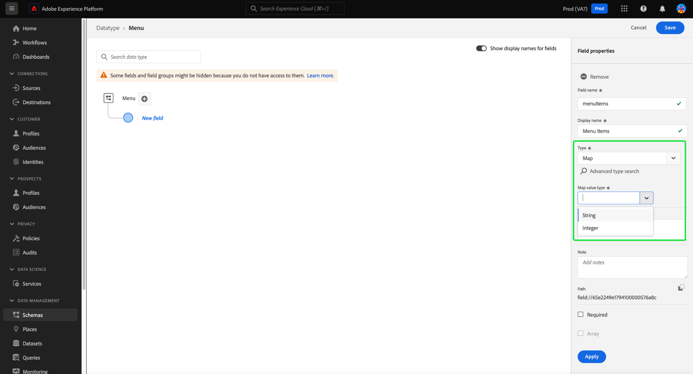

# UI에서 XDM 필드 정의

다음 [!DNL Schema Editor] Adobe Experience Platform 사용자 인터페이스에서 사용자 지정 XDM(경험 데이터 모델) 클래스 및 스키마 필드 그룹 내에서 고유한 필드를 정의할 수 있습니다. 이 안내서에서는 각 필드 유형에 사용할 수 있는 구성 옵션을 포함하여 UI에서 XDM 필드를 정의하는 단계를 다룹니다.

## 전제 조건

이 안내서에서는 XDM 시스템에 대한 작업 이해가 필요합니다. 다음을 참조하십시오. [XDM 개요](../../home.md) Experience Platform 에코시스템 내에서 XDM의 역할 소개 및 [스키마 컴포지션 기본 사항](../../schema/composition.md) 클래스와 필드 그룹이 XDM 스키마에 필드를 제공하는 방법을 알아봅니다.

이 안내서에서는 필요하지 않지만, [UI에서 스키마 작성](../../tutorials/create-schema-ui.md) 의 다양한 기능에 익숙해지려면 [!DNL Schema Editor].

## 필드를 추가할 리소스 선택 {#select-resource}

UI에서 새 XDM 필드를 정의하려면 먼저 내에서 스키마를 열어야 합니다. [!DNL Schema Editor]. 에서 현재 사용할 수 있는 스키마에 따라 [!DNL Schema Library], 다음을 선택할 수 있습니다. [새 스키마 만들기](../resources/schemas.md#create) 또는 [편집할 기존 스키마 선택](../resources/schemas.md#edit).

를 가져오면 [!DNL Schema Editor] 열려 있고 필드를 추가하는 컨트롤이 캔버스에 나타납니다. 이러한 컨트롤은 선택한 클래스 또는 필드 그룹 아래에 정의된 개체 유형 필드뿐 아니라 스키마 이름 옆에 나타납니다.

>[!WARNING]
>
>표준 필드 그룹에서 제공하는 개체에 필드를 추가하려고 하면 해당 필드 그룹이 사용자 정의 필드 그룹으로 변환되고 원래 필드 그룹은 더 이상 사용할 수 없습니다. 의 섹션을 참조하십시오. [표준 필드 그룹에 필드 추가](../resources/schemas.md#custom-fields-for-standard-groups) 자세한 내용은 스키마 UI 안내서 를 참조하십시오.

리소스에 새 필드를 추가하려면 **더하기(+)** 아이콘 캔버스에서 스키마 이름 옆에 있거나 아래에 필드를 정의할 객체 유형 필드 옆에 있습니다.

필드를 스키마에 직접 추가하는지 또는 구성 클래스 및 필드 그룹에 추가하는지에 따라 필드를 추가하는 데 필요한 단계가 달라집니다. 이 문서의 나머지 부분에서는 스키마에서 필드가 나타나는 위치에 관계없이 필드의 속성을 구성하는 방법을 중점적으로 다룹니다. 스키마에 필드를 추가할 수 있는 다양한 방법에 대한 자세한 내용은 스키마 UI 안내서의 다음 섹션을 참조하십시오.

* [필드 그룹에 필드 추가](../resources/schemas.md#add-fields)
* [스키마에 직접 필드 추가](../resources/schemas.md#add-individual-fields)

## 필드의 속성 정의 {#define}

을(를) 선택한 후 **더하기(+)** 아이콘, **[!UICONTROL 제목 없는 필드]** 캔버스에 자리 표시자가 나타납니다.

아래에 있는 오른쪽 레일에서 **[!UICONTROL 필드 속성]**, 새 필드의 세부 사항을 구성할 수 있습니다. 각 필드에 다음 정보가 필요합니다.

| 필드 속성 | 설명 |
| --- | --- |
| [!UICONTROL 필드 이름] | 필드에 대한 고유한 설명적인 이름. 스키마가 저장된 후에는 필드 이름을 변경할 수 없습니다. 이 값은 코드 및 기타 다운스트림 애플리케이션에서 필드를 식별하고 참조하는 데 사용됩니다  이름은 camelCase로 작성해야 합니다. 영숫자, 대시 또는 밑줄 문자가 포함될 수 있지만 **다음을 수행할 수 없음** 밑줄로 시작합니다.<ul><li>**정답**: `fieldName`</li><li>**허용됨:** `field_name2`, `Field-Name`, `field-name_3`</li><li>**잘못됨**: `_fieldName`</li></ul> |
| [!UICONTROL 표시 이름] | 필드의 표시 이름입니다. 스키마 편집기 캔버스 내의 필드를 나타내는 데 사용할 이름입니다. 필드 이름은 를 사용하여 표시 이름으로 변경할 수 있습니다. [표시 이름 전환](../resources/schemas.md#display-name-toggle). |
| [!UICONTROL 유형] | 필드에 포함될 데이터의 유형입니다. 이 드롭다운 메뉴에서 다음 중 하나를 선택할 수 있습니다. [표준 스칼라 유형](../../schema/field-constraints.md) XDM 또는 다중 필드 중 하나에서 지원 [데이터 유형](../resources/data-types.md) 이전에 정의된에서 [!DNL Schema Registry]. 참고: 맵 데이터 유형을 선택한 경우 [!UICONTROL 맵 값 유형] 속성이 나타납니다.  다음을 선택할 수도 있습니다. **[!UICONTROL 고급 유형 검색]** 기존 데이터 유형을 검색 및 필터링하고 원하는 유형을 더 쉽게 찾을 수 있습니다. |
| [!UICONTROL 맵 값 유형] | 다음을 선택하는 경우 이 값이 필요합니다. [!UICONTROL 맵] 를 필드에 대한 데이터 유형으로 사용하십시오. 맵에 사용할 수 있는 값은 다음과 같습니다 [!UICONTROL 문자열] 및 [!UICONTROL 정수]. 사용 가능한 옵션의 드롭다운 목록에서 값을 선택합니다. 에 대해 자세히 알아보기 [유형별 필드 속성](#type-specific-properties), 필드 정의 개요 를 참조하십시오. |

{style="table-layout:auto"}

각 필드에 대한 설명 및 메모를 제공하도록 선택할 수도 있습니다. 사용 **[!UICONTROL 설명]** 컨텍스트를 추가하고 맵 데이터 유형의 기능을 설명하는 필드입니다. 이는 구현의 유지 관리 및 가독성에 기여합니다. 초기 설명을 보완하기 위해 메모를 추가할 수도 있습니다. 개발자가 코드 베이스의 컨텍스트 내에서 맵을 효과적으로 이해, 유지 관리 및 활용하는 데 도움이 되는 보다 세분화되고 구체적인 정보를 제공해야 합니다. |

>[!NOTE]
>
>에 따라 **[!UICONTROL 유형]** 이 필드를 선택하면 오른쪽 레일에 추가 구성 컨트롤이 나타날 수 있습니다. 의 섹션을 참조하십시오. [유형별 필드 속성](#type-specific-properties) 자세한 내용은 컨트롤을 참조하십시오.
>
>오른쪽 레일은 특수 필드 유형을 지정하는 확인란도 제공합니다. 의 섹션을 참조하십시오. [특수 필드 유형](#special) 추가 정보.

필드 구성을 마치면 을 선택합니다 **[!UICONTROL 적용]**.

![다음 [!UICONTROL 필드 속성] [스키마 편집기]의 섹션이 강조 표시됩니다.](../../images/ui/fields/overview/field-details.png)

캔버스는 고유한 테넌트 ID에 네임스페이스가 지정된 오브젝트 내에 있는 새로 추가된 필드를 표시하도록 업데이트됩니다( 로 표시됨). `_tenantId` 아래 예제에서). 스키마에 추가된 모든 사용자 정의 필드는 Adobe 제공 클래스 및 필드 그룹의 다른 필드와의 충돌을 방지하기 위해 이 네임스페이스 내에 자동으로 배치됩니다. 이제 오른쪽 레일에 다른 속성 외에도 필드의 경로가 나열됩니다.

![스키마 다이어그램의 새 필드와 의 해당 경로 [!UICONTROL 필드 속성] 섹션이 강조 표시됩니다.](../../images/ui/fields/overview/field-added.png)

위의 단계에 따라 스키마에 필드를 추가할 수 있습니다. 스키마가 저장되면 해당 기본 클래스와 필드 그룹도 변경된 경우 저장됩니다.

>[!NOTE]
>
>한 스키마의 필드 그룹 또는 클래스에 대한 변경 사항은 해당 변경 사항을 사용하는 다른 모든 스키마에 반영됩니다.

## 유형별 필드 속성 {#type-specific-properties}

새 필드를 정의할 때 오른쪽 레일에 다음에 따라 추가 구성 옵션이 나타날 수 있습니다. **[!UICONTROL 유형]** 필드를 선택합니다. 다음 표에서는 이러한 추가 필드 속성과 해당 호환 유형을 간략하게 설명합니다.

| 필드 속성 | 호환 가능한 유형 | 설명 |
| --- | --- | --- |
| [!UICONTROL 맵 값 유형] | [!UICONTROL 맵] | 다음 [!UICONTROL 맵 값 유형] 속성은에서 맵 값을 선택하는 경우에만 UI에 표시됩니다. [!UICONTROL 유형] 드롭다운 옵션. 맵의 문자열 및 정수 값 유형 중에서 선택할 수 있습니다. {width="100" zoomable="yes"} 참고: API를 통해 만든 문자열 또는 정수 유형이 아닌 모든 맵 데이터 유형은 &#39;[!UICONTROL 복합]&#39; 데이터 유형. &#39;&#39;을(를) 만들 수 없습니다.[!UICONTROL 복합]&#39; UI를 통한 데이터 유형. |
| [!UICONTROL 기본 값] | [!UICONTROL 문자열], [!UICONTROL Double], [!UICONTROL 길게], [!UICONTROL 정수], [!UICONTROL 짧음], [!UICONTROL 바이트], [!UICONTROL 부울] | 수집 중에 다른 값이 제공되지 않는 경우 이 필드에 할당되는 기본값입니다. 이 값은 필드에서 선택한 유형을 준수해야 합니다.  기본값은 시간이 지남에 따라 변경될 수 있으므로 수집 시 데이터 세트에 저장되지 않습니다. 스키마에 설정된 기본값은 다운스트림 플랫폼 서비스 및 애플리케이션이 데이터 세트에서 데이터를 읽을 때 추론합니다. 예를 들어 쿼리 서비스를 사용하여 데이터를 쿼리할 때 속성에 NULL 값이 있지만 기본값은 로 설정되어 있는 경우 `5` 스키마 수준에서 쿼리 서비스가 를 반환해야 합니다. `5` NULL 대신 이 동작은 현재 모든 AEP 서비스에서 균일하지 않습니다. |
| [!UICONTROL 패턴] | [!UICONTROL 문자열] | A [정규 표현식](https://developer.mozilla.org/en-US/docs/Web/JavaScript/Guide/Regular_Expressions) 수집 중에 수락하려면 이 필드의 값이 일치해야 합니다. |
| [!UICONTROL 포맷] | [!UICONTROL 문자열] | 값이 준수해야 하는 문자열의 사전 정의된 형식 목록에서 선택합니다. 사용 가능한 형식은 다음과 같습니다. <ul><li>[[!UICONTROL date-time]](https://tools.ietf.org/html/rfc3339)</li><li>[[!UICONTROL 이메일]](https://tools.ietf.org/html/rfc2822)</li><li>[[!UICONTROL 호스트 이름]](https://tools.ietf.org/html/rfc1123#page-13)</li><li>[[!UICONTROL ipv4]](https://tools.ietf.org/html/rfc791)</li><li>[[!UICONTROL ipv6]](https://tools.ietf.org/html/rfc2460)</li><li>[[!UICONTROL uri]](https://tools.ietf.org/html/rfc3986)</li><li>[[!UICONTROL uri-reference]](https://tools.ietf.org/html/rfc3986#section-4.1)</li><li>[[!UICONTROL url-template]](https://tools.ietf.org/html/rfc6570)</li><li>[[!UICONTROL json 포인터]](https://tools.ietf.org/html/rfc6901)</li></ul> |
| [!UICONTROL 최소 길이] | [!UICONTROL 문자열] | 수집 중에 값을 수락하기 위해 문자열에 포함해야 하는 최소 문자 수입니다. |
| [!UICONTROL 최대 길이] | [!UICONTROL 문자열] | 수집 중에 값을 수락하기 위해 문자열에 포함해야 하는 최대 문자 수입니다. |
| [!UICONTROL 최소값] | [!UICONTROL 이중] | 수집 중에 수락될 Double의 최소값입니다. 수집된 값이 여기에 입력한 값과 정확히 일치하는 경우 값이 수락됩니다. 이 제약 조건을 사용할 때 &quot;[!UICONTROL 전용 최소값]&quot;제약 조건은 비워 두어야 합니다. |
| [!UICONTROL 최대값] | [!UICONTROL 이중] | 수집 중에 수락할 Double의 최대값입니다. 수집된 값이 여기에 입력한 값과 정확히 일치하는 경우 값이 수락됩니다. 이 제약 조건을 사용할 때 &quot;[!UICONTROL 전용 최대값]&quot;제약 조건은 비워 두어야 합니다. |
| [!UICONTROL 전용 최소값] | [!UICONTROL 이중] | 수집 중에 수락할 Double의 최대값입니다. 수집한 값이 여기에 입력한 값과 정확히 일치하는 경우 값이 거부됩니다. 이 제약 조건을 사용할 때 &quot;[!UICONTROL 최소값]&quot;(비제외) 제약 조건은 비워 두어야 합니다. |
| [!UICONTROL 전용 최대값] | [!UICONTROL 이중] | 수집 중에 수락할 Double의 최대값입니다. 수집한 값이 여기에 입력한 값과 정확히 일치하는 경우 값이 거부됩니다. 이 제약 조건을 사용할 때 &quot;[!UICONTROL 최대값]&quot;(비제외) 제약 조건은 비워 두어야 합니다. |

{style="table-layout:auto"}

## 특수 필드 유형 {#special}

오른쪽 레일은 선택한 필드에 대해 특수 역할을 지정하는 데 사용할 수 있는 몇 가지 확인란을 제공합니다. 이러한 옵션 중 일부의 사용 사례에는 데이터 모델링 전략과 다운스트림 플랫폼 서비스를 사용하는 방법에 대한 중요한 고려 사항이 포함됩니다.

이러한 특수 유형에 대한 자세한 내용은 다음 설명서를 참조하십시오.

* [맵](./map.md)
* [[!UICONTROL 필수]](./required.md)
* [[!UICONTROL 배열]](./array.md)
* [[!UICONTROL 열거형]](./enum.md)
* [[!UICONTROL 신원]](./identity.md) (문자열 필드에만 사용 가능)
* [[!UICONTROL 관계]](./relationship.md) (문자열 필드에만 사용 가능)

기술적으로 특별한 필드 유형은 아니지만 의 안내서를 방문하는 것도 좋습니다. [오브젝트 유형 필드 정의](./object.md) 스키마 구조를 사용하는 경우 중첩된 하위 필드 정의에 대해 자세히 알아봅니다.

## 다음 단계

이 안내서에서는 UI에서 XDM 필드를 정의하는 방법에 대한 개요를 제공했습니다. 필드는 클래스 및 필드 그룹을 사용하여 스키마에만 추가할 수 있습니다. UI에서 이러한 리소스를 관리하는 방법에 대한 자세한 내용은 만들기 및 편집에 대한 안내서를 참조하십시오. [클래스](../resources/classes.md) 및 [필드 그룹](../resources/field-groups.md).

의 기능에 대한 자세한 내용 [!UICONTROL 스키마] 작업 영역에서 다음을 참조하십시오 [[!UICONTROL 스키마] 작업 영역 개요](../overview.md).
