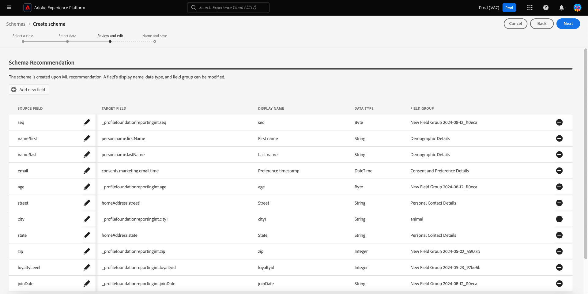
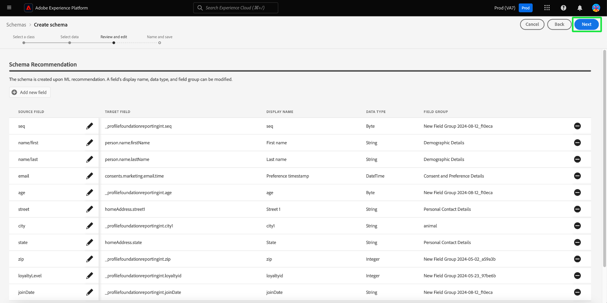

# 머신 러닝 지원 스키마 생성

ML 알고리즘을 사용하여 샘플 데이터에서 스키마를 생성합니다. 이 프로세스는 복잡한 대규모 데이터 세트의 구조, 필드 및 데이터 유형을 정의할 때 시간을 절약하고 정확도를 높입니다.

ML 스키마 생성을 사용하면 새로운 데이터 소스를 빠르게 통합하고 수동 생성으로 인한 실수를 줄일 수 있습니다. 기술 전문가가 아닌 사용자도 추가 작업 없이 스키마를 생성하거나 크고 복잡한 데이터 세트를 관리하는 데 사용할 수 있습니다. 이 지원을 통해 새로운 데이터 소스를 쉽게 결합하고 데이터 분석을 수행할 수 있으므로 데이터 가져오기에서 통찰력을 얻는 프로세스에 걸리는 시간을 단축할 수 있습니다.

## 시작하기

이 튜토리얼에서는 스키마 만들기 요구 사항에 대한 작업 이해를 필요로 합니다. 이 안내서를 계속하기 전에 스키마 만들기 및 편집에 대한 [UI 안내서](./resources/schemas.md)를 읽어야 합니다.

이 안내서에서는 머신 러닝(ML) 알고리즘을 사용하여 샘플 데이터에서 스키마를 생성하는 방법을 설명합니다. 스키마 만들기 프로세스에 대한 이해를 높이기 위해 스키마 편집기에서 [필드 기반 워크플로우에 대한 문서 또는 스키마 만들기에 대한 정보는 [수동 스키마 만들기 워크플로우 안내서](https://experienceleague.adobe.com/en/docs/experience-platform/xdm/ui/resources/schemas#add-field-groups)를 참조하십시오.](https://experienceleague.adobe.com/en/docs/experience-platform/xdm/ui/field-based-workflows)

>[!NOTE]
>
>[!DNL Schema Registry] API를 사용하여 스키마를 구성할 수도 있습니다. API를 사용하여 수동으로 스키마를 만들려면 먼저 [[!DNL Schema Registry] 개발자 안내서](../api/getting-started.md)를 읽은 후 [API를 사용하여 스키마 만들기](../tutorials/create-schema-api.md)에 대한 자습서를 시도하십시오.

## 스키마 생성 워크플로우로 이동합니다. {#navigate-to-schema-creation-workflow}

Platform UI의 왼쪽 탐색에서 **[!UICONTROL 스키마]** 작업 영역을 선택합니다. **[!UICONTROL 스키마]** 작업 영역이 나타납니다. 스키마 만들기 워크플로를 시작할 새 스키마를 추가하려면 **[!UICONTROL 스키마 만들기]**&#x200B;를 선택하십시오.

## 스키마 만들기 {#create-a-schema}

[!UICONTROL 스키마 만들기] 대화 상자가 나타납니다. **[ML 지원]** 스키마 만들기 옵션을 선택한 다음 **[!UICONTROL 선택]**&#x200B;을 선택하여 선택을 확인합니다.

![[!UICONTROL ML- 지원]이 강조 표시된 [!UICONTROL 스키마 만들기] 대화 상자.](../images/ui/ml-schema-creation/use-sample-csv.png)

### 기본 클래스 선택 {#select-base-class}

[!UICONTROL 스키마 만들기] 워크플로가 나타납니다. 스키마에 대한 기본 클래스를 선택한 후 **[!UICONTROL 다음]**&#x200B;을(를) 선택하십시오.

### CSV 파일 업로드 {#upload-csv}

만들기 워크플로의 **[!UICONTROL 데이터 선택]** 단계가 나타납니다. **[!UICONTROL 파일 업로드]** 섹션에서 **[!UICONTROL 파일 선택]** 또는 **[!UICONTROL 파일 드래그 앤 드롭]** 섹션을 선택하십시오. 컴퓨터에서 .csv 파일을 선택하여 스키마를 생성합니다.

### 데이터 미리 보기 {#preview-data}

[!UICONTROL 파일 업로드] 섹션에는 가져온 CSV 파일의 이름이 표시되고 **[!UICONTROL 미리 보기]** 섹션에는 업로드한 파일의 샘플 데이터 행이 표시됩니다. 워크플로우를 계속하려면 **[!UICONTROL 다음]**&#x200B;을(를) 선택하십시오.

미리 보기 섹션에 강조 표시된 샘플 데이터의 행 

### 스키마 검토 및 편집 {#review-schema}

이제 작성 워크플로의 **[!UICONTROL 검토 및 편집]** 단계가 나타나고 테이블화된 보기에서 머신 러닝 지원 **[!UICONTROL 스키마 추천]**&#x200B;이 표시됩니다. 이 단계에서는 머신 러닝 모델에서 생성한 권장 스키마에서 필드를 편집, 추가 또는 제거할 수 있습니다. 이 표에는 다음 필드가 포함되어 있습니다.

| 필드 이름 | 설명 |
|------------------|---------------------------------------------------------|
| [!UICONTROL 데이터 테이블] | 필드가 시작되는 데이터 세트 또는 데이터베이스입니다. |
| [!UICONTROL Source 필드] | 소스 시스템의 원래 필드 이름입니다. |
| [!UICONTROL 대상 필드] | 데이터가 매핑될 대상 시스템의 필드 이름입니다. |
| [!UICONTROL 표시 이름] | 사용자 인터페이스에 필드를 표시하는 데 사용되는 이름입니다. 이 이름은 보다 사용자에게 친숙한 이름이나 설명적인 이름이어야 합니다. |
| [!UICONTROL 데이터 형식] | 필드에 저장된 데이터의 형식입니다(예: `String`, `Date`). |
| [!UICONTROL 필드 그룹] | 사용 또는 컨텍스트를 기반으로 필드를 범주화합니다(예: [!UICONTROL 인구 통계학적 세부 정보], [!UICONTROL Commerce 세부 정보]). |

#### 필드 추가 {#add-field}

스키마에 필드를 추가하려면 **[!UICONTROL 새 필드 추가]**&#x200B;를 선택하십시오.

[!UICONTROL 필드 선택] 대화 상자가 나타납니다. 이 대화 상자에는 스키마의 다이어그램이 현재 그대로 포함되어 있습니다. 원하는 필드를 선택하고 **[선택]**&#x200B;을 선택하여 스키마에 새 필드를 추가합니다. 필요한 경우 대화 상자를 닫으려면 **[취소]**&#x200B;를 선택하십시오.

새 행이 권장 스키마에 나타납니다. 이제 필드를 편집할 수 있습니다.

#### 필드 편집 {#edit-field}

필드를 편집하려면 편집할 행의 연필 아이콘을 선택합니다. 사용자 정의 필드 매핑을 편집할 수 있는 세부 정보 패널이 오른쪽에 나타납니다. 세부 정보 패널에는 [!UICONTROL 대상 필드], [!UICONTROL 표시 이름], [!UICONTROL 데이터 형식] 및 [!UICONTROL 필드 그룹]이 있습니다. 필요에 따라 변경하고 **[!UICONTROL 적용]**&#x200B;을 선택하여 확인합니다. 연필 아이콘을 다시 선택하여 세부 정보 패널을 닫습니다.

#### 필드 제거 {#remove-field}

필드를 제거하려면 삭제할 행에서 빼기 아이콘을 선택합니다.

>[!CAUTION]
>
>이 항목을 제거할 때 확인 대화 상자가 나타나지 않습니다.

#### 권장 스키마 승인 {#approve}

권장 스키마를 승인하고 **[!UICONTROL 스키마 만들기]** 워크플로우를 계속하려면 **[다음]**&#x200B;을 선택합니다.

### 스키마 이름 지정 및 저장 {#name-and-save}

만들기 워크플로의 **[!UICONTROL 이름 및 저장]** 단계가 나타납니다. **[스키마 표시 이름]** 및 선택적 설명을 입력하십시오. **[스키마 생성]** 섹션은 ML 생성 스키마의 다이어그램을 제공합니다. 스키마 만들기 워크플로를 완료하려면 **[완료]**&#x200B;를 선택하십시오.

### 스키마 편집기에서 보기 {#view-in-editor}

새로 만든 스키마가 캔버스에 표시된 스키마 편집기가 나타납니다. [!UICONTROL 스키마] 작업 영역으로 돌아가려면 **[!UICONTROL 저장]**&#x200B;을(를) 선택하십시오.

## 다음 단계

스키마를 만든 후 필요한 경우 스키마 편집기를 사용하여 추가로 수정할 수 있습니다. 이제 새 스키마를 데이터 소스와 통합하여 데이터 분석에 사용할 준비가 되었습니다.

스키마 편집기 사용에 대한 자세한 내용은 [기존 스키마 안내서 편집](https://experienceleague.adobe.com/en/docs/experience-platform/xdm/ui/resources/schemas#edit)을 참조하십시오.
