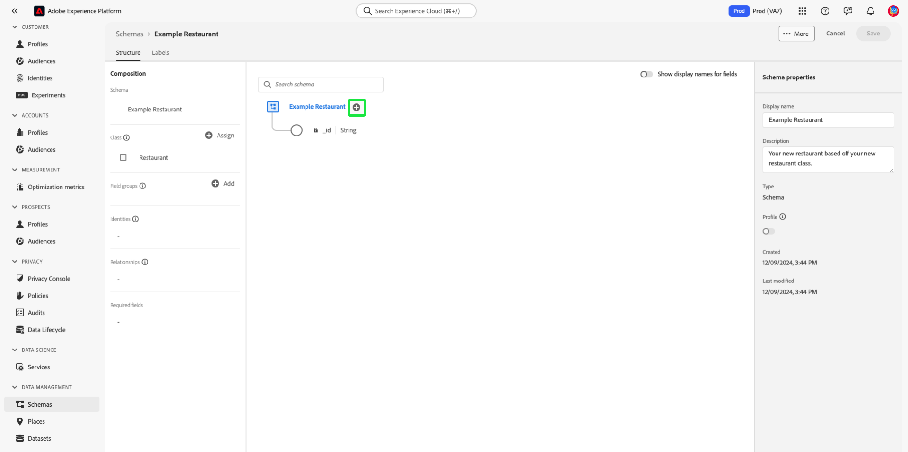

# UI에서 클래스 만들기 및 편집 {#ui-create-and-edit}

>[!CONTEXTUALHELP]
>id="platform_schemas_class_filter"
>title="표준 또는 사용자 정의 클래스 필터"
>abstract="사용 가능한 클래스의 목록은 클래스의 생성 방법에 따라 사전에 필터링됩니다. 표준과 사용자 정의 옵션 중에서 선택하려면 라디오 버튼을 선택하십시오. 표준 옵션은 Adobe에서 생성한 엔티티를 표시하며 XDM 개별 프로필 및 XDM 경험 이벤트 클래스를 모두 포함합니다. 사용자 정의 옵션은 내 조직 내에서 생성된 엔티티를 표시합니다. 클래스의 생성 및 편집에 대한 자세한 내용은 설명서를 참조하십시오."

Adobe Experience Platform에서 스키마의 클래스는 스키마에 포함될 데이터의 동작 측면(레코드 또는 시계열)을 정의합니다. 이 외에도 클래스는 해당 클래스를 기반으로 하는 모든 스키마가 포함해야 하는 가장 적은 수의 공통 속성을 설명하고 여러 호환되는 데이터 세트가 병합될 수 있는 방법을 제공합니다.

Adobe은 [XDM 개별 프로필](../../classes/individual-profile.md) 및 [XDM ExperienceEvent](../../classes/experienceevent.md)을(를) 포함한 여러 표준(&quot;코어&quot;) 경험 데이터 모델(XDM) 클래스를 제공합니다. 이러한 핵심 클래스 외에도 사용자 정의 클래스를 만들어 조직의 보다 구체적인 사용 사례를 설명할 수도 있습니다.

이 문서에서는 Experience Platform UI에서 사용자 정의 클래스를 만들고, 편집하고, 관리하는 방법에 대한 개요를 제공합니다.

## 전제 조건 {#prerequisites}

이 안내서에서는 XDM 시스템에 대한 작업 이해가 필요합니다. Experience Platform 에코시스템 내에서 XDM의 역할에 대한 소개와 스키마 컴포지션의 [기본 사항](../../home.md)을(를) 참조하여 클래스가 XDM 스키마에 기여하는 방법을 알아보십시오. [XDM 개요](../../schema/composition.md).

이 안내서에서는 필요하지 않지만, [UI에서 스키마 작성](../../tutorials/create-schema-ui.md)에 대한 자습서를 따라 스키마 편집기의 다양한 기능을 숙지하는 것이 좋습니다.

## 시작 {#getting-started}

Experience Platform UI의 왼쪽 탐색에서 **[!UICONTROL 스키마]**&#x200B;를 선택하여 [!UICONTROL 스키마] 작업 영역을 연 다음 **[!UICONTROL 클래스]** 탭을 선택합니다. 사용 가능한 클래스 목록이 표시됩니다.

![[!UICONTROL 스키마] 작업 영역 [!UICONTROL 클래스] 및 [!UICONTROL 스키마]의 [!UICONTROL 클래스] 탭에 있는 클래스 중 하나를 강조 표시했습니다.](../../images/ui/resources/classes/available-classes.png)

## 클래스 필터링 {#filter}

클래스 목록은 클래스 생성 방법에 따라 자동으로 필터링됩니다. 기본 설정은 Adobe에서 정의한 클래스를 표시합니다. 목록을 필터링하여 조직에서 만든 목록을 표시할 수도 있습니다. 라디오 단추를 선택하여 [!UICONTROL 표준]과(와) [!UICONTROL 사용자 지정] 옵션 중에서 선택하십시오. [!UICONTROL 표준] 옵션은 Adobe에서 만든 엔터티를 표시하고 [!UICONTROL 사용자 지정] 옵션은 조직 내에서 만든 엔터티를 표시합니다.

![Standard[!UICONTROL  및 ]Custom[!UICONTROL 이 강조 표시된 ]스키마[!UICONTROL  작업 영역의 ]클래스[!UICONTROL  탭입니다.]](../../images/ui/resources/classes/standard-and-custom-classes.png)

>[!TIP]
>
>검색 기능을 사용하여 이름을 기반으로 클래스를 필터링하거나 찾습니다. 자세한 내용은 [XDM 리소스 탐색](../explore.md)에 대한 안내서를 참조하십시오.

## 새 클래스 만들기 {#create}

**[!UICONTROL 클래스 만들기]** 또는 **[!UICONTROL 스키마 만들기]**&#x200B;를 통해 Experience Platform UI에서 클래스를 만드는 두 가지 방법이 있습니다.

### 클래스 만들기

**[!UICONTROL 스키마]** 작업 영역의 [!UICONTROL 클래스] 탭에서 [!UICONTROL 클래스 만들기]를 선택합니다.

![클래스 만들기[!UICONTROL 가 강조 표시된 ]스키마[!UICONTROL  작업 영역의 ]클래스[!UICONTROL  탭]](../../images/ui/resources/classes/create-class.png)

[!UICONTROL 클래스 만들기] 대화 상자가 나타납니다. 클래스의 [!UICONTROL 표시 이름] 및 [!UICONTROL 설명]을 입력하고 라디오 단추로 클래스의 동작을 선택하십시오. 클래스는 [!UICONTROL 레코드] 또는 [!UICONTROL 시계열] 형식일 수 있습니다. **[!UICONTROL 만들기]**&#x200B;를 선택하여 선택 항목을 확인하고 [!UICONTROL 클래스] 탭으로 돌아갑니다.

![강조 표시된 [!UICONTROL 만들기]와(과) 함께 [!UICONTROL 클래스 만들기] 대화 상자가 있습니다.](../../images/ui/resources/classes/create-class-dialog.png)

만든 클래스를 사용할 수 있으며 [!UICONTROL 클래스] 보기에 나열됩니다.

최근에 만든 클래스가 강조 표시된 ![스키마[!UICONTROL  작업 영역의 ]클래스[!UICONTROL  탭입니다.]](../../images/ui/resources/classes/new-class-listing.png)

### 스키마 만들기

또는 수동으로 스키마를 생성하여 클래스를 만들 수 있습니다. **[!UICONTROL 스키마]** 작업 영역의 [!UICONTROL 클래스] 탭에서 [!UICONTROL 스키마 만들기]를 선택합니다.

![스키마 만들기[!UICONTROL 가 강조 표시된 ]스키마[!UICONTROL  작업 영역의 ]클래스[!UICONTROL  탭]](../../images/ui/resources/classes/create-schema.png)

표시되는 **[!UICONTROL 스키마 만들기]** 대화 상자에서 [!UICONTROL 수동]을 선택합니다.

>[!NOTE]
>
>ML 지원 스키마 생성 워크플로우를 사용하는 경우, 파일을 업로드하고 ML 알고리즘을 사용하여 권장 스키마를 생성할 수 있습니다. 해당 스키마 생성 워크플로우에서는 스키마에 대한 기본 클래스를 지정할 필요가 없습니다. ML에서 csv 파일을 기반으로 스키마 구조를 권장하는 방법에 대해 알아보려면 [기계 학습 지원 스키마 만들기 안내서](../ml-assisted-schema-creation.md)를 참조하십시오.

스키마 생성 워크플로가 나타납니다. [!UICONTROL 스키마 세부 정보] 섹션에서 **[!UICONTROL 기타]**&#x200B;를 선택합니다. 사용 가능한 클래스 목록이 나타납니다. **[!UICONTROL 클래스 만들기]**&#x200B;를 선택합니다.

![[!UICONTROL 스키마 세부 정보] 섹션에서 강조 표시된 [!UICONTROL 기타]을(를) 사용하는 [!UICONTROL 스키마 만들기] 워크플로우입니다.](../../images/ui/resources/classes/other-schema-details.png)

[!UICONTROL 클래스 만들기] 대화 상자가 나타납니다. 클래스의 [!UICONTROL 표시 이름] 및 [!UICONTROL 설명]을 입력하고 라디오 단추로 클래스의 동작을 선택하십시오. 클래스는 [!UICONTROL 레코드] 또는 [!UICONTROL 시계열] 형식일 수 있습니다. **[!UICONTROL 만들기]**&#x200B;를 선택하여 선택 항목을 확인하고 [!UICONTROL 클래스] 탭으로 돌아갑니다.

![강조 표시된 [!UICONTROL 만들기]와(과) 함께 [!UICONTROL 클래스 만들기] 대화 상자가 있습니다.](../../images/ui/resources/classes/create-class-from-schema.png)

[!UICONTROL 스키마 세부 정보] 섹션에서 클래스 목록이 새로 고침되고 새로 만든 클래스가 자동으로 선택됩니다. 스키마를 계속 만들려면 **[!UICONTROL 다음]**&#x200B;을(를) 선택하십시오.

![새 클래스를 선택하고 [!UICONTROL 다음]을(를) 강조 표시한 [!UICONTROL 스키마 세부 정보] 섹션.](../../images/ui/resources/classes/select-new-class.png)

클래스를 선택하면 [!UICONTROL 이름 및 검토] 섹션이 나타납니다. 이 섹션에서는 스키마를 식별하기 위한 이름과 설명을 제공합니다. &#x200B;선택한 클래스와 스키마 구조를 검토하고 확인할 수 있도록 스키마의 기본 구조(클래스에서 제공)가 캔버스에 표시됩니다.

텍스트 필드에 사용자에게 친숙한 [!UICONTROL 스키마 표시 이름]을(를) 입력하십시오. 그런 다음 스키마를 식별하는 데 도움이 되는 적절한 설명을 입력합니다. 스키마 구조를 검토하고 설정이 마음에 들면 **[!UICONTROL 완료]**&#x200B;를 선택하여 스키마를 만듭니다.

![스키마 표시 이름[!UICONTROL , ]설명[!UICONTROL  및 ]마침[!UICONTROL 이 강조 표시된 ]스키마 만들기[!UICONTROL  워크플로의 ]이름 및 검토[!UICONTROL  섹션.]](../../images/ui/resources/classes/schema-details.png)

## 클래스에 필드 추가 {#add-fields}

스키마 편집기에 사용자 지정 클래스를 사용하는 스키마가 열려 있으면 클래스에 필드를 추가할 수 있습니다. 새 필드를 추가하려면 스키마 이름 옆에 있는 **더하기(+)** 아이콘을 선택합니다.

>[!IMPORTANT]
>
>조직에서 정의한 클래스를 구현하는 스키마를 작성할 때 스키마 필드 그룹은 호환되는 클래스에서만 사용할 수 있습니다. 정의한 클래스가 새 클래스이므로 **[!UICONTROL 필드 그룹 추가]** 대화 상자에 호환되는 필드 그룹이 없습니다. 대신 해당 클래스에서 사용하려면 [새 필드 그룹을 만들어야](./field-groups.md#create)합니다. 다음에 새 클래스를 구현하는 스키마를 구성할 때 정의한 필드 그룹이 나열되고 사용할 수 있습니다.

>[!IMPORTANT]
>
>클래스에 추가하는 모든 필드는 해당 클래스를 사용하는 모든 스키마에서 사용됩니다. 따라서 모든 스키마 사용 사례에서 어떤 필드가 유용한지 신중하게 고려해야 합니다. 이 클래스 아래의 일부 스키마에서만 사용할 수 있는 필드를 추가하려는 경우 [필드 그룹을 생성](./field-groups.md#create)하여 해당 스키마에 추가하는 것이 좋습니다.

**[!UICONTROL 제목 없는 필드]** 자리 표시자가 캔버스에 나타나고 오른쪽 레일이 업데이트되어 필드의 속성을 구성하는 컨트롤을 표시합니다. **[!UICONTROL 할당 대상]**&#x200B;에서 **[!UICONTROL 클래스]**&#x200B;을 선택합니다.

![스키마 편집기의 캔버스에 있는 제목 없는 필드에서 [!UICONTROL 클래스]에 할당 필드 속성을 선택하고 강조 표시합니다.](../../images/ui/resources/classes/assign-to-class.png)

필드를 구성하고 클래스에 추가하는 방법에 대한 특정 단계는 [UI의 필드 정의](../fields/overview.md#define)에 대한 안내서를 참조하십시오. 클래스에 필요한 만큼 필드를 계속 추가합니다. 완료되면 **[!UICONTROL 저장]**&#x200B;을 선택하여 스키마와 클래스를 모두 저장합니다.

![스키마 편집기의 캔버스에 새로 만든 스키마로 [!UICONTROL 저장]이 강조 표시되어 있습니다.](../../images/ui/resources/classes/save.png)

이 클래스를 사용하는 스키마를 이전에 생성한 경우에는 새로 추가된 필드가 해당 스키마에 자동으로 표시됩니다.

## 클래스 편집 {#edit-a-class}

>[!NOTE]
>
>조직에서 정의한 사용자 정의 클래스만 완전히 편집하고 사용자 정의할 수 있습니다. Adobe으로 정의된 코어 클래스의 경우 개별 스키마의 컨텍스트 내에서 해당 필드의 표시 이름만 편집할 수 있습니다. 자세한 내용은 [스키마 필드에 대한 표시 이름 편집](./schemas.md#display-names)의 섹션을 참조하십시오.
>
>사용자 정의 클래스를 저장하고 데이터 수집에 사용하면 이후에 추가 변경 사항만 수행할 수 있습니다. 자세한 내용은 [스키마 진화의 규칙](../../schema/composition.md#evolution)을 참조하십시오.

클래스를 확장하는 기존 스키마를 편집하거나 스키마를 수동으로 만들어 스키마 워크플로우를 통해 클래스를 편집할 수 있습니다. 클래스를 직접 편집할 수는 없습니다. [!UICONTROL 스키마] 작업 영역의 [!UICONTROL 찾아보기] 탭 내에서 기존 클래스를 선택하거나 **[!UICONTROL 스키마 만들기]**&#x200B;를 선택합니다.

![기존 클래스와 [!UICONTROL 스키마 만들기]가 강조 표시된 스키마 편집기.](../../images/ui/resources/classes/edit-class-options.png)

새 스키마를 만들도록 선택한 경우 자세한 내용은 [스키마 만들기](#create-schema) 섹션을 참조하십시오. 스키마 생성을 완료하면(또는 기존 스키마를 선택한 후) 스키마 편집기가 나타납니다. 기존 클래스 필드를 업데이트하려면 스키마 구조에서 필드를 선택합니다. 필드의 정보가 오른쪽 레일에 표시됩니다. [!UICONTROL 할당 대상] 확인
**[!UICONTROL 클래스]** 옵션이 선택되었거나 업데이트에 영향을 주지 않습니다.

![필드를 선택하고 강조 표시한 다음 오른쪽 레일이 표시되어 [!UICONTROL 할당 대상]을 강조 표시하는 스키마 편집기.](../../images/ui/resources/classes/edit-existing-field.png)

필드를 원하는 대로 변경하고 오른쪽 레일에서 아래로 스크롤하여 **[!UICONTROL 적용]**&#x200B;을 선택하여 변경 내용을 저장합니다.

>[!IMPORTANT]
>
> 필드에 대한 업데이트는 [스키마 변경 규칙](../../schema/composition.md#evolution)에 따라 해당 클래스를 사용하는 모든 스키마에 적용됩니다.

![필드를 선택하고 오른쪽 레일이 표시된 스키마 편집기에서 [!UICONTROL 적용]을 강조 표시합니다.](../../images/ui/resources/classes/save-changes.png)

새 필드를 추가하려면 [클래스에 필드 추가](#add-fields-to-a-class) 안내서를 따르십시오. 완료되면 **[!UICONTROL 저장]**&#x200B;을 선택하여 스키마와 클래스를 모두 저장합니다.

![[!UICONTROL 저장]이 강조 표시된 스키마 편집기.](../../images/ui/resources/classes/save-schema.png)

## 스키마 클래스 변경 {#schema}

저장하기 전에 초기 생성 프로세스 중에 언제든지 스키마 클래스를 변경할 수 있습니다. 그러나 필드 그룹은 특정 클래스와만 호환되므로 이 작업은 주의하여 수행해야 합니다. 클래스를 변경하면 캔버스와 추가한 모든 필드가 재설정됩니다.
자세한 내용은 [스키마 만들기 및 편집](./schemas.md#change-class)에 대한 안내서를 참조하십시오.

## 다음 단계 {#next-steps}

이 문서에서는 Experience Platform UI를 사용하여 클래스를 만들고 편집하는 방법에 대해 설명합니다. [!UICONTROL 스키마] 작업 영역의 기능에 대한 자세한 내용은 [[!UICONTROL 스키마] 작업 영역 개요](../overview.md)를 참조하십시오.

스키마 레지스트리 API를 사용하여 클래스를 관리하는 방법에 대한 자세한 내용은 [클래스 끝점 안내서](../../api/classes.md)를 참조하십시오.
