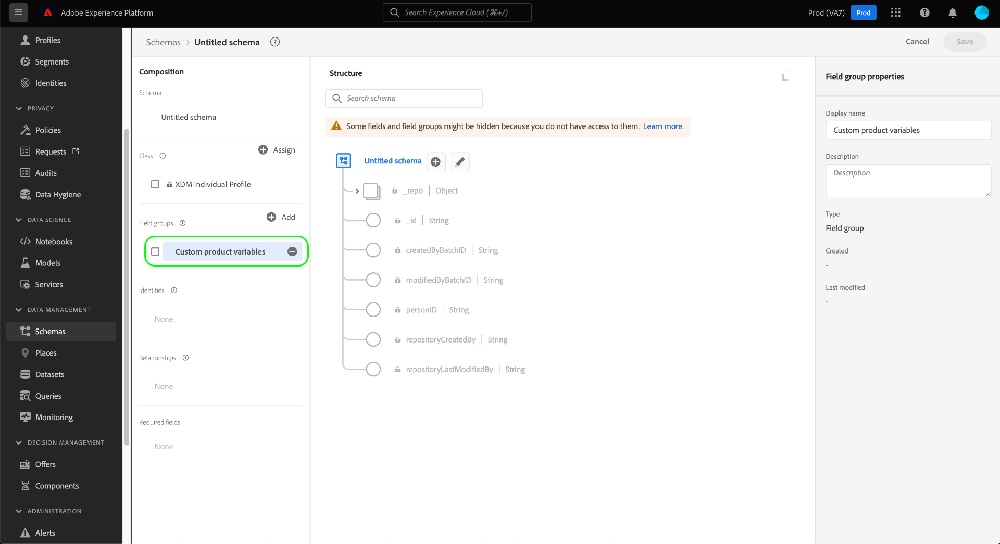

# UI에서 스키마 필드 그룹 만들기 및 편집

XDM(Experience Data Model)에서 스키마 필드 그룹은 개인 세부 사항, 호텔 환경 설정 또는 주소와 같은 특정 기능을 구현하는 필드를 하나 이상 정의하는 재사용 가능한 구성 요소입니다. 필드 그룹은 호환 클래스를 구현하는 스키마의 일부로 포함되기 위한 것입니다.

필드 그룹은 필드 그룹이 나타내는 데이터(레코드 또는 시계열)의 동작을 기반으로 호환되는 클래스를 정의합니다. 즉, 모든 필드 그룹을 모든 클래스에서 사용할 수는 없습니다.

Adobe Experience Platform에서는 광범위한 마케팅 사용 사례를 다루는 많은 표준 필드 그룹을 제공합니다. 그러나 고유한 사용자 지정 필드 그룹을 만들고 편집하여 XDM 스키마 내에서 비즈니스에 관련된 추가 개념을 정의할 수도 있습니다. 이 안내서에서는 Platform UI에서 조직의 사용자 지정 필드 그룹을 작성, 편집 및 관리하는 방법에 대한 개요를 제공합니다.

## 전제 조건

이 안내서에서는 XDM 시스템을 작업해야 합니다. 자세한 내용은 [XDM 개요](../../home.md) Experience Platform 에코시스템 내에서 XDM의 역할을 소개합니다. [스키마 구성 기본 사항](../../schema/composition.md) 필드 그룹이 XDM 스키마에 기여하는 방식에 대해 설명합니다.

이 안내서에는 필요하지 않지만, 다음 튜토리얼도 따르는 것이 좋습니다. [UI에서 스키마 작성](../../tutorials/create-schema-ui.md) 다음과 같은 다양한 기능에 익숙해지다 [!DNL Schema Editor].

## 새 필드 그룹 만들기 {#create}

새 필드 그룹을 만들려면 먼저 필드 그룹이 추가될 스키마를 선택해야 합니다. 선택할 수 있습니다 [새 스키마 만들기](./schemas.md#create) 또는 [편집할 기존 스키마 선택](./schemas.md#edit).

스키마를에서 열면 [!DNL Schema Editor], 선택 **[!UICONTROL 추가]** 다음 [!UICONTROL 필드 그룹] 왼쪽 레일의 섹션에 있습니다.

대화 상자가 나타나면 **[!UICONTROL 새 필드 그룹 만들기]**. 여기에서 다음을 제공할 수 있습니다 **[!UICONTROL 표시 이름]** 및 **[!UICONTROL 설명]** 를 입력합니다. 완료되면 을 선택합니다 **[!UICONTROL 필드 그룹 추가]**.

다음 [!DNL Schema Editor] 왼쪽 레일에 새 필드 그룹이 나열되고 다시 나타납니다. 이 그룹은 완전히 새로운 필드 그룹이므로 현재 스키마에 필드를 제공하지 않으므로 캔버스는 변경되지 않은 상태로 유지됩니다. 이제 시작할 수 있습니다 [필드 그룹에 필드 추가](#add-fields).

## 기존 필드 그룹 편집 {#edit}

>[!NOTE]
>
>조직에서 정의한 사용자 정의 필드 그룹만 완전히 편집하고 사용자 지정할 수 있습니다. Adobe으로 정의된 코어 필드 그룹의 경우 개별 스키마 컨텍스트 내에서 해당 필드의 표시 이름만 편집할 수 있습니다. 의 섹션을 참조하십시오. [스키마 필드에 대한 표시 이름 편집](./schemas.md#display-names) 자세한 내용
>
>사용자 지정 필드 그룹이 저장되고 데이터 수집을 위해 스키마에 사용되면, 이후에 필드 그룹에 추가 변경만 수행할 수 있습니다. 자세한 내용은 [스키마 진화 규칙](../../schema/composition.md#evolution) 추가 정보.

기존 필드 그룹을 편집하려면 먼저 내의 필드 그룹을 사용하는 스키마를 열어야 합니다 [!DNL Schema Editor]. 다음을 수행할 수 있습니다 [편집할 기존 스키마 선택](./schemas.md#edit)또는 [새 스키마 만들기](./schemas.md#create) 그리고 해당 필드 그룹을 추가합니다.

편집기에서 스키마를 열면 다음을 시작할 수 있습니다 [필드 그룹에 필드 추가](#add-fields).

## 필드 그룹에 필드 추가 {#add-fields}

>[!NOTE]
>
>이 섹션에서는 사용자 지정 필드 그룹에 필드를 추가하는 데 중점을 둡니다. 표준 필드 그룹에 사용자 지정 필드를 추가하는 방법에 대한 자세한 내용은 [스키마 UI 안내서](./schemas.md#custom-fields-for-standard-groups).

사용자 지정 필드 그룹에 필드를 추가하려면 먼저 **더하기(+)** 캔버스에서 스키마 이름 옆에 있는 아이콘.

An **[!UICONTROL 제목 없는 필드]** 자리 표시자가 캔버스에 표시되고 오른쪽 레일이 업데이트되어 필드의 속성을 구성하는 컨트롤을 표시합니다. 다음 안내서를 참조하십시오. [ui에서 필드 정의](../fields/overview.md#define) 를 참조하십시오.

아래 **[!UICONTROL 할당 대상]**&#x200B;에서 을(를) 선택합니다. **[!UICONTROL 필드 그룹]** 옵션을 선택한 다음 드롭다운을 사용하여 목록에서 원하는 필드 그룹을 선택합니다. 필드 그룹의 이름에 입력을 시작하여 결과를 좁힐 수 있습니다.

아래 **[!UICONTROL 할당 대상]**&#x200B;에서 을(를) 선택합니다. **[!UICONTROL 필드 그룹]** 옵션을 선택한 다음 드롭다운을 사용하여 목록에서 원하는 필드 그룹을 선택합니다. 필드 그룹의 이름에 입력을 시작하여 결과를 좁힐 수 있습니다.

스키마에 필드가 추가되면 선택한 필드 그룹에 할당됩니다. 필드 그룹에 필요한 만큼 필드를 계속 추가합니다. 완료되면 을 선택합니다 **[!UICONTROL 저장]** 스키마와 필드 그룹을 모두 저장하려면 을 클릭합니다.

동일한 필드 그룹을 이미 다른 스키마에 사용하는 경우, 새로 추가된 필드가 해당 스키마에 자동으로 표시됩니다.

## 다음 단계

이 안내서에서는 플랫폼 UI를 사용하여 필드 그룹을 만들고 편집하는 방법에 대해 설명합니다. 의 기능에 대한 자세한 내용은 [!UICONTROL 스키마] 작업 영역, 자세한 내용은 [[!UICONTROL 스키마] 작업 공간 개요](../overview.md).

를 사용하여 필드 그룹을 관리하는 방법을 배우려면 [!DNL Schema Registry] API인 경우 [필드 그룹 끝점 안내서](../../api/field-groups.md).
