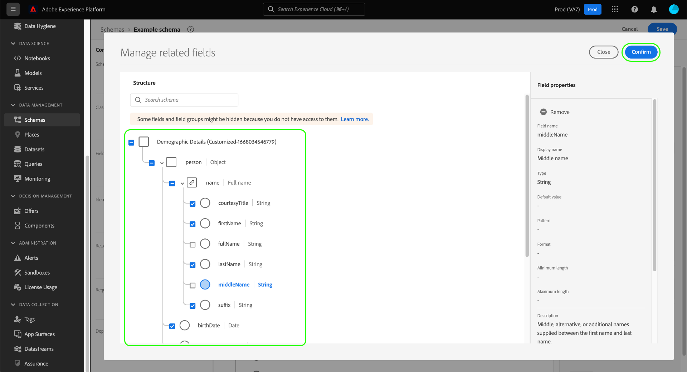

# UI에서 스키마 만들기 및 편집

이 안내서에서는 Adobe Experience Platform UI에서 조직에 대한 XDM(Experience Data Model) 스키마를 생성, 편집 및 관리하는 방법에 대한 개요를 제공합니다.

>[!IMPORTANT]
>
>XDM 스키마는 사용자 지정할 수 있으므로 스키마를 만드는 단계는 스키마를 캡처하려는 데이터 종류에 따라 다를 수 있습니다. 따라서 이 문서에서는 UI의 스키마로 수행할 수 있는 기본 상호 작용만 다룹니다. 또한 클래스 사용자 지정, 스키마 필드 그룹, 데이터 유형 및 필드와 같은 관련 단계는 제외합니다.
>
>스키마 만들기 프로세스를 자세히 살펴보려면 다음을 수행하십시오. [스키마 만들기 자습서](../../tutorials/create-schema-ui.md) 전체 예제 스키마를 만들고 의 여러 기능에 숙지하십시오 [!DNL Schema Editor].

## 전제 조건

이 안내서에서는 XDM 시스템을 작업해야 합니다. 자세한 내용은 [XDM 개요](../../home.md) Experience Platform 에코시스템 내에서 XDM의 역할을 소개합니다. [스키마 구성 기본 사항](../../schema/composition.md) 스키마 구성 방법에 대한 개요입니다.

## 새 스키마 만들기 {#create}

에서 [!UICONTROL 스키마] 작업 영역, 선택 **[!UICONTROL 스키마 만들기]** 오른쪽 상단 모서리에서 표시되는 드롭다운에서 다음 중 하나를 선택할 수 있습니다 **[!UICONTROL XDM 개별 프로필]** 및 **[!UICONTROL XDM ExperienceEvent]** 를 스키마의 기본 클래스로 사용합니다. 또는 다음을 선택할 수 있습니다 **[!UICONTROL 찾아보기]** 사용 가능한 클래스의 전체 목록에서 선택하거나 [새 사용자 지정 클래스 만들기](./classes.md#create) 을 가리키도록 업데이트하는 것이 좋습니다.

클래스를 선택하면 [!DNL Schema Editor] 가 나타나고 스키마의 기본 구조(클래스에서 제공)가 캔버스에 표시됩니다. 여기에서 오른쪽 레일을 사용하여 **[!UICONTROL 표시 이름]** 및 **[!UICONTROL 설명]** 스키마.

이제 다음을 통해 스키마 구조 작성을 시작할 수 있습니다 [스키마 필드 그룹 추가](#add-field-groups).

## 기존 스키마 편집 {#edit}

>[!NOTE]
>
>스키마를 저장하고 데이터 처리에 사용하면 추가 변경만 수행할 수 있습니다. 자세한 내용은 [스키마 진화 규칙](../../schema/composition.md#evolution) 추가 정보.

기존 스키마를 편집하려면 **[!UICONTROL 찾아보기]** 탭을 클릭한 다음 편집할 스키마의 이름을 선택합니다.

>[!TIP]
>
>작업 공간의 검색 및 필터링 기능을 사용하여 스키마를 보다 쉽게 찾을 수 있습니다. 다음 안내서를 참조하십시오. [xdm 리소스 탐색](../explore.md) 추가 정보.

스키마를 선택하면 [!DNL Schema Editor] 캔버스에 표시된 스키마 구조와 함께 나타납니다. 이제 다음을 수행할 수 있습니다 [필드 그룹 추가](#add-field-groups) 스키마(또는 [개별 필드 추가](#add-individual-fields) 해당 그룹에서 다음을 수행합니다. [필드 표시 이름 편집](#display-names), 또는 [기존 사용자 지정 필드 그룹 편집](./field-groups.md#edit) 스키마에서 적용되는 경우.

## 스키마에 필드 그룹 추가 {#add-field-groups}

>[!NOTE]
>
>이 섹션에서는 스키마에 기존 필드 그룹을 추가하는 방법을 설명합니다. 새 사용자 지정 필드 그룹을 만들려면 다음에 대한 안내서를 참조하십시오 [필드 그룹 만들기 및 편집](./field-groups.md#create) 을 가리키도록 업데이트하는 것이 좋습니다.

스키마 내에서 를 연 후 [!DNL Schema Editor]를 채울 때는 필드 그룹을 사용하여 스키마에 필드를 추가할 수 있습니다. 시작하려면 다음을 선택합니다 **[!UICONTROL 추가]** 다음 **[!UICONTROL 필드 그룹]** 왼쪽 레일에 있습니다.

스키마에 대해 선택할 수 있는 필드 그룹 목록이 표시되는 대화 상자가 나타납니다. 필드 그룹은 한 클래스와만 호환되므로 스키마의 선택한 클래스와 연결된 필드 그룹만 나열됩니다. 기본적으로 나열된 필드 그룹은 조직 내의 사용 인기도에 따라 정렬됩니다.

추가할 필드의 일반 활동 또는 비즈니스 영역을 알고 있는 경우 왼쪽 레일에서 업계 카테고리 중 하나 이상을 선택하여 표시된 필드 그룹 목록을 필터링합니다.

>[!NOTE]
>
>XDM에서 업계 특정 데이터 모델링을 위한 우수 사례에 대한 자세한 내용은 [업계 데이터 모델](../../schema/industries/overview.md).

검색 막대를 사용하여 원하는 필드 그룹을 찾을 수도 있습니다. 쿼리 이름과 일치하는 필드 그룹이 목록 맨 위에 나타납니다. 아래 **[!UICONTROL 표준 필드]**, 원하는 데이터 속성을 설명하는 필드가 포함된 필드 그룹이 표시됩니다.

스키마에 추가할 필드 그룹 이름 옆에 있는 확인란을 선택합니다. 목록에서 여러 필드 그룹을 선택할 수 있습니다. 선택한 각 필드 그룹이 오른쪽 레일에 표시됩니다.

>[!TIP]
>
>나열된 필드 그룹의 경우 정보 아이콘()을 클릭하여 필드 그룹이 캡처하는 데이터 종류에 대한 간단한 설명을 볼 수 있습니다. 미리 보기 아이콘() 를 클릭하여 스키마에 추가하기 전에 필드 그룹이 제공하는 필드의 구조를 확인합니다.

필드 그룹을 선택하면 **[!UICONTROL 필드 그룹 추가]** 를 추가하여 스키마에 추가합니다.

다음 [!DNL Schema Editor] 캔버스에 표시된 필드 그룹 제공 필드와 함께 다시 나타납니다.

스키마에 필드 그룹을 추가한 후 선택적으로 다음 작업을 수행할 수 있습니다 [기존 필드 제거](#remove-fields) 또는 [새 사용자 지정 필드 추가](#add-fields) 필요에 따라 해당 그룹에 추가합니다.

### 필드 그룹에서 추가한 필드 제거 {#remove-fields}

스키마에 필드 그룹을 추가한 후에는 필요하지 않은 필드를 제거할 수 있습니다.

>[!NOTE]
>
>필드 그룹에서 필드를 제거하면 작업 중인 스키마에만 영향을 주며 필드 그룹 자체에는 영향을 주지 않습니다. 하나의 스키마에서 필드를 제거하면 동일한 필드 그룹을 사용하는 다른 모든 스키마에서 해당 필드를 계속 사용할 수 있습니다.

다음 예에서는 표준 필드 그룹입니다 **[!UICONTROL 인구 통계 세부 정보]** 가 스키마에 추가되었습니다. 다음과 같은 단일 필드를 제거하려면 `taxId`캔버스에서 필드를 선택한 다음 을 선택합니다 **[!UICONTROL 제거]** 오른쪽 레일에 있습니다.

제거할 필드가 여러 개 있으면 필드 그룹을 전체적으로 관리할 수 있습니다. 캔버스에서 그룹에 속하는 필드를 선택한 다음 을 선택합니다 **[!UICONTROL 관련 필드 관리]** 오른쪽 레일에 있습니다.

해당 필드 그룹의 구조를 보여 주는 대화 상자가 나타납니다. 여기에서 제공된 확인란을 사용하여 필요한 필드를 선택하거나 선택 취소할 수 있습니다. 만족하면 을 선택합니다 **[!UICONTROL 확인]**.

스키마 구조에 선택된 필드만 있는 캔버스가 다시 나타납니다.

### 필드 그룹에 사용자 지정 필드 추가 {#add-fields}

스키마에 필드 그룹을 추가한 후 해당 그룹에 대한 추가 필드를 정의할 수 있습니다. 그러나 하나의 스키마의 필드 그룹에 추가된 모든 필드는 동일한 필드 그룹을 사용하는 다른 모든 스키마에도 표시됩니다.

또한 사용자 지정 필드가 표준 필드 그룹에 추가되면 해당 필드 그룹이 사용자 지정 필드 그룹으로 변환되고 원래 표준 필드 그룹은 더 이상 사용할 수 없습니다.

표준 필드 그룹에 사용자 지정 필드를 추가하려면 [아래 섹션](#custom-fields-for-standard-groups) 자세한 내용은 사용자 지정 필드 그룹에 필드를 추가하는 경우 [사용자 지정 필드 그룹 편집](./field-groups.md) 필드 그룹 UI 안내서에서 를 참조하십시오.

기존 필드 그룹을 변경하지 않으려면 다음을 수행할 수 있습니다 [새 사용자 지정 필드 그룹 만들기](./field-groups.md#create) 을 추가하여 다른 필드를 정의합니다.

## 스키마에 개별 필드 추가 {#add-individual-fields}

특정 사용 사례에 전체 필드 그룹을 추가하지 않으려면 스키마 편집기를 사용하여 개별 필드를 스키마에 직접 추가할 수 있습니다. 다음을 수행할 수 있습니다 [표준 필드 그룹에서 개별 필드 추가](#add-standard-fields) 또는 [고유한 사용자 지정 필드 추가](#add-custom-fields) 을 가리키도록 업데이트하는 것이 좋습니다.

>[!IMPORTANT]
>
>스키마 편집기를 사용하면 기능적으로 개별 필드를 스키마에 직접 추가할 수 있지만, 이렇게 해도 XDM 스키마의 모든 필드를 해당 클래스나 해당 클래스와 호환되는 필드 그룹이 제공해야 한다는 사실은 변경되지 않습니다. 아래 섹션에서는 모든 개별 필드가 스키마에 추가될 때 여전히 클래스 또는 필드 그룹과 연결되어 있습니다.

### 표준 필드 추가 {#add-standard-fields}

표준 필드 그룹의 필드를 스키마에 직접 추가할 수 있지만, 해당 필드 그룹을 미리 알지 않아도 됩니다. 스키마에 표준 필드를 추가하려면 더하기(**+**) 아이콘을 클릭하여 제품에서 사용할 수 있습니다. An **[!UICONTROL 제목 없는 필드]** 자리 표시자가 스키마 구조에 나타나고 오른쪽 레일이 업데이트되어 필드를 구성할 컨트롤을 표시합니다.

아래 **[!UICONTROL 필드 이름]**&#x200B;을 입력하여 추가할 필드의 이름을 입력합니다. 시스템은 쿼리와 일치하는 표준 필드를 자동으로 검색하여 **[!UICONTROL 권장 표준 필드]**&#x200B;에는 해당 필드가 속한 필드 그룹을 포함합니다.

일부 표준 필드는 이름이 같지만 필드 그룹에 따라 구조가 달라질 수 있습니다. 표준 필드가 필드 그룹 구조의 상위 개체 내에 중첩된 경우 하위 필드가 추가되면 상위 필드도 스키마에 포함됩니다.

미리 보기 아이콘()을 클릭하여 표준 필드 그룹의 구조를 보고 중첩할 방법을 보다 잘 이해할 수 있습니다. 스키마에 표준 필드를 추가하려면 더하기 아이콘().

캔버스는 필드 그룹 구조 내에 중첩된 상위 필드를 비롯하여 스키마에 추가된 표준 필드를 표시하도록 업데이트됩니다. 필드 그룹의 이름도 아래에 나열됩니다 **[!UICONTROL 필드 그룹]** 왼쪽 레일에 있습니다. 동일한 필드 그룹에서 필드를 더 추가하려면 을 선택합니다 **[!UICONTROL 관련 필드 관리]** 오른쪽 레일에 있습니다.

### 사용자 지정 필드 추가 {#add-custom-fields}

표준 필드의 워크플로우와 유사하게, 스키마에 직접 사용자 지정 필드를 추가할 수도 있습니다.

스키마의 루트 수준에 필드를 추가하려면 더하기(**+**) 아이콘을 클릭하여 제품에서 사용할 수 있습니다. An **[!UICONTROL 제목 없는 필드]** 자리 표시자가 스키마 구조에 나타나고 오른쪽 레일이 업데이트되어 필드를 구성할 컨트롤을 표시합니다.

추가할 필드의 이름에 입력을 시작하면 시스템이 자동으로 일치하는 표준 필드 검색을 시작합니다. 대신 새 사용자 지정 필드를 만들려면 다음에 첨부된 위쪽 옵션을 선택합니다 **([!UICONTROL 새 필드])**.

필드에 대한 표시 이름 및 데이터 유형을 제공한 후 다음 단계는 필드를 상위 XDM 리소스에 할당하는 것입니다. 스키마에서 사용자 지정 클래스를 사용하는 경우 [지정된 클래스에 필드 추가](#add-to-class) 또는 [필드 그룹](#add-to-field-group) 을 가리키도록 업데이트하는 것이 좋습니다. 스키마에서 표준 클래스를 사용하는 경우 사용자 지정 필드만 필드 그룹에 할당할 수 있습니다.

#### 사용자 지정 필드 그룹에 필드 할당 {#add-to-field-group}

>[!NOTE]
>
>이 섹션에서는 사용자 지정 필드 그룹에 필드를 할당하는 방법을 다룹니다. 표준 필드 그룹을 대신 새 사용자 지정 필드로 확장하려면 [표준 필드 그룹에 사용자 지정 필드 추가](#custom-fields-for-standard-groups).

아래 **[!UICONTROL 할당 대상]**, 선택 **[!UICONTROL 필드 그룹]**. 스키마에서 표준 클래스를 사용하는 경우 이 옵션이 유일한 옵션이며 기본적으로 선택됩니다.

다음으로, 연결할 새 필드의 필드 그룹을 선택해야 합니다. 제공된 텍스트 입력에 필드 그룹의 이름을 입력합니다. 입력과 일치하는 기존 사용자 지정 필드 그룹이 있는 경우 드롭다운 목록에 표시됩니다. 또는 고유한 이름을 입력하여 대신 새 필드 그룹을 만들 수 있습니다.

>[!WARNING]
>
>기존 사용자 지정 필드 그룹을 선택하는 경우, 해당 필드 그룹을 사용하는 다른 모든 스키마도 변경 사항을 저장한 후 새로 추가한 필드를 상속합니다. 이러한 이유로 이 유형의 전달을 원하는 경우에만 기존 필드 그룹을 선택합니다. 그렇지 않으면 대신 새 사용자 지정 필드 그룹을 만들도록 선택해야 합니다.

목록에서 필드 그룹을 선택한 후 **[!UICONTROL 적용]**.

새 필드가 캔버스에 추가되고, 이름순으로 표시됩니다 [임차인 ID](../../api/getting-started.md#know-your-tenant_id) 표준 XDM 필드와 충돌하지 않도록 합니다. 새 필드와 연결한 필드 그룹이 아래에 표시됩니다 **[!UICONTROL 필드 그룹]** 왼쪽 레일에 있습니다.

>[!NOTE]
>
>선택한 사용자 지정 필드 그룹에서 제공하는 나머지 필드는 기본적으로 스키마에서 제거됩니다. 이러한 필드 중 일부를 스키마에 추가하려면 그룹에 속하는 필드를 선택한 다음 을 선택합니다 **[!UICONTROL 관련 필드 관리]** 오른쪽 레일에 있습니다.

#### 사용자 지정 클래스에 필드 할당 {#add-to-class}

아래 **[!UICONTROL 할당 대상]**, 선택 **[!UICONTROL 클래스]**. 아래 입력 필드는 현재 스키마의 사용자 지정 클래스 이름으로 대체되어 새 필드가 이 클래스에 할당됨을 나타냅니다.

![다음 [!UICONTROL 클래스] 새 필드 지정에 대해 선택 중인 옵션입니다.](../../images/ui/resources/schemas/assign-field-to-class.png)

원하는 대로 필드를 계속 구성하고 을(를) 선택합니다 **[!UICONTROL 적용]** 완료됨.

![[!UICONTROL 적용] 새 필드에 대해 선택되고 있습니다.](../../images/ui/resources/schemas/assign-field-to-class-apply.png)

새 필드가 캔버스에 추가되고, 이름순으로 표시됩니다 [임차인 ID](../../api/getting-started.md#know-your-tenant_id) 표준 XDM 필드와 충돌하지 않도록 합니다. 왼쪽 레일에서 클래스 이름을 선택하면 새 필드가 클래스 구조의 일부로 표시됩니다.

### 표준 필드 그룹의 구조에 사용자 지정 필드 추가 {#custom-fields-for-standard-groups}

작업 중인 스키마에 표준 필드 그룹에서 제공하는 객체 유형 필드가 있는 경우 해당 표준 객체에 고유한 사용자 지정 필드를 추가할 수 있습니다.

>[!WARNING]
>
>하나의 스키마의 필드 그룹에 추가된 모든 필드는 동일한 필드 그룹을 사용하는 다른 모든 스키마에도 표시됩니다. 또한 사용자 지정 필드가 표준 필드 그룹에 추가되면 해당 필드 그룹이 사용자 지정 필드 그룹으로 변환되고 원래 표준 필드 그룹은 더 이상 사용할 수 없습니다.
>
>이 기능의 베타에 참여한 경우 이전에 사용자 정의한 표준 필드 그룹을 알려주는 대화 상자가 표시됩니다. 선택하면 **[!UICONTROL 승인]**&#x200B;를 입력하면 나열된 리소스가 사용자 지정 필드 그룹으로 변환됩니다.
>
>

시작하려면 더하기(**+**) 아이콘을 클릭합니다.

표준 필드 그룹을 변환할지 여부를 확인하는 경고 메시지가 나타납니다. 선택 **[!UICONTROL 필드 그룹 만들기를 계속합니다]** 계속 진행합니다.

새 필드에 대한 제목 없는 자리 표시자가 있는 캔버스가 다시 나타납니다. 표준 필드 그룹의 이름이 &quot;([!UICONTROL 확장])&quot;를 클릭하여 원래 버전에서 수정되었음을 나타냅니다. 여기에서 오른쪽 레일의 컨트롤을 사용하여 필드의 속성을 정의합니다.

변경 사항을 적용한 후 표준 개체 내의 테넌트 ID 네임스페이스 아래에 새 필드가 나타납니다. 이러한 중첩 네임스페이스는 동일한 필드 그룹을 사용하는 다른 스키마에서 변경 사항을 중단하지 않도록 필드 그룹 자체 내에서 필드 이름 충돌을 방지합니다.

## 실시간 고객 프로필에 대한 스키마 활성화 {#profile}

>[!CONTEXTUALHELP]
>id="platform_schemas_enableforprofile"
>title="프로필에 대한 스키마 활성화"
>abstract="프로필에 대해 스키마가 활성화되면 이 스키마에서 생성된 모든 데이터 세트가 실시간 고객 프로필에 참여하며, 서로 다른 소스의 데이터를 병합하여 각 고객에 대한 전체 보기를 구성합니다. 스키마를 사용하여 데이터를 프로필에 수집하면 비활성화할 수 없습니다. 자세한 내용은 설명서를 참조하십시오."

[실시간 고객 프로필](../../../profile/home.md) 서로 다른 소스의 데이터를 병합하여 각 개별 고객에 대한 전체 보기를 구성합니다. 스키마로 캡처된 데이터를 이 프로세스에 참여하도록 하려면 에서 사용할 스키마를 활성화해야 합니다 [!DNL Profile].

>[!IMPORTANT]
>
>스키마를 활성화하기 위한 [!DNL Profile]에는 기본 id 필드가 정의되어 있어야 합니다. 다음 안내서를 참조하십시오. [id 필드 정의](../fields/identity.md) 추가 정보.

스키마를 활성화하려면 왼쪽 레일에서 스키마 이름을 선택한 다음, **[!UICONTROL 프로필]** 오른쪽 레일에서 전환합니다.

스키마가 활성화되고 저장되면 비활성화할 수 없다는 팝업 창이 나타납니다. 선택 **[!UICONTROL 활성화]** 계속하십시오.

캔버스가 [!UICONTROL 프로필] 활성화됨 토글.

>[!IMPORTANT]
>
>스키마가 아직 저장되지 않았으므로 스키마가 실시간 고객 프로필에 참여할 수 있도록 하는 데 대한 결정을 변경할 경우 반환되지 않는 점입니다. 활성화된 스키마를 저장하면 더 이상 비활성화할 수 없습니다. 을(를) 선택합니다 **[!UICONTROL 프로필]** 스키마를 비활성화하려면 다시 전환합니다.

프로세스를 완료하려면 **[!UICONTROL 저장]** 스키마를 저장하려면 을 클릭합니다.

이제 실시간 고객 프로필에서 사용할 수 있도록 스키마가 활성화됩니다. Platform이 이 스키마를 기반으로 하여 데이터 세트에 데이터를 수집하면 해당 데이터가 병합된 프로필 데이터에 통합됩니다.

## 스키마 필드의 표시 이름 편집 {#display-names}

클래스를 지정하고 필드 그룹을 스키마에 추가하면 해당 필드가 표준 또는 사용자 지정 XDM 리소스에서 제공되었는지 여부에 관계없이 스키마 필드의 표시 이름을 편집할 수 있습니다.

>[!NOTE]
>
>표준 클래스나 필드 그룹에 속하는 필드의 표시 이름은 특정 스키마 컨텍스트에서만 편집할 수 있습니다. 즉, 하나의 스키마에서 표준 필드의 표시 이름을 변경해도 동일한 연관된 클래스 또는 필드 그룹을 사용하는 다른 스키마에는 영향을 주지 않습니다.
>
>스키마 필드에 대한 표시 이름을 변경하면 해당 변경 사항이 해당 스키마를 기반으로 하는 기존 데이터 세트에 즉시 반영됩니다.

스키마 필드의 표시 이름을 편집하려면 캔버스에서 필드를 선택합니다. 오른쪽 레일에서 아래에 새 이름을 입력합니다 **[!UICONTROL 표시 이름]**.

선택 **[!UICONTROL 적용]** 오른쪽 레일에서 캔버스가 업데이트되어 필드의 새 표시 이름이 표시됩니다. 선택 **[!UICONTROL 저장]** 스키마에 변경 사항을 적용하려면

## 스키마 클래스 변경 {#change-class}

스키마를 저장하기 전에 초기 구성 프로세스 중에 언제든지 스키마 클래스를 변경할 수 있습니다.

>[!WARNING]
>
>스키마에 대한 클래스 재지정은 매우 신중하게 수행해야 합니다. 필드 그룹은 특정 클래스와 호환되기 때문에 클래스를 변경하면 캔버스 및 추가한 필드가 재설정됩니다.

클래스를 재할당하려면 **[!UICONTROL 지정]** 캔버스 왼쪽.

조직에서 정의한 클래스(소유자가 &quot;[!UICONTROL 고객]&quot;)도 포함되어 있습니다.

목록에서 클래스를 선택하여 대화 상자의 오른쪽에 해당 설명을 표시합니다. 선택할 수도 있습니다 **[!UICONTROL 미리 보기 클래스 구조]** 를 클릭하여 클래스와 연결된 필드 및 메타데이터를 확인합니다. 선택 **[!UICONTROL 클래스 할당]** 계속하십시오.

새 클래스를 할당할지 확인하는 새 대화 상자가 열립니다. 선택 **[!UICONTROL 지정]** 확인합니다.

클래스 변경을 확인한 후 캔버스가 재설정되고 모든 구성 진행 상태가 손실됩니다.

## 다음 단계

이 문서에서는 Platform UI에서 스키마를 만들고 편집하는 기본 사항을 다룹니다. 를 검토하는 것이 좋습니다 [스키마 만들기 자습서](../../tutorials/create-schema-ui.md) 고유한 사용 사례를 위한 사용자 지정 필드 그룹 및 데이터 유형 만들기를 포함하여, UI에서 전체 스키마를 생성하기 위한 포괄적인 워크플로우입니다.

의 기능에 대한 자세한 내용은 [!UICONTROL 스키마] 작업 영역, 자세한 내용은 [[!UICONTROL 스키마] 작업 공간 개요](../overview.md).

에서 스키마를 관리하는 방법을 알아보려면 [!DNL Schema Registry] API인 경우 [스키마 끝점 안내서](../../api/schemas.md).
