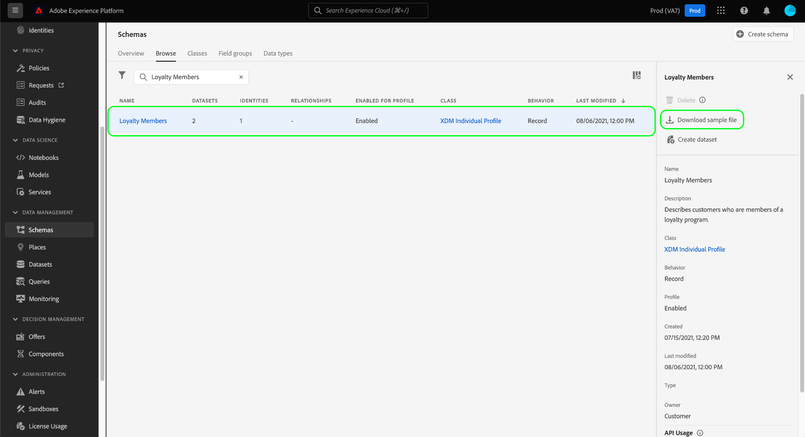

# UI에서 XDM 스키마에 대한 샘플 데이터 생성 {#generate-sample-data-for-an-xdm-schema}

>[!CONTEXTUALHELP]
>id="platform_xdm_downloadsamplefile"
>title="샘플 파일 다운로드"
>abstract="선택한 스키마의 구조를 준수하는 샘플 JSON 오브젝트를 생성합니다. 이 오브젝트는 해당 스키마를 사용하는 데이터 세트에 수집할 수 있도록 데이터 형식이 올바르게 지정되었는지 확인하는 템플릿 역할을 할 수 있습니다. 브라우저에서 샘플 JSON 파일이 다운로드됩니다."

데이터를 Adobe Experience Platform에 수집하려면 데이터의 형식 및 구조가 기존 XDM(경험 데이터 모델) 스키마를 준수해야 합니다. 특정 데이터 세트에 대한 스키마의 복잡성에 따라 데이터 세트에서 수집 시 예상하는 데이터의 정확한 모양을 결정하는 것이 어려울 수 있습니다.

Experience Platform UI에서 정의하는 모든 스키마의 경우 스키마 구조를 준수하는 샘플 JSON 개체를 생성할 수 있습니다. 이 개체는 해당 스키마를 사용하는 데이터 세트에 수집되는 모든 데이터에 대한 템플릿 역할을 할 수 있습니다.

Experience Platform UI의 왼쪽 탐색에서 **[!UICONTROL 스키마]**&#x200B;를 선택합니다. **[!UICONTROL 찾아보기]** 탭에서 샘플 데이터를 생성할 스키마를 찾습니다. 목록에서 해당 스키마를 선택하면 오른쪽 레일이 업데이트되어 스키마에 대한 세부 정보가 표시됩니다. 여기에서 **[!UICONTROL 샘플 파일 다운로드]**&#x200B;를 선택하십시오.

샘플 JSON 파일은 브라우저에 의해 다운로드됩니다. 이제 이 스키마를 사용하는 데이터 세트로 수집할 때 데이터를 구성하는 방법에 대한 참조로 이 파일을 사용할 수 있습니다.

## 다음 단계

이 안내서에서는 Experience Platform UI의 XDM 스키마에서 샘플 JSON 파일을 생성하는 방법에 대해 설명합니다. 스키마 레지스트리 API를 사용하여 샘플 데이터를 생성하는 방법에 대해 알아보려면 [샘플 데이터 끝점 안내서](../api/sample-data.md)를 참조하십시오.

데이터 수집을 시작할 준비가 되면 [XDM에 CSV 파일 매핑](../../ingestion/tutorials/map-csv/overview.md)에 대한 자습서를 참조하여 플랫 데이터 파일(예: CSV)을 XDM 스키마에 매핑하고 Experience Platform에 수집하는 방법을 알아보십시오. 또는 외부 소스에서 데이터를 가져와 XDM에 매핑하기 위해 [소스 연결](../../sources/home.md)을 설정할 수 있습니다.

UI에서 [!UICONTROL 스키마] 작업 영역의 기능에 대한 자세한 내용은 [[!UICONTROL 스키마] 작업 영역 개요](./overview.md)를 참조하십시오.
